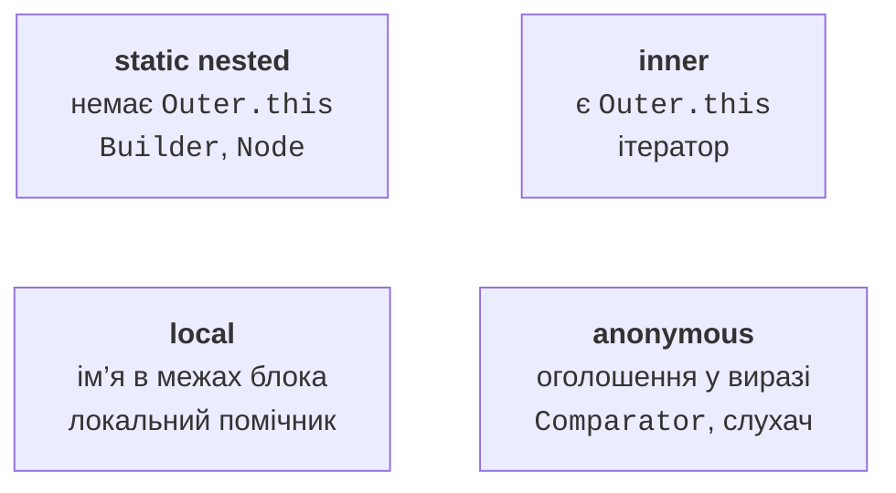

# Вкладені класи та стандартні контракти

## Чотири види вкладених класів

Статичний вкладений клас оголошують усередині іншого класу з модифікатором static. Він не має неявного посилання на конкретний зовнішній екземпляр. Створення має вигляд `new Order.Builder(...)`. Такий клас зручно використати для вузла, результату допоміжної операції або будівельника, який логічно належить моделі.

Внутрішній клас без static пов’язаний із зовнішнім об’єктом. У RangeIterator вираз `Range.this` позначає саме цей об’єкт, а звичайний `this` – ітератор. Якщо внутрішній клас доступний клієнтові, синтаксис створення має вигляд `outer.new Inner()`. У нашому прикладі клас приватний, тому клієнт одержує його через фабрику iterator, не знаючи деталей створення.

Обидва види вкладених класів можуть звертатися до приватних членів зовнішнього класу в межах правил наявності екземпляра. Static клас не може звернутися до нестатичного поля без явного об’єкта. Неявний зв’язок inner може продовжити життя зовнішнього об’єкта: поки потрібний ітератор, потрібний і його Range.

Локальний клас оголошується всередині методу або блока. Його ім’я доступне лише в цій області. Анонімний клас оголошується прямо у виразі створення й не має власного імені конструктора. У прикладі сортування вираз `new Comparator<Product>() { ... }` створює один об’єкт окремого класу, який реалізує Comparator.



Рис. 7.5. Види вкладених класів і область їх використання {.caption}

Локальні й анонімні класи можуть захоплювати локальні змінні, які є final або *effectively final*: після ініціалізації їм не присвоюють інше значення. Об’єкт може існувати після повернення методу, тому він не працює з довільно змінюваною локальною коміркою стека. Якщо захоплено посилання на масив, сам масив може змінюватися; незмінність посилання не є незмінністю даних.

Анонімний клас має власний this. Це важливо для слухача подій, який викликає методи зовнішнього об’єкта: за потреби слід явно написати Outer.this. Лямбди, що вивчатимуться в темі 11, мають інші правила this. До того часу компаратори й слухачі записуємо класами, щоб бачити весь контракт і не змішувати механізми.

## Приклад 4. Статичний будівельник замовлення

Замовлення має обов’язкового клієнта, кількість і необов’язкову примітку. Ланцюжок методів будівельника читається за іменами, а не за позиціями багатьох параметрів. Будівельник змінюваний; готове замовлення незмінне. Подальша зміна builder не повинна змінити вже створений Order.

```java
final class Order {
    private final String customer;
    private final int quantity;
    private final String note;
    private Order(Builder builder) {
        customer = builder.customer;
        quantity = builder.quantity;
        note = builder.note;
    }
    @Override
    public String toString() {
        return customer + ": " + quantity + " [" + note + "]";
    }
    public static final class Builder {
        private final String customer;
        private int quantity = 1;
        private String note = "";
        public Builder(String customer) {
            if (customer == null || customer.isBlank()) {
                throw new IllegalArgumentException("Empty customer");
            }
            this.customer = customer.strip();
        }
        public Builder quantity(int quantity) {
            if (quantity < 1 || quantity > 100) {
                throw new IllegalArgumentException(
                        "Invalid quantity");
            }
            this.quantity = quantity;
            return this;
        }
        public Builder note(String note) {
            if (note == null || note.length() > 100) {
                throw new IllegalArgumentException("Invalid note");
            }
            this.note = note.strip();
            return this;
        }
        public Order build() { return new Order(this); }
    }
}
public class Main {
    public static void main(String[] args) {
        Order.Builder builder = new Order.Builder("Olena");
        Order first = builder.quantity(3).note("pickup").build();
        Order second = builder.quantity(5).build();
        System.out.println(first);
        System.out.println(second);
        try {
            builder.quantity(0);
        } catch (IllegalArgumentException ex) {
            System.out.println(ex.getMessage());
        }
        System.out.println(builder.build());
    }
}
```

```text
Olena: 3 [pickup]
Olena: 5 [pickup]
Invalid quantity
Olena: 5 [pickup]
```

Валідація відбувається до присвоєння, тому невдалий виклик quantity(0) не руйнує попередній стан builder. Якщо інваріант залежить від кількох полів, остаточну перевірку варто виконати також у build або конструкторі Order. Для масиву чи списку в builder потрібно зробити захисну копію під час створення результату.

## Інші стандартні контракти та стратегії

`AutoCloseable` задає close для ресурсу й дозволяє використання в try-with-resources. Це не команда видалити об’єкт із пам’яті, а завершити роботу з зовнішнім ресурсом: файлом, з’єднанням, потоком. Порядок закриття кількох ресурсів зворотний порядку створення. Механіку винятків розглянуто в темі 4.

`CharSequence` задає читання послідовності символів, зокрема length і charAt. Його реалізують String та StringBuilder, але інтерфейс сам не обіцяє незмінності. Метод, який приймає CharSequence, має визначити, чи він читає одразу, чи зберігає посилання на майбутнє. У другому випадку зміна StringBuilder може вплинути на результат, якщо не створено знімка рядка.

Маркерний інтерфейс не містить методів, але позначає властивість типу для іншого механізму. Приклад – Cloneable. Наявність маркера не означає автоматичного публічного методу clone. Для власної програми часто краще явний метод чи анотація, якщо роль потребує перевірюваної поведінки, а не лише позначки.

Шаблон «Стратегія» передає алгоритм як об’єкт інтерфейсного типу. Сортування вже використало цей підхід: масив не знає, чому один товар передує іншому, а запитує Comparator. Так само Invoice може приймати DiscountPolicy і викликати її метод без залежності від конкретного виду знижки. Стратегію можна замінити під час створення без нової ієрархії Invoice.

Контракт стратегії має описувати допустимі значення, одиниці й побічні ефекти. Для знижки важливо, чи результат означає суму знижки або кінцеву вартість, як округлюються копійки й чи допускається нуль. Інтерфейс із правильною сигнатурою, але нечіткою семантикою не забезпечує взаємозамінності реалізацій.

## Робота в середовищі та перевірка контрактів

Команда *Code → Implement Methods* або **Ctrl+I** показує обов’язкові методи. Перевірте створену видимість і типи; автоматичне тіло з нульовим результатом є заготовкою, а не готовою реалізацією. Перехід до реалізацій через **Ctrl+Alt+B** допомагає знайти всі класи, що виконують роль.

::: info Знімок екрана
In IntelliJ IDEA declare Product implements Comparable. Use Ctrl+I and show the compareTo method selection dialog.
:::

Рис. 7.6. Вибір методів для реалізації {.caption}

::: info Знімок екрана
Select a service class. Open Refactor &gt; Extract &gt; Interface. Show the new interface name and selected public operations.
:::

Рис. 7.7. Виділення вузького інтерфейсу {.caption}

Виділення інтерфейсу має починатися з потреб клієнта. Не позначайте всі методи механічно: службове очищення кешу або внутрішній setter може не належати ролі. Після рефакторингу перевірте, що клієнт компілюється через інтерфейс і що можна підставити другу реалізацію.

Для ітератора перевірте порожній, одноелементний і звичайний діапазони, два незалежні обходи й next після завершення. Для компаратора – рівні ключі, зворотний порядок, мінімальні й максимальні числа. Для builder – обов’язкові поля, межі кількості й незмінність уже створеного результату після нової конфігурації будівельника.
