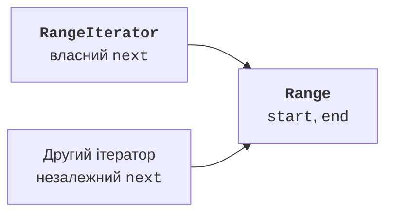

# Порівняння та ітерація

## Приклад 2. Природний і зовнішній порядок

`Comparable<Product>` задає природний порядок товарів. У прикладі порівнюємо спочатку назву, потім ціну. `Comparator<Product>` задає окрему стратегію порядку: спочатку ціна, потім назва. Параметр у кутових дужках означає тип елемента; власні узагальнення вивчатимемо пізніше. Зараз достатньо підставити Product.

Результат порівняння – від’ємне число, нуль або додатне число. Не потрібно повертати саме −1 чи 1. Не віднімайте цілі значення для порівняння: віднімання може переповнитися. `Long.compare` та `Integer.compare` виражають намір і працюють на всьому діапазоні типу.

```java
import java.util.Arrays;
import java.util.Comparator;
import java.util.Objects;

final class Product implements Comparable<Product> {
    private final String name;
    private final long price;
    Product(String name, long price) {
        if (name == null || name.isBlank()
                || price < 0 || price > 1_000_000) {
            throw new IllegalArgumentException("Invalid product");
        }
        this.name = name.strip();
        this.price = price;
    }
    public String name() { return name; }
    public long price() { return price; }
    @Override
    public int compareTo(Product other) {
        int byName = name.compareTo(other.name);
        return byName != 0 ? byName
                : Long.compare(price, other.price);
    }
    @Override
    public boolean equals(Object other) {
        return other instanceof Product p
                && name.equals(p.name) && price == p.price;
    }
    @Override
    public int hashCode() { return Objects.hash(name, price); }
    @Override
    public String toString() { return name + ":" + price; }
}
public class Main {
    public static void main(String[] args) {
        Product[] items = {
            new Product("Pen", 500),
            new Product("Book", 2000),
            new Product("Pen", 300)
        };
        Arrays.sort(items);
        System.out.println(Arrays.toString(items));
        Comparator<Product> byPrice = new Comparator<Product>() {
            @Override
            public int compare(Product a, Product b) {
                int result = Long.compare(a.price(), b.price());
                return result != 0 ? result
                        : a.name().compareTo(b.name());
            }
        };
        Arrays.sort(items, byPrice);
        System.out.println(Arrays.toString(items));
        System.out.println(new Product("Pen", 500)
                .compareTo(new Product("Pen", 500)));
    }
}
```

```text
[Book:2000, Pen:300, Pen:500]
[Pen:300, Pen:500, Book:2000]
0
```

`Arrays.sort` змінює переданий масив. Щоб зберегти вхідний порядок, спочатку створіть `items.clone()`. Компаратор не повинен змінювати товари чи залежати від лічильника викликів. Для тих самих значень він має давати узгоджений результат і транзитивний порядок. Інакше сортування не має коректно визначеної мети.

Природний порядок бажано узгоджувати з equals: нульовий compareTo означає логічну рівність. У цьому класі обидва враховують назву й ціну. Для окремого компаратора лише за ціною два різні товари могли б порівнюватися як однакові; це треба документувати, особливо перед використанням упорядкованої множини. Опис Comparator: <https://docs.oracle.com/en/java/javase/27/docs/api/java.base/java/util/Comparator.html>.

## Iterable і Iterator

`Iterable<Integer>` означає, що об’єкт може надати ітератор цілих значень. Метод `iterator()` створює `Iterator<Integer>`, який має `hasNext()` і `next()`. Цикл for-each використовує цей контракт; клієнтові не потрібно знати, чи джерело зберігає масив, зв’язаний список або обчислює значення на вимогу.

`hasNext()` лише повідомляє про наявність наступного елемента. `next()` повертає його та пересуває позицію. Після вичерпання він повинен кинути `NoSuchElementException`, а не повернути довільний нуль або повторити останнє значення. Метод remove можна не підтримувати; стандартна реалізація повідомляє про непідтримувану операцію.

## Приклад 3. Діапазон із внутрішнім ітератором

Діапазон містить цілі числа від start включно до end невключно. Порожній діапазон дозволений. Межі −1000000..1000000 забезпечують безпечне збільшення позиції; кількість елементів не перевищує двох мільйонів. Кожний виклик iterator створює незалежний курсор, тому два обходи не заважають один одному.

```java
import java.util.Iterator;
import java.util.NoSuchElementException;

final class Range implements Iterable<Integer> {
    private final int start;
    private final int end;
    Range(int start, int end) {
        if (start < -1_000_000 || end > 1_000_000 || start > end) {
            throw new IllegalArgumentException("Invalid range");
        }
        this.start = start;
        this.end = end;
    }
    @Override
    public Iterator<Integer> iterator() {
        return new RangeIterator();
    }
    private class RangeIterator implements Iterator<Integer> {
        private int next = Range.this.start;
        @Override
        public boolean hasNext() { return next < Range.this.end; }
        @Override
        public Integer next() {
            if (!hasNext()) { throw new NoSuchElementException(); }
            return next++;
        }
    }
}
public class Main {
    public static void main(String[] args) {
        Range range = new Range(2, 5);
        for (int value : range) { System.out.println(value); }
        Iterator<Integer> a = range.iterator();
        Iterator<Integer> b = range.iterator();
        System.out.println(a.next() + ":" + b.next());
        Iterator<Integer> empty = new Range(3, 3).iterator();
        System.out.println(empty.hasNext());
        try {
            empty.next();
        } catch (NoSuchElementException ex) {
            System.out.println("No next element");
        }
    }
}
```

```text
2
3
4
2:2
false
No next element
```

Тип Integer є оболонкою для int, потрібною в параметрі узагальненого інтерфейсу. Повернення `next++` автоматично упаковує int, а for-each розпаковує Integer назад. Це не означає, що можна безпечно розпакувати null: така операція спричинить виняток. Наш ітератор ніколи не повертає null.



Рис. 7.4. Ітератор має власний курсор і зв’язок із діапазоном {.caption}
