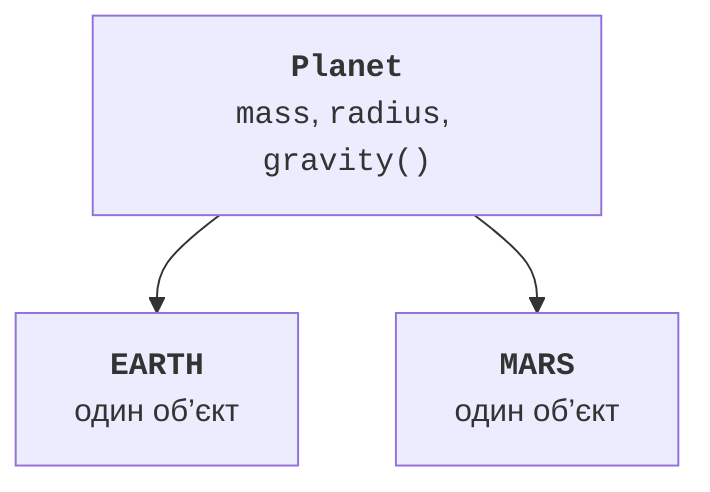

# Переліки enum

## Enum задає скінченний набір варіантів

**Перелік** (*enum*) оголошує іменовані константи типу. Замість рядків `"NEW"`, `"PAID"`, `"SENT"` можна використати OrderStatus. Помилка в імені стане помилкою компіляції, а не прихованим новим станом. Константи є об’єктами, створеними механізмом enum; довільний `new OrderStatus()` заборонений.

`values()` повертає масив констант у порядку оголошення, `valueOf` шукає точне ім’я й за відсутності кидає IllegalArgumentException. `name()` повертає оголошене ім’я, а `ordinal()` – його позицію від нуля. Не зберігайте ordinal як зовнішній ідентифікатор: перестановка констант змінить значення. Краще явний стабільний код.

Порівняння enum через `==` природне: кожна константа має одну ідентичність у межах відповідного класу. `compareTo` порівнює порядок оголошення, а не автоматичну предметну важливість. Якщо важливість інша, задайте поле або Comparator. `switch` за enum читається як перелік дозволених випадків.

Перелік може мати приватні поля, конструктор і методи, реалізовувати інтерфейси. Конструктор не повинен бути public: створення визначає сам перелік. Для різної поведінки констант можна оголосити абстрактний метод і надати тіло для кожної константи. Невелика формула в полі часто простіша за окремі тіла.



Рис. 8.2. Константи enum є об’єктами одного типу {.caption}

## Приклад 2. Планети з параметрами

Використовуємо округлені навчальні маси й радіуси, щоб показати зв’язок константи, конструктора та методу. Поверхневе прискорення обчислюємо як `G * mass / (radius * radius)`. Вхідна маса тіла не повинна бути від’ємною або нескінченною.

```java
import java.util.Locale;

enum Planet {
    EARTH(5.972e24, 6.371e6),
    MARS(6.417e23, 3.390e6);

    private static final double G = 6.67430e-11;
    private final double mass;
    private final double radius;

    Planet(double mass, double radius) {
        this.mass = mass;
        this.radius = radius;
    }

    double gravity() { return G * mass / (radius * radius); }

    double weight(double bodyMass) {
        if (!Double.isFinite(bodyMass) || bodyMass < 0
                || bodyMass > 1_000_000) {
            throw new IllegalArgumentException("Invalid mass");
        }
        return bodyMass * gravity();
    }
}

public class Main {
    public static void main(String[] args) {
        for (Planet planet : Planet.values()) {
            System.out.printf(Locale.ROOT, "%s %.2f %.2f%n",
                    planet.name(), planet.gravity(),
                    planet.weight(10));
        }
        System.out.println(Planet.valueOf("EARTH") == Planet.EARTH);
        try {
            Planet.valueOf("earth");
        } catch (IllegalArgumentException ex) {
            System.out.println("Unknown planet");
        }
    }
}
```

```text
EARTH 9.82 98.20
MARS 3.73 37.27
true
Unknown planet
```

Внутрішні обчислення не округлюються після кожного кроку; формат %.2f округлює лише представлення. У задачах із точними фінансовими правилами такий double-підхід не слід механічно переносити на гроші. Для прикладу фізичної формули він відповідає наближеному характеру вхідних констант.

`EnumSet` і `EnumMap` спеціалізуються на множинах і ключах-переліках. Вони стануть корисними для набору дозволених станів або таблиці правил; детально колекції розглядаються в темі 10. На цьому етапі достатньо масиву values і switch, без передчасної складності контейнерів.
