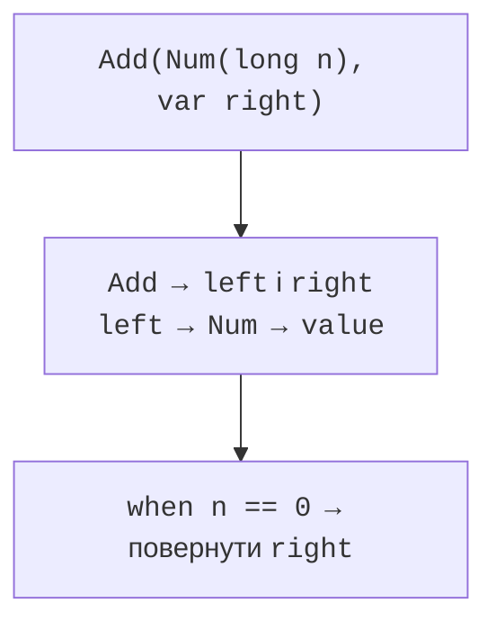
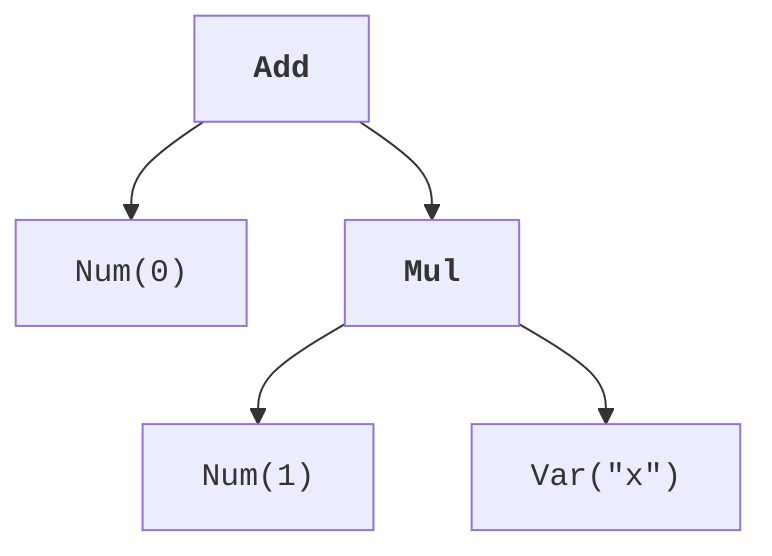

# Зразки записів і деконструкція

## Зразки записів і деконструкція

Зразок запису показує потрібні компоненти прямо в умові. `var` дозволяє вивести їхні типи, а вкладений зразок розкладає компонент, який сам є записом. Наприклад, зразок ребра з двома точками може одразу одержати чотири координати без проміжних змінних.

Символ `_` означає, що відповідне значення не використовується. Його не можна читати як змінну. Це допомагає відрізнити навмисне ігнорування компонента від випадково забутого імені. Не замінюйте ним дані, які потрібні для перевірки інваріанта: деконструкція не є автоматичною валідацією.



Рис. 8.5. Вкладений зразок дістає потрібні компоненти {.caption}

Вкладений зразок типу або запису не обов’язково збігається з null у компоненті. Найпростіша модель для навчальних дерев – заборонити null у конструкторах вузлів. Тоді кожне ребро дерева веде до коректного підвиразу, а evaluator не потребує прихованого набору спеціальних випадків.

## Приклад 4. Дерево арифметичного виразу

Expr описує число, змінну, додавання або множення. Для простоти середовище містить одну змінну x; інше ім’я відхиляється. Обчислення використовує точні цілі операції з перевіркою переповнення. Спрощення демонструє вкладені зразки та охоронні умови для нуля й одиниці.

```java
import java.util.Objects;

sealed interface Expr permits Num, Var, Add, Mul { }
record Num(long value) implements Expr { }
record Var(String name) implements Expr {
    Var {
        if (!"x".equals(name)) {
            throw new IllegalArgumentException("Unknown variable");
        }
    }
}
record Add(Expr left, Expr right) implements Expr {
    Add {
        Objects.requireNonNull(left);
        Objects.requireNonNull(right);
    }
}
record Mul(Expr left, Expr right) implements Expr {
    Mul {
        Objects.requireNonNull(left);
        Objects.requireNonNull(right);
    }
}
public class Main {
    static long eval(Expr expr, long x) {
        return switch (Objects.requireNonNull(expr)) {
            case Num(long value) -> value;
            case Var _ -> x;
            case Add(var a, var b) ->
                    Math.addExact(eval(a, x), eval(b, x));
            case Mul(var a, var b) ->
                    Math.multiplyExact(eval(a, x), eval(b, x));
        };
    }
    static Expr simplify(Expr expr) {
        Expr prepared = switch (Objects.requireNonNull(expr)) {
            case Add(var a, var b) ->
                    new Add(simplify(a), simplify(b));
            case Mul(var a, var b) ->
                    new Mul(simplify(a), simplify(b));
            default -> expr;
        };
        return switch (prepared) {
            case Add(Num(long n), var b) when n == 0 -> b;
            case Add(var a, Num(long n)) when n == 0 -> a;
            case Mul(Num(long n), var b) when n == 1 -> b;
            case Mul(var a, Num(long n)) when n == 1 -> a;
            default -> prepared;
        };
    }
    public static void main(String[] args) {
        Expr expression = new Add(new Num(0),
                new Mul(new Num(1), new Var("x")));
        Expr result = simplify(expression);
        System.out.println(eval(expression, 7));
        System.out.println(result);
        System.out.println(eval(result, 7));
        try {
            eval(new Add(new Num(Long.MAX_VALUE), new Num(1)), 0);
        } catch (ArithmeticException ex) {
            System.out.println("Overflow");
        }
    }
}
```

```text
7
Var[name=x]
7
Overflow
```

Спочатку simplify рекурсивно спрощує дітей, потім застосовує локальне правило. Тому вкладена одиниця зникає раніше, ніж зовнішнє додавання нуля. Ми не застосовуємо правило множення довільного виразу на нуль: воно могло б приховати переповнення або іншу відмову підвиразу під час обчислення. Спрощення повинне зберігати обрану семантику.



Рис. 8.6. Вираз нуль плюс одиниця помножити на x {.caption}

Алгебраїчний тип даних поєднує альтернативи й компоненти: Expr є однією з чотирьох форм, а Add містить пару Expr. Для нової операції можна написати новий вичерпний switch. Для нової форми потрібно оновити всі такі операції. Це корисний обмін зручністю, який слід враховувати при проєктуванні.

Рекурсивне дерево має обмежувати глибину, якщо його будує користувач. Дуже глибокий вираз може переповнити стек викликів навіть без арифметичного переповнення. У лабораторних задачах обмежуйте глибину, наприклад 20, і кількість вузлів, наприклад 1000; формат введення має бути явно визначеним.

## Preview можливості та засоби IDE

У JDK 27 зразки для примітивних типів у ширших контекстах залишаються preview можливістю (*Primitive Types in Patterns, instanceof, and switch, Fifth Preview*). Не змішуйте їх зі стабільними зразками записів і компонентів. Усі повні програми цієї теми компілюються без `--enable-preview`. Офіційна специфікація експерименту: <https://docs.oracle.com/javase/specs/jls/se27/preview/specs/primitive-types-in-patterns-instanceof-switch-jls.html>.

Для окремого preview експерименту потрібні узгоджені параметри компіляції `--enable-preview --release 27` і запуску `--enable-preview`, а також відповідний рівень мови IDE. Такі класи прив’язані до версії preview; їх не слід непомітно включати до звичайних лабораторних прикладів або вимагати для базового рівня.

::: info Знімок екрана
In IntelliJ IDEA open a final immutable Point class. Show the Convert to record intention and preview of components before applying.
:::

Рис. 8.7. Перетворення носія даних на запис {.caption}

::: info Знімок екрана
Add a permitted Triangle record to Shape. Show the compiler diagnostic on area switch and the Add missing branches intention.
:::

Рис. 8.8. Додавання відсутньої альтернативи switch {.caption}

Автоматичне перетворення на record потребує перевірки зовнішніх викликів: getX і x мають різні імена. Перевірте також рівність, формат toString та захисне копіювання. Якщо клас мав прихований кеш екземпляра, перетворення може вимагати зміни моделі, а не лише заміни синтаксису.

Для sealed switch корисна негативна перевірка: додайте тимчасовий підтип і переконайтеся, що вичерпний evaluator перестає компілюватися. Потім додайте потрібну гілку. Такий експеримент пояснює, чому default іноді приховує корисну перевірку повноти під час розвитку моделі.
