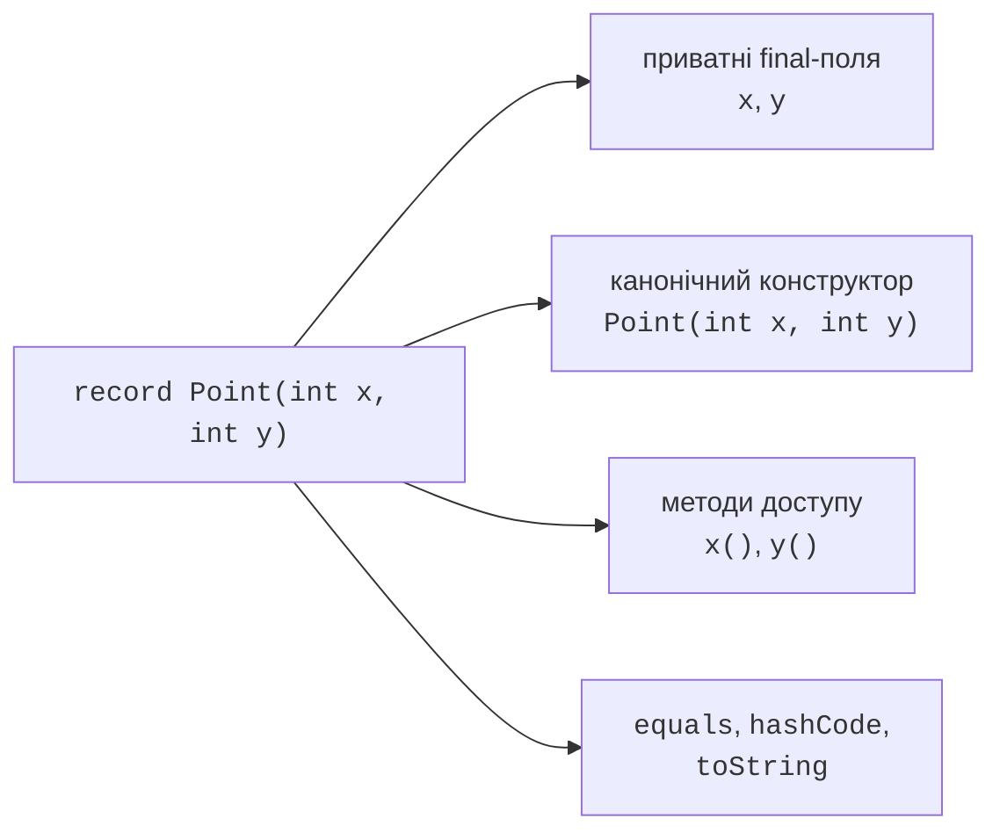

# Записи та незмінність

## Значення замість набору службового коду

Для точки, грошової суми або результату вимірювання часто потрібний клас, у якого головне – сукупність даних. Звичайний клас потребує полів, конструктора, аксесорів, equals, hashCode і toString. Коли всі ці операції прямо випливають із компонентів, Java дозволяє оголосити **запис** (*record*).

Заголовок `record Point(int x, int y)` задає два компоненти. Компілятор створює приватні фінальні поля, канонічний конструктор із цими параметрами, аксесори `x()` та `y()`, а також методи рівності, хешування й текстового представлення. Аксесор називається x, а не getX: це частина стандартного контракту запису.

Запис неявно фінальний і наслідує `java.lang.Record`. Він не може наслідувати довільний інший клас, але може реалізовувати інтерфейси. Додаткові поля екземпляра поза компонентами заборонені; статичні поля, методи, вкладені типи та додаткові конструктори дозволені. Додатковий конструктор делегує канонічному, щоб кожне створення встановлювало всі компоненти.

Запис – не автоматичний вибір для будь-якої сутності. Якщо об’єкт має приховану змінювану ідентичність або повинен вільно змінювати внутрішнє представлення без зміни публічного API, звичайний клас може бути доречнішим. Компоненти запису є частиною його відкритого контракту й беруть участь у рівності.

Офіційний вступ: <https://dev.java/learn/records/>. У прикладах нижче записи використовуються як перевірені значення, які безпечно передавати між частинами програми та порівнювати за вмістом.



Рис. 8.1. Компоненти визначають стандартні члени запису {.caption}

## Компактний конструктор та інваріанти

Канонічний конструктор має ті самі типи й порядок параметрів, що й компоненти. Компактний конструктор дозволяє не повторювати цей список: після імені запису пишуть тіло без круглих дужок. Усередині доступні параметри компонентів. Після успішного завершення вони автоматично присвоюються полям.

У компактному конструкторі можна перевірити число, нормалізувати рядок або замінити параметр копією. Пряме присвоєння `this.component = ...` у такому конструкторі заборонене. Змінюють параметр component, а остаточне присвоєння виконує механізм запису. Не викликайте аксесор для перевірки ще не присвоєного поля: перевіряйте параметр.

Конструктор не повинен непомітно виправляти будь-яке неправильне значення. Обрізання крайових пробілів у коді валюти може бути визначеною нормалізацією, а перетворення від’ємної суми на нуль приховає помилку користувача. Межі й правила нормалізації потрібно записати як частину контракту.

## Приклад 1. Грошове значення

Money містить код навчальної валюти та невід’ємні копійки. Перелік валют тут навмисно обмежений UAH і EUR; програма не виконує конвертації або платежів. Додавати можна тільки однакові валюти, а верхній ліміт контролюється конструктором нового результату.

```java
import java.util.Locale;
import java.util.Objects;

record Money(String currency, long cents) {
    Money {
        if (currency == null) {
            throw new IllegalArgumentException("Missing currency");
        }
        currency = currency.strip().toUpperCase(Locale.ROOT);
        if (!currency.equals("UAH") && !currency.equals("EUR")) {
            throw new IllegalArgumentException("Unknown currency");
        }
        if (cents < 0 || cents > 1_000_000_000) {
            throw new IllegalArgumentException("Invalid amount");
        }
    }

    static Money ofUnits(String currency, long units) {
        return new Money(currency, Math.multiplyExact(units, 100));
    }

    Money plus(Money other) {
        Objects.requireNonNull(other);
        if (!currency.equals(other.currency)) {
            throw new IllegalArgumentException(
                    "Different currencies");
        }
        return new Money(currency, Math.addExact(cents, other.cents));
    }
}

public class Main {
    public static void main(String[] args) {
        Money first = new Money(" uah ", 1250);
        Money second = Money.ofUnits("UAH", 5);
        System.out.println(first);
        System.out.println(first.plus(second));
        System.out.println(first.equals(new Money("UAH", 1250)));
        System.out.println(first.currency());
        try {
            first.plus(new Money("EUR", 100));
        } catch (IllegalArgumentException ex) {
            System.out.println(ex.getMessage());
        }
    }
}
```

```text
Money[currency=UAH, cents=1250]
Money[currency=UAH, cents=1750]
true
UAH
Different currencies
```

Згенерований toString придатний для демонстрації й налагодження, але не є стабільним протоколом обміну даними. Не розбирайте його назад як формат файлу. Фабрика ofUnits виражає одиниці входу в імені й використовує multiplyExact, щоб переповнення не перетворило велику додатну суму на неправильне число.

Додавання створює новий запис, тому first залишається

1. Для граничних перевірок потрібні нуль, верхній

ліміт, сума понад ліміт, невідома валюта й null. Перевірка рівності має враховувати нормалізацію: `" uah "` і `"UAH"` дають однаковий компонент.

## Неглибока незмінність і захисні копії

Фінальність поля забороняє переприсвоїти посилання, але не забороняє змінити об’єкт за ним. Запис із масивом без захисту може змінити видимий стан через вхідний масив або через аксесор. Для незмінного значення потрібно копіювати на вході й на виході.

Згенеровані equals і hashCode використовують семантику компонентів. Для масиву це посилальна рівність, а не порівняння елементів. Тому запис із масивом, який має означати значення послідовності, потребує явних Arrays.equals і Arrays.hashCode. Нижче демонструємо обидва аспекти разом.

```java
import java.util.Arrays;

record Scores(int[] values) {
    Scores {
        if (values == null || values.length > 100) {
            throw new IllegalArgumentException("Invalid scores");
        }
        values = values.clone();
        for (int value : values) {
            if (value < 0 || value > 100) {
                throw new IllegalArgumentException("Invalid score");
            }
        }
    }

    @Override
    public int[] values() { return values.clone(); }

    @Override
    public boolean equals(Object other) {
        return other instanceof Scores scores
                && Arrays.equals(values, scores.values);
    }

    @Override
    public int hashCode() { return Arrays.hashCode(values); }
    @Override
    public String toString() { return Arrays.toString(values); }
}

public class Main {
    public static void main(String[] args) {
        int[] input = {80, 90};
        Scores scores = new Scores(input);
        input[0] = 0;
        scores.values()[1] = 0;
        Scores equal = new Scores(new int[]{80, 90});
        System.out.println(scores);
        System.out.println(scores.equals(equal));
        System.out.println(scores.hashCode() == equal.hashCode());
        System.out.println(new Scores(new int[0]));
    }
}
```

```text
[80, 90]
true
true
[]
```

Порожня послідовність тут допустима, бо немає операції середнього без визначеної поведінки для порожнього набору. Копіювання масиву примітивів повністю відділяє його елементи. Для масиву змінюваних об’єктів потрібне окреме рішення щодо кожного елемента; clone копіює тільки контейнер.
