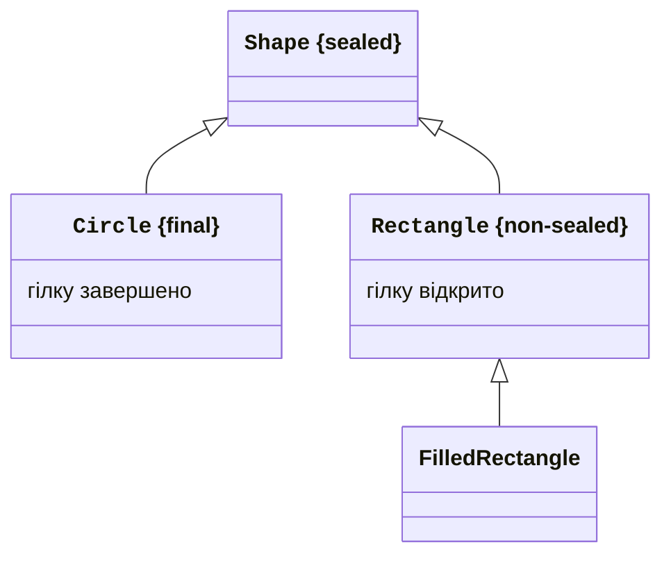
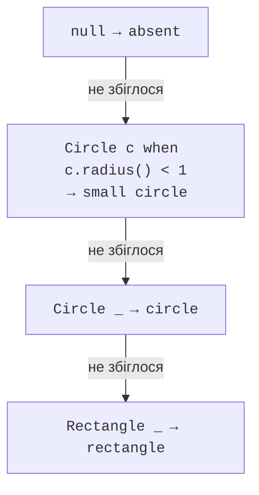

# Запечатані типи та зразки

## Sealed обмежує прямі підтипи

Звичайний відкритий клас дозволяє створювати нові підкласи поза поточним файлом. `final` забороняє всі підкласи. `sealed` займає проміжне положення: тип явно визначає дозволені безпосередні підтипи через `permits`. Це корисно, коли модель повинна мати контрольований набір альтернатив.

Прямий підклас sealed класу має бути `final`, `sealed` або `non-sealed`. Фінальний завершує гілку, sealed продовжує контрольований перелік, non-sealed знову відкриває свою гілку. Для реалізації sealed інтерфейсу запис підходить природно: record уже неявно final. Звичайний інтерфейс-підтип може бути sealed або non-sealed, але не final.

Дозволені підтипи мають належати тому самому іменованому модулю; в неіменованому модулі вони мають бути в тому самому пакеті. Якщо всі прямі підтипи оголошено в одному файлі, permits може бути виведено, але явний список часто краще пояснює початківцю межі моделі.



Рис. 8.3. Закриті й відкриті гілки запечатаної ієрархії {.caption}

Схема показує загальну можливість відкритої гілки Rectangle. У повній програмі нижче обидві конкретні фігури є записами й тому фінальні: це інший, повністю закритий варіант моделі.

Sealed не робить поля незмінними й не перевіряє інваріанти. Він контролює структуру підтипів. Незмінність компонентів, відсутність null та допустимі розміри потрібно забезпечити окремо. Поєднання sealed інтерфейсу й записів часто дає компактну модель альтернатив із перевіреними даними.

## Зразки типів, область дії та null

`instanceof Circle circle` перевіряє тип і вводить посилання circle там, де успіх доведений потоком керування. У правій частині логічного `&&` змінна доступна, бо ліва перевірка вже істинна. Після запереченої перевірки з раннім return змінна може бути доступна далі: невідповідна гілка завершилася.

`switch` зі зразками переносить таке розгалуження до списку випадків. `case Circle c ->` працює з об’єктами відповідного типу. Охоронна умова `when` додатково перевіряє значення, наприклад малий радіус. Випадок із умовою не замінює загальну гілку типу, якщо умова може бути хибною.

Порядок має значення. Загальний випадок типу перед вужчим робить останній недосяжним – він домінує над ним. Компілятор відхиляє таку структуру. Спочатку пишіть спеціальні випадки й умови, потім загальні. `case null` задає явну поведінку для відсутності об’єкта; звичайний default сам по собі не означає обробку null.



Рис. 8.4. Тип, охоронна умова та загальний випадок {.caption}

## Приклад 3. Запечатані фігури

Shape має лише Circle і Rectangle. Кожний запис перевіряє скінченність і додатність розмірів. Switch area вичерпний без default: компілятор знає обидва прямі підтипи. Якщо додати нову фігуру, повторна компіляція вимагатиме доповнити обчислення.

```java
sealed interface Shape permits Circle, Rectangle { }
record Circle(double radius) implements Shape {
    Circle { Dimensions.check(radius); }
}
record Rectangle(double width, double height) implements Shape {
    Rectangle {
        Dimensions.check(width);
        Dimensions.check(height);
    }
}
final class Dimensions {
    private Dimensions() { }
    static void check(double value) {
        if (!Double.isFinite(value) || value <= 0 || value > 10_000) {
            throw new IllegalArgumentException("Invalid dimension");
        }
    }
}
public class Main {
    static double area(Shape shape) {
        return switch (shape) {
            case null -> throw new IllegalArgumentException(
                    "No shape");
            case Circle(double r) -> Math.PI * r * r;
            case Rectangle(double w, double h) -> w * h;
        };
    }
    static String kind(Shape shape) {
        return switch (shape) {
            case null -> "absent";
            case Circle c when c.radius() < 1 -> "small circle";
            case Circle _ -> "circle";
            case Rectangle _ -> "rectangle";
        };
    }
    public static void main(String[] args) {
        Shape[] shapes = {new Circle(0.5), new Rectangle(3, 4)};
        for (Shape shape : shapes) {
            System.out.printf(java.util.Locale.ROOT, "%s %.2f%n",
                    kind(shape), area(shape));
        }
        System.out.println(kind(null));
        try {
            new Circle(Double.NaN);
        } catch (IllegalArgumentException ex) {
            System.out.println(ex.getMessage());
        }
    }
}
```

```text
small circle 0.79
rectangle 12.00
absent
Invalid dimension
```

`case Circle(double r)` – зразок запису, який розкладає компонент через його аксесор. Тут тип компонента вже double; це стабільне використання зразка запису, не preview перевірка довільного Object на примітивний тип. `Circle _` перевіряє тип, але не вводить імені, бо об’єкт у тілі не потрібний.

Вичерпність описує всі ненульові альтернативи sealed моделі; обробку null ми додали явно. У production-коді часто конструктор контейнера забороняє null, проте публічна функція все одно повинна мати задокументовану політику його приймання.
