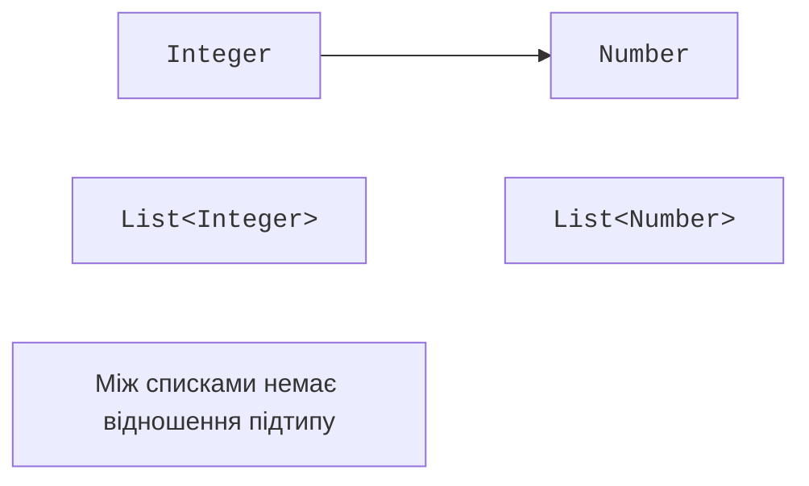

# Обмеження та інваріантність

## Обмежені параметри типів

Запис `<T extends Number>` дозволяє використовувати методи `Number`, наприклад `doubleValue`. Слово `extends` застосовується і до класової, і до інтерфейсної межі. Без явної межі використовується `Object`, тому довільний `T` не має методів арифметики чи порівняння.

Для природного порядку часто потрібна межа `<T extends Comparable<? super T>>`. Вона дозволяє типу порівнюватися не лише точно з самим собою, а й із його супертипом. Це корисно, коли підклас успадкував порівняння з базового класу, не оголошуючи новий Comparable підкласу.

### Приклад 2. Максимум трьох значень

```java
import java.time.LocalDate;
import java.util.Objects;

public class Main {
    static <T extends Comparable<? super T>> T maximum(
            T first, T second, T third) {
        Objects.requireNonNull(first);
        Objects.requireNonNull(second);
        Objects.requireNonNull(third);
        T best = first;
        if (second.compareTo(best) > 0) best = second;
        if (third.compareTo(best) > 0) best = third;
        return best;
    }

    public static void main(String[] args) {
        System.out.println(maximum(4, 9, 2));
        System.out.println(maximum("pear", "apple", "plum"));
        var first = LocalDate.of(2026, 9, 1);
        System.out.println(maximum(
            first, first.plusDays(2), first.plusDays(1)));
    }
}
```

```text
9
plum
2026-09-03
```

При рівності метод зберігає перший максимум. Це правило нічиєї не записане в типі, але є частиною поведінки. Порівняння рядків лексикографічне й не є повноцінним мовним сортуванням українських назв. Для іншого порядку передають окремий `Comparator`.

Кілька меж розділяють `&`: `<T extends Base & Named & Runnable>`. Якщо є класова межа, вона записується першою; решта – інтерфейси. Так алгоритм оголошує потрібні можливості, а не перелічує всі допустимі конкретні класи. Надлишкові межі безпідставно звужують API.

### Від межі до контракту обчислення

Межа `Number` не дозволяє писати `a + b` для довільних `T`. Різні числові класи мають різні правила точності та переповнення. Перетворення всього на `doubleValue()` дає спільну операцію, але може втратити точність великого `Long` чи `BigDecimal`. Такий перехід потрібно називати наближеним обчисленням.

Узагальнений числовий алгоритм іноді повинен отримувати стратегію додавання та нульове значення як окремий об’єкт. Це складніше за межу `Number`, але чесно описує необхідні операції. У цій темі достатньо не обіцяти математичних гарантій, яких статична межа насправді не забезпечує.

## Інваріантність і відмінність від масивів

`Integer` є підтипом `Number`, але `Box<Integer>` не є підтипом `Box<Number>`. Якби таке присвоєння дозволялося, через друге посилання можна було б записати `Double`, а перше продовжувало б обіцяти `Integer`. Java робить звичайні generics інваріантними, щоб закрити цей шлях.

Масиви Java історично коваріантні. `Integer[]` можна присвоїти `Number[]`, але масив пам’ятає фактичний тип компонентів і перевіряє запис під час виконання. Неправильний запис спричиняє `ArrayStoreException`. Узагальнення переважно переносить подібні помилки до компілятора.

```java
public class Main {
    public static void main(String[] args) {
        Number[] values = new Integer[] {1, 2};
        try {
            values[0] = 2.5;
        } catch (ArrayStoreException error) {
            System.out.println("array rejects Double");
        }
        System.out.println(values[0]);
    }
}
```



Рис. 9.2. Спільний верхній тип елементів не створює присвоєння між інваріантними контейнерами. {.caption}

Інтерфейс читання сам по собі не робить параметр класу Java коваріантним. Java використовує шаблони в місці використання: `Box<? extends Number>`. На відміну від деяких інших мов, модифікаторів `out` і `in` у декларації параметра Java немає.
