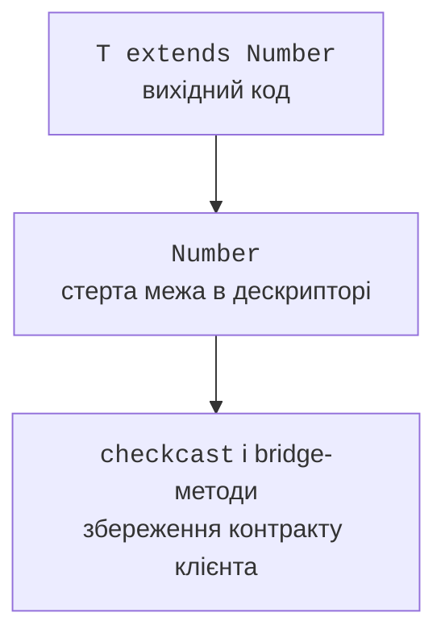
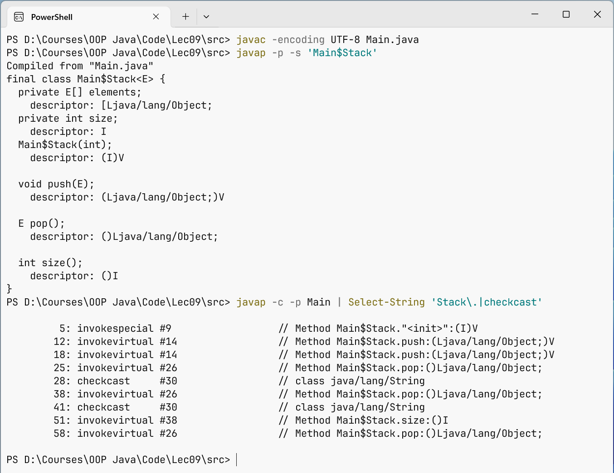

# Стирання типів і його наслідки

## Стирання типів і згенеровані мости

Компілятор перевіряє generics, а для виконання JVM переважно стирає аргументи типів. Необмежений `T` замінюється на `Object`, обмежений – на першу межу. У місці використання компілятор може вставити приведення до очікуваного типу.



Рис. 9.4. Перевірений вихідний контракт компілюється зі стертим типом і приведенням у викликачі. {.caption}

Інформація про generic-сигнатуру може залишатися в метаданих class-файла для інструментів і рефлексії. Це не означає, що кожен екземпляр `ArrayList<String>` має runtime-перевірку кожного елемента за String. Розрізняйте опис декларації і фактичний тип значення в довільному контейнері.

Bridge-методи підтримують поліморфне перевизначення після стирання. Наприклад, клас із `Comparable<Student>` реалізує `compareTo(Student)`, а компілятор може додати міст `compareTo(Object)`, який виконує приведення й викликає типізований метод. Це деталь згенерованого коду, яку не потрібно вручну дублювати у звичайному класі.



Рис. 9.5. Javap показує стерті сигнатури та вставлені приведення. {.caption}

Команда `javap -c -p` показує інструкції й приватні члени. Для подробиць прапорців bridge/synthetic використовують `javap -v`. Згенеровані назви локальних елементів можуть змінюватися між версіями компілятора; перевіряти слід зміст сигнатур і перевірок, а не випадковий номер у constant pool.

## Обмеження узагальнень

Не можна створити `new T()`, оскільки стертий тип не визначає конструктор. Замість цього передають фабрику або інший явно типізований механізм створення. `new T[]` також не дозволено: масив має знати runtime-тип компонентів, а generics його стирає.

Статичне поле не може мати тип параметра екземпляра класу: статична область одна для всіх параметризацій. `Box<String>` і `Box<Integer>` не отримують окремі копії static-поля. Статичний метод може оголосити власний незалежний `<T>`.

Не можна перевантажити два методи лише як `List<String>` і `List<Integer>`, якщо після стирання сигнатури збігаються. Виберіть різні імена або інший набір параметрів. Узагальнений клас також не може бути прямим чи непрямим підкласом `Throwable`. Типізований результат помилки краще виразити окремою моделлю.

Перевірка довільного `Object` через `instanceof List<String>` не доводить параметризацію й не є загальним доступним тестом. `instanceof List<?>` перевіряє зовнішній контейнер. Новіші правила мови дозволяють окремі перевірки параметризованих типів, коли потрібну сумісність уже доведено статично; це не дозволяє перевірити довільний вміст списку за один крок.

## Приклад 4. Стек на масиві

Масив є внутрішнім сховищем, яке ніколи не повертається клієнту. Усі записи проходять через `push(E)`, тому не порушують елементний контракт. Це дозволяє локалізувати неперевірене приведення під час створення сховища та пояснити його інваріант.

```java
import java.util.Arrays;
import java.util.NoSuchElementException;
import java.util.Objects;

public class Main {
    static final class Stack<E> {
        private E[] elements;
        private int size;

        @SuppressWarnings("unchecked")
        Stack(int capacity) {
            if (capacity < 1) {
                throw new IllegalArgumentException("capacity");
            }
            elements = (E[]) new Object[capacity];
        }

        void push(E value) {
            Objects.requireNonNull(value);
            if (size == elements.length) {
                int capacity = Math.multiplyExact(size, 2);
                elements = Arrays.copyOf(elements, capacity);
            }
            elements[size++] = value;
        }

        E pop() {
            if (size == 0) throw new NoSuchElementException("empty");
            int index = --size;
            E value = elements[index];
            elements[index] = null;
            return value;
        }

        int size() { return size; }
    }

    public static void main(String[] args) {
        var values = new Stack<String>(1);
        values.push("first");
        values.push("second");
        System.out.println(values.pop());
        System.out.println(values.pop());
        System.out.println(values.size());
        try {
            values.pop();
        } catch (NoSuchElementException error) {
            System.out.println(error.getMessage());
        }
    }
}
```

```text
second
first
0
empty
```

Занулення вилученої комірки прибирає зайве сильне посилання на об’єкт. Без нього масив міг би утримувати значення після логічного вилучення зі стека. Лічильник змінюється лише після перевірки порожнечі. Додавання з подвоєнням місткості має амортизовану O(1) складність, хоча окреме розширення копіює O(n).

Приведений масив фактично залишається `Object[]`, а не `String[]`. Якщо віддати його клієнту як `E[]`, зовнішнє приведення може завершитися помилкою. Тому API повертає окремі `E`, а не внутрішній масив. Альтернатива – зберігати `Object[]` і локалізувати приведення в операції читання.
