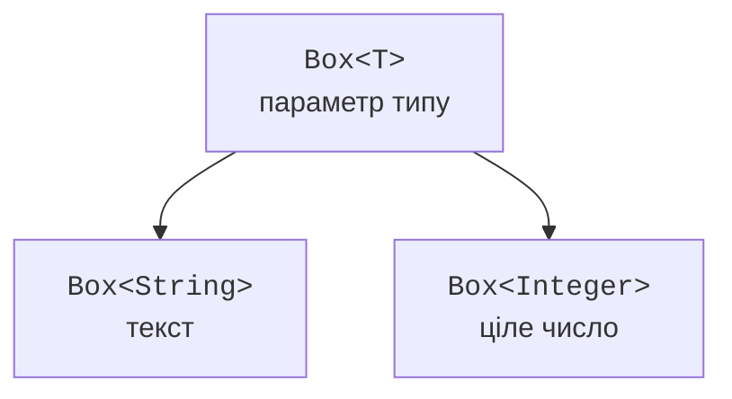

# Параметри типів, класи та методи

## Від Object до параметра типу

Розглянемо контейнер без узагальнення. Поле `Object` приймає рядок, ціле число після упаковки або будь-який інший об’єкт. Компілятор не знає, яке значення поверне метод читання. Приведення до `Integer` лише відкладає перевірку до виконання.

```java
public class Main {
    static final class ObjectBox {
        private Object value;
        void put(Object value) { this.value = value; }
        Object get() { return value; }
    }

    public static void main(String[] args) {
        var box = new ObjectBox();
        box.put("Kotlin");
        try {
            Integer number = (Integer) box.get();
            System.out.println(number);
        } catch (ClassCastException error) {
            System.out.println("wrong runtime type");
        }
    }
}
```

Це навмисний приклад помилки, а не рекомендований спосіб зберігання даних. У `Box<T>` той самий параметр використовується для запису й читання: `void put(T value)` та `T get()`. Створення `Box<String>` зв’язує ці операції з рядком і дозволяє відхилити `put(42)` до запуску програми.



Рис. 9.1. Узагальнення переносить перевірку відповідності типу до компілятора. {.caption}

`T` є параметром типу, а `String` у `Box<String>` – аргументом типу. Імена `T`, `E`, `K`, `V` традиційно позначають тип, елемент, ключ і значення. Можна використовувати описові назви, якщо вони покращують читання складного API. Це не ключові слова мови.

Аргументами generics є посилальні типи. `Box<int>` не компілюється, але `Box<Integer>` коректний. Автоупакування робить використання зручнішим, проте `Integer` допускає `null`, має об’єктне представлення і не є просто іншою назвою примітивного `int`.

## Узагальнені класи, записи та diamond

Параметри типу оголошують після назви класу. Вони доступні в полях, конструкторах і методах екземпляра. Конструктор не повторює список типів після власної назви. Вираз `new Box<>()` використовує diamond-оператор: компілятор виводить аргументи з контексту або аргументів конструктора.

`var` виводить тип локальної змінної, але не вимикає типізацію. Вираз `var box = new Box<String>()` має конкретний тип `Box<String>`. Якщо потрібний аргумент не можна визначити з контексту, його задають явно. Надмірно загальний результат виведення, наприклад `Object`, може приховати намір автора.

### Приклад 1. Узагальнена пара

Запис зручний для простого незмінного набору компонентів. `Pair<A,B>` має два незалежні параметри, тому обмін повертає `Pair<B,A>`. Статична фабрика має власні параметри типу: статичний контекст не використовує параметри екземпляра запису.

```java
import java.util.Objects;

public class Main {
    record Pair<A, B>(A first, B second) {
        Pair {
            Objects.requireNonNull(first);
            Objects.requireNonNull(second);
        }

        static <X, Y> Pair<X, Y> of(X first, Y second) {
            return new Pair<>(first, second);
        }

        Pair<B, A> swap() {
            return new Pair<>(second, first);
        }
    }

    public static void main(String[] args) {
        Pair<String, Integer> result = Pair.of("Ada", 95);
        var swapped = result.swap();
        System.out.println(result);
        System.out.println(swapped);
        System.out.println(result.equals(swapped.swap()));
    }
}
```

```text
Pair[first=Ada, second=95]
Pair[first=95, second=Ada]
true
```

Конструктор запису явно забороняє `null`. Сам синтаксис generics такої заборони не створює. Компоненти запису є final-посиланнями, але якщо вони вказують на змінювані об’єкти, запис не стає глибоко незмінним. Захисне копіювання може бути частиною конструктора конкретної моделі.

Типи `Pair<String,Integer>` і `Pair<Integer,String>` залишаються різними на рівні компілятора, хоча реалізація запису одна. Не слід очікувати, що перевірка `equals` обов’язково порівнює параметри generics як окремі runtime-мітки: вони переважно стерті.

## Узагальнені методи й виведення аргументів

Параметри узагальненого методу оголошують перед типом результату: `static <T> T identity(T value)`. Цей `T` належить саме методу. Якщо метод класу випадково оголосить власний параметр з таким самим ім’ям, він затінить параметр класу й ускладнить читання. Для незалежних ролей використовуйте різні назви.

Аргумент типу можна задати явно: `Main.<String>identity("text")`. Зазвичай виведення достатньо, але явний аргумент допомагає пояснити складний виклик. Узагальненість потрібна, коли є зв’язок між кількома параметрами або між входом і результатом; не варто додавати `<T>` до методу, який однаково працює з `Object`.

Наприклад, `void print(Object value)` уже приймає будь-який об’єкт. Натомість `<T> T choose(T first, T second)` зберігає зв’язок типу повернутого значення з аргументами. Компілятор може знайти спільний верхній тип різних аргументів; тому контекст очікуваного результату також важливий.
