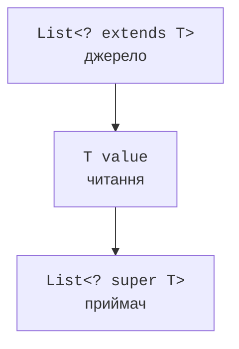

# Шаблони та принцип PECS

## Шаблони й принцип PECS

`?` означає невідомий, але конкретний для цього об’єкта тип. `List<?>` не дорівнює `List<Object>`: до списку Object можна додати довільний об’єкт, а до списку невідомого типу – не можна. Читати можна як `Object`. Запис `null` у деякі шаблонні контейнери типово можливий на рівні типів, але сама реалізація колекції може його забороняти.

`? extends T` обмежує невідомий тип зверху. З такого джерела можна отримати `T`, але не можна довільно записати конкретний підтип: фактичний тип може бути іншим. `? super T` обмежує тип знизу: він приймає значення `T`, а результат читання без додаткової інформації має лише загальний тип `Object`.

PECS означає *Producer Extends, Consumer Super*: виробник значень використовує extends, споживач – super. Це правило напряму потоку даних, а не вимога завжди ставити шаблон. Контейнер, у який потрібно і читати, і писати той самий точний тип, часто має бути просто `List<T>`.



Рис. 9.3. Джерело виробляє T, приймач дозволяє запис T. {.caption}

### Приклад 3. Числова сума та копіювання

Колекції тут використовуються лише як готові послідовності елементів; повна ієрархія буде в наступній темі. `List.of` створює список значень, а `ArrayList` – змінюваний список. Операція copy додає елементи до кінця приймача.

```java
import java.util.ArrayList;
import java.util.List;

public class Main {
    static double sum(List<? extends Number> source) {
        double total = 0.0;
        for (Number value : source) {
            if (value == null
                    || !Double.isFinite(value.doubleValue())) {
                throw new IllegalArgumentException("finite numbers");
            }
            total += value.doubleValue();
        }
        if (!Double.isFinite(total)) {
            throw new IllegalArgumentException("sum overflow");
        }
        return total;
    }

    static <T> void copy(
            List<? super T> destination,
            List<? extends T> source) {
        var snapshot = new ArrayList<T>(source);
        for (T value : snapshot) destination.add(value);
    }

    public static void main(String[] args) {
        var numbers = List.of(2, 4, 6);
        System.out.println(sum(numbers));
        List<Object> destination = new ArrayList<>();
        copy(destination, numbers);
        copy(destination, List.of("ready"));
        System.out.println(destination);
        var repeated = new ArrayList<>(List.of(1, 2));
        copy(repeated, repeated);
        System.out.println(repeated);
    }
}
```

```text
12.0
[2, 4, 6, ready]
[1, 2, 1, 2]
```

Знімок джерела потрібний не через generics, а через можливий збіг джерела й приймача. Без нього структурна зміна під час обходу могла б зірвати операцію. Типобезпечна сигнатура не гарантує автоматично правильний контракт стану.

Якщо приймач відхиляє елемент або не підтримує додавання, метод може завершитися з помилкою після частини записів. Це не транзакційне копіювання. Якщо потрібна атомарність пакета, її проєктують окремо: повна перевірка, нова структура й заміна стану лише після успішного формування.

## Захоплення шаблону та допоміжний метод

Невідомий тип із `List<?>` можна тимчасово назвати параметром допоміжного методу. Це називається захопленням шаблону. Так компілятор може довести, що прочитаний елемент повертається в той самий список, не знаючи його конкретного класу.

```java
import java.util.ArrayList;
import java.util.List;

public class Main {
    static void swapFirstTwo(List<?> values) {
        swap(values);
    }

    private static <T> void swap(List<T> values) {
        if (values.size() < 2) return;
        T first = values.get(0);
        values.set(0, values.get(1));
        values.set(1, first);
    }

    public static void main(String[] args) {
        var words = new ArrayList<>(List.of("A", "B", "C"));
        swapFirstTwo(words);
        System.out.println(words);
    }
}
```

Тут не потрібне приведення до `List<Object>`: воно втратило б саму гарантію, яку намагаємося зберегти. Допоміжний параметр позначає один і той самий невідомий тип для читання й запису. Список із нулем або одним елементом залишається без змін.
