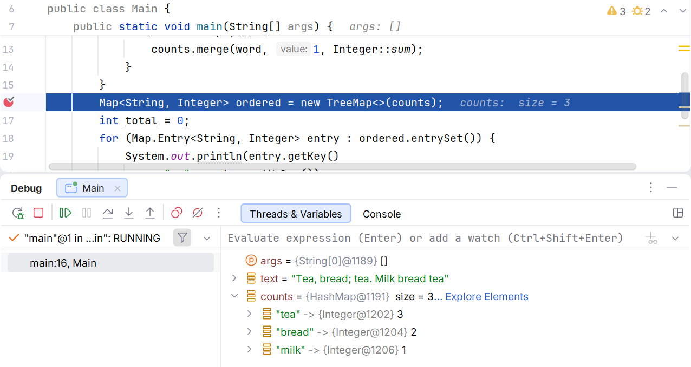

# Копії, обгортки та вибір колекції

## Копії, обгортки та спеціальні класи

`Collections.unmodifiableList(source)` забороняє модифікації через обгортку, але відображає подальші зміни source. `List.copyOf` надає незмінний список зі знімком елементів на момент виклику. Жоден з цих засобів не робить глибокої копії змінюваних елементів. У контрактах API треба окремо описувати змінюваність контейнера й змінюваність об’єктів усередині.

Алгоритми `Collections.sort`, `reverse`, `shuffle`, `frequency`, `min`, `max` працюють через відповідні інтерфейси. `nCopies` створює незмінний список повторень того самого посилання; це не фабрика незалежних об’єктів. Для випадкового перемішування в тестах використовуйте генератор з фіксованим seed.

`EnumSet` і `EnumMap` спеціалізовані для enum-ключів і часто точніше виражають скінченний набір станів. EnumSet не приймає null; EnumMap не приймає null-ключі, але допускає null-значення. Порядок обходу узгоджений з порядком оголошення enum-констант.

Звичайні ArrayList, HashMap і ArrayDeque не є потокобезпечними. Синхронізована обгортка не робить складену послідовність «перевірити, потім змінити» автоматично неподільною. Конкурентні структури мають окремі гарантії, які розглядатимуться пізніше; не обирайте їх лише для приховування помилки ітератора.

## Від вимог до перевірюваного рішення

Розглянемо журнал подій, де потрібно зберегти кожне надходження, швидко знаходити останній стан за id і показувати хронологію. Одна структура не обов’язково має виконувати всі ролі. Список подій є джерелом історії, а словник останніх станів може бути похідним індексом. Тоді слід чітко визначити, коли оновлюється індекс і як його відновити, щоб дві структури не суперечили одна одній.

Якщо ж історія не потрібна, словник з унікальним id може бути єдиним джерелом істини. Звіт формують із його entrySet, копіюючи й сортуючи лише потрібне подання. Не слід обирати LinkedHashMap лише тому, що в першому прикладі він дав гарний порядок: порядок вставлення та порядок за датою можуть різнитися.

Контракт повернення колекції має відповідати відповідальності класу. Якщо getter повертає внутрішній змінюваний список, клієнт може обійти перевірку унікальності id чи місткості. Незмінна копія захищає структуру, а спеціальний метод додавання залишає контроль інваріанта всередині класу. Повернення живого подання також допустиме, але його зміст і життєвий цикл повинні бути явно описані.

Перевірки колекційного алгоритму зручно будувати навколо властивостей. Сортування не змінює кількість і мультимножину елементів; об’єднання множин містить кожен елемент обох джерел; витіснення з LRU не перевищує місткість; перенесення з черги до журналу не втрачає й не дублює заявки. Такі перевірки виявляють більше помилок, ніж один збіг надрукованого рядка.

Окремі тести повинні розрізняти однаковий ключ і однакове значення. Дві книги можуть мати однакову назву, але різні id; два замовлення – однакову суму, але різний час. Якщо тестові дані ніколи не містять нічиєї, помилка компаратора чи випадкове видалення повторів може залишитися непомітною.

| Перевірка | Що вона виявляє |
| --- | --- |
| Порожній набір | Необґрунтований getFirst, min або ділення на нуль |
| Повторний ключ | Неописану політику заміни чи об’єднання |
| Рівні ключі сортування | Нестабільний звіт або втрату запису в TreeSet |
| Зміна джерела | Плутанину між копією й живим поданням |
| Операція після вилучення | Некоректний стан ітератора чи черги |

Рис. 10.7. Перегляд словника в налагоджувачі IntelliJ IDEA {.caption}
