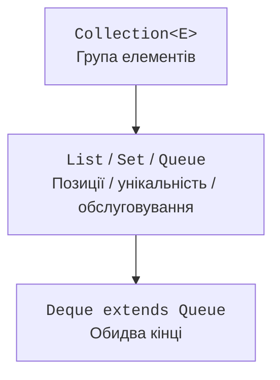
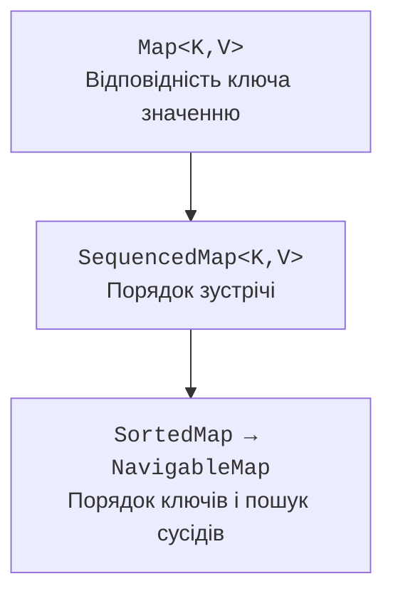
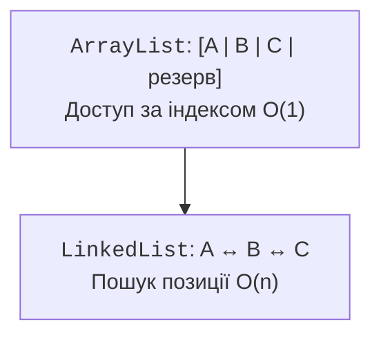

# Інтерфейси колекцій і списки

## Карта інтерфейсів

`Collection<E>` описує групу елементів: розмір, перевірку порожності, належності, додавання, вилучення та ітерацію. `List<E>` додає позиції й дозволяє повтори; `Set<E>` задає унікальність; `Queue<E>` описує вибір наступного елемента; `Deque<E>` дозволяє працювати з обома кінцями. Підтримка конкретної операції може бути необов’язковою: незмінна колекція існує в цій ієрархії, але відхиляє модифікації.

`Map<K,V>` не успадковує `Collection`: його елемент логічно є відповідністю ключа значенню. `keySet`, `values` і `entrySet` надають колекційні подання різних частин словника. Ключ унікальний, але значення можуть повторюватися.



Рис. 10.1. Основні контракти колекцій: від загальної групи до спеціальних операцій. {.caption}

Починаючи з Java 21, `SequencedCollection<E>` об’єднує колекції з визначеним порядком зустрічі. Він має операції першого й останнього елементів і `reversed()`. `List` і `Deque` входять до цієї моделі; `SequencedSet` поєднує порядок з унікальністю. Порядок зустрічі не обов’язково є порядком сортування.

`SequencedMap<K,V>` надає `firstEntry`, `lastEntry`, операції розміщення на кінцях і зворотне подання. `LinkedHashMap` зберігає порядок вставлення або доступу, `SortedMap` – порядок ключів. Відсортована структура не дозволяє довільно переставляти ключ на початок методом `putFirst`: це суперечило б її інваріанту.



Рис. 10.2. Словники з довільним, послідовним і відсортованим порядком. {.caption}

## Складність і характер доступу

Оцінка складності описує зростання кількості операцій зі збільшенням даних. Вона не замінює вимірювань. Компактний масив часто швидший за вузли завдяки локальності пам’яті, навіть якщо обидва алгоритми мають однакову асимптотику. Для невеликих навчальних наборів спершу обирають правильний контракт, потім усувають доведені вузькі місця.

| Структура | Доступ за індексом | Пошук значення | Типове додавання |
| --- | --- | --- | --- |
| `ArrayList` | O(1) | O(n) | O(1), амортизовано в кінець |
| `LinkedList` | O(n) | O(n) | O(1) на відомому кінці |
| `HashSet` | немає | очікувано O(1) | очікувано O(1) |
| `TreeSet` | немає | O(log n) | O(log n) |
| `ArrayDeque` | немає | O(n) | O(1), амортизовано на кінці |

Для хеш-структур очікувана стала складність потребує належного розподілу хешів. Для списку додавання всередину потребує зсуву або пошуку позиції. Фраза «LinkedList швидко вставляє» неповна: якщо спочатку треба знайти тисячну позицію, цей пошук лінійний.

## Списки та представлення масивів

`ArrayList` зберігає елементи в масиві змінної місткості. Логічний розмір і місткість різні: резерв не є набором заповнених елементів. `get` і `set` звертаються до наявної позиції; `add` створює нову, а `remove` змінює розмір. Попереднє резервування допомагає, коли приблизна кількість даних відома, але не слід резервувати довільно великий масив лише «про запас».

`LinkedList` має двозв’язні вузли та реалізує і `List`, і `Deque`. Він не є стандартним вибором для всіх черг: `ArrayDeque` зазвичай має менші накладні витрати, якщо потрібні лише операції кінців. Нульові значення в черзі краще не зберігати навіть там, де клас це допускає: `poll` використовує `null` для позначення порожності.



Рис. 10.3. Масив посилань і зв’язані вузли: однакові значення, різна організація. {.caption}

Перевантаження `remove` є типовою пасткою. Для `List<Integer>` виклик `remove(1)` видаляє елемент з індексом 1. Щоб вилучити саме число 1, передають `Integer.valueOf(1)`. У коді рев’ю варто перевіряти не лише назву методу, а й статичний тип аргументу.

`List.of(...)` створює список, який не можна змінювати і який не допускає `null`. `Arrays.asList(array)` повертає список фіксованого розміру, пов’язаний із масивом: заміна через `set` дозволена, додавання й видалення – ні. Передавання примітивного `int[]` створює список з одним елементом-масивом, а не список Integer.

`subList(from, to)` є поданням частини списку, де права межа не входить. Зміна через подання відображається у вихідному списку. Структурні зміни основного списку поза цим поданням можуть зробити подальшу роботу з поданням некоректною. Для незалежного результату використовують `new ArrayList<>(subList)` або `List.copyOf`.

### Приклад 1. Редагування списку покупок

Програма видаляє порожні назви через ітератор, прибирає перше входження конкретного товару та сортує результат. Вхідний список є змінюваним: обгортання `List.of` в `ArrayList` робить це явним. Сортування відбувається за природним порядком рядків.

```java
import java.util.ArrayList;
import java.util.Iterator;
import java.util.List;

public class Main {
    public static void main(String[] args) {
        List<String> items = new ArrayList<>(
            List.of("tea", "", "bread", "tea", "milk")
        );
        Iterator<String> iterator = items.iterator();
        while (iterator.hasNext()) {
            if (iterator.next().isBlank()) iterator.remove();
        }
        items.remove("tea");
        items.sort(null);
        System.out.println(items);
        List<String> snapshot = List.copyOf(items);
        items.addFirst("water");
        System.out.println(items.reversed());
        System.out.println(snapshot);
        List<Integer> numbers = new ArrayList<>(List.of(1, 2, 1));
        numbers.remove(Integer.valueOf(1));
        System.out.println(numbers);
    }
}
```

```text
[bread, milk, tea]
[tea, milk, bread, water]
[bread, milk, tea]
[2, 1]
```

`snapshot` не змінюється після додавання води. Зворотне подання натомість відображає поточний список. Це різні контракти, хоча обидва результати можна обійти однаковим циклом.
