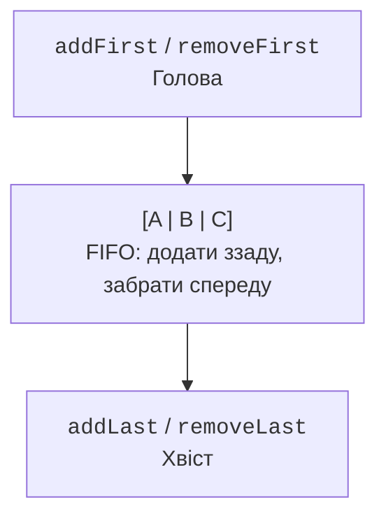

# Ітератори, множини та черги

## Ітератори та структурні зміни

Ітератор відокремлює алгоритм обходу від будови контейнера. `hasNext` перевіряє наявність наступного елемента; `next` повертає його або кидає `NoSuchElementException`. Після допустимого `next` метод `remove` може вилучити поточний елемент, якщо реалізація підтримує цю операцію. Два `remove` поспіль без нового `next` порушують стан ітератора.

Звичайний enhanced-for використовує ітератор приховано. Видалення через сам список усередині такого циклу зазвичай виявляється як `ConcurrentModificationException`. Це може відбутися в одному потоці виконання: назва винятку не означає обов’язкову багатопотоковість. Fail-fast є діагностикою на основі найкращих зусиль, а не механізмом синхронізації чи гарантованим виявленням усіх помилок.

`ListIterator` дозволяє рухатися в обох напрямках, замінювати елемент і вставляти новий у визначеній позиції. Його курсор стоїть між елементами. Після вставлення слід уважно перевіряти, який елемент поверне `next` або `previous`; інакше легко пропустити значення або повторно обробити його.

## Множини та рівність

Множина зберігає унікальні елементи. `HashSet` визначає рівність через `equals` і використовує `hashCode` для пошуку кандидата. `LinkedHashSet` додає передбачуваний порядок зустрічі. `TreeSet` використовує порівняння: якщо компаратор повертає нуль, другий елемент вважається вже наявним незалежно від інших полів.

Звідси випливає небезпечний випадок: компаратор студентів лише за балом перетворює двох різних студентів з однаковим балом на один елемент TreeSet. Якщо потрібні всі студенти, додають id як другий ключ або використовують список. Порядок має бути узгоджений з `equals`, якщо множина повинна виконувати загальний контракт Set.

`NavigableSet` надає сусідів: `lower` і `higher` шукають строго менше й більше, `floor` і `ceiling` допускають рівність. `headSet`, `tailSet` і `subSet` утворюють подання діапазонів. Спроба вставити через таке подання елемент за його межами відхиляється, навіть якщо основне дерево могло б його зберегти.

### Приклад 2. Операції над тегами

Копіювання перед `retainAll` чи `removeAll` зберігає початкові множини. У прикладі LinkedHashSet робить порядок результату стабільним, що корисно для звітів і автоматичних перевірок.

```java
import java.util.LinkedHashSet;
import java.util.List;
import java.util.Set;
import java.util.TreeSet;

public class Main {
    public static void main(String[] args) {
        Set<String> first = new LinkedHashSet<>(
            List.of("java", "oop", "java", "test")
        );
        Set<String> second = Set.of("oop", "files");
        Set<String> common = new LinkedHashSet<>(first);
        common.retainAll(second);
        Set<String> onlyFirst = new LinkedHashSet<>(first);
        onlyFirst.removeAll(second);
        System.out.println(first);
        System.out.println(common);
        System.out.println(onlyFirst);
        TreeSet<Integer> marks = new TreeSet<>(List.of(60, 75, 90));
        System.out.println(marks.floor(80));
        System.out.println(marks.ceiling(90));
        System.out.println(marks.higher(90));
    }
}
```

```text
[java, oop, test]
[oop]
[java, test]
75
90
null
```

Не робіть перевірку виводу HashSet залежною від випадкового порядку конкретного запуску. Якщо задача потребує порядку, оберіть відповідну структуру або явно відсортуйте результат.

## Черги та двобічні черги

Черга відокремлює правило обслуговування від фізичної позиції елемента. У FIFO першим обслуговується той, хто раніше надійшов. У черзі пріоритетів наступний елемент визначається компаратором. `PriorityQueue` не гарантує повністю відсортований порядок ітерації: щоб отримати порядок обслуговування, послідовно викликають `poll` або сортують окрему копію.

| Дія | Виняток при неможливості | Спеціальний результат |
| --- | --- | --- |
| Додати | `add` | `offer` |
| Вилучити голову | `remove` | `poll` |
| Переглянути голову | `element` | `peek` |

Для необмеженої ArrayDeque `offer` зазвичай успішний; у загальному інтерфейсі Queue допускаються й обмежені реалізації. `poll` та `peek` повертають `null` для порожньої черги. ArrayDeque забороняє нульові елементи, отже результат не двозначний.



Рис. 10.4. Операції двох кінців дозволяють реалізувати FIFO та LIFO. {.caption}

Для стека достатньо `push`, `pop`, `peek` через `Deque<E>`. Клас `Stack` є історичним нащадком Vector; новий код зазвичай обирає ArrayDeque. Це рішення стосується контракту й накладних витрат, а не того, що старий клас перестав працювати.

### Приклад 3. Обслуговування заявок

Менше число означає вищий пріоритет. Лічильник надходження розв’язує нічию й забезпечує передбачуваний порядок заявок з однаковим пріоритетом. Журнал зберігає фактичне обслуговування.

```java
import java.util.ArrayDeque;
import java.util.Comparator;
import java.util.Deque;
import java.util.PriorityQueue;
import java.util.Queue;

public class Main {
    record Request(String name, int priority, long sequence) {}

    public static void main(String[] args) {
        Comparator<Request> order = Comparator
            .comparingInt(Request::priority)
            .thenComparingLong(Request::sequence);
        Queue<Request> queue = new PriorityQueue<>(order);
        queue.offer(new Request("A", 2, 0));
        queue.offer(new Request("B", 1, 1));
        queue.offer(new Request("C", 1, 2));
        Deque<String> history = new ArrayDeque<>();
        while (!queue.isEmpty()) {
            Request request = queue.remove();
            history.addLast(request.name());
        }
        System.out.println(history);
        System.out.println(history.removeLast());
        System.out.println(history);
        System.out.println(queue.poll());
    }
}
```

```text
[B, C, A]
A
[B, C]
null
```

Посилання на методи в компараторі задають ключі порівняння; синтаксис буде докладно розглянуто в наступній лекції. Важливий контракт тут – порівнювати всі поля, потрібні для однозначного порядку, і не змінювати пріоритет об’єкта, поки він у купі.
