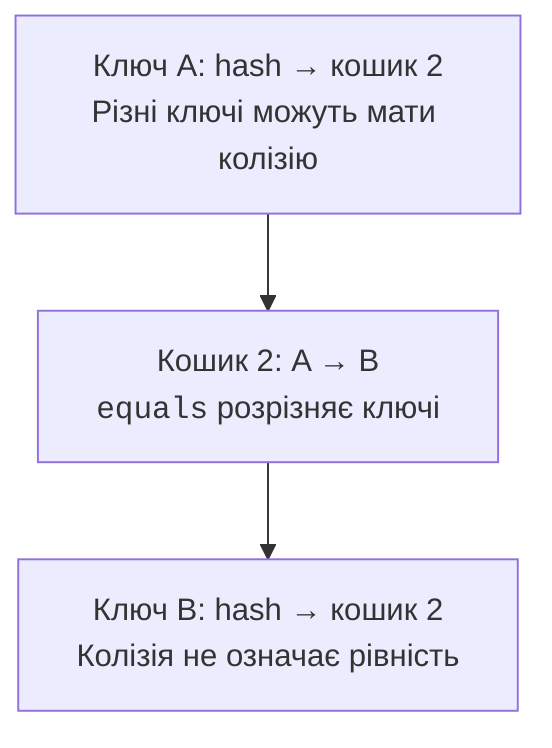
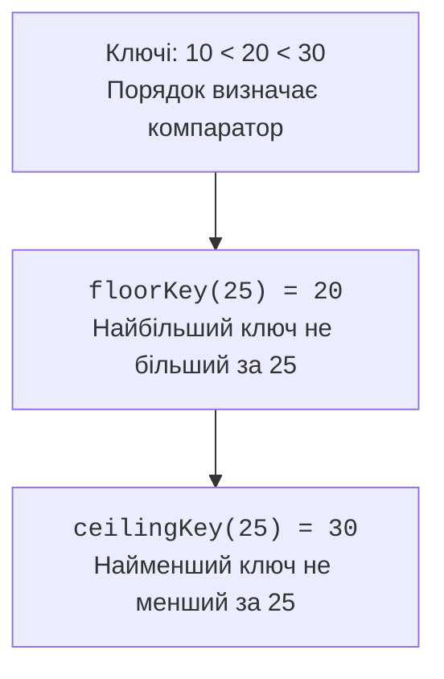

# Словники та хешування

## Словники та хешування

`HashMap` перетворює хеш ключа на номер кошика. Кілька різних ключів можуть потрапити в один кошик: це колізія, а не помилка `equals`. Усередині кошика реалізація розрізняє ключі за рівністю. Зміна місткості перерозподіляє записи; коефіцієнт заповнення дозволяє балансувати пам’ять і частоту такого розширення.



Рис. 10.5. Колізія зберігає різні ключі в одному кошику. {.caption}

У сучасному OpenJDK довгі ланцюжки за певних умов перетворюються на дерева. Відомий поріг кількості вузлів не є самостійною гарантією: враховується також місткість таблиці, і мала таблиця спершу може розширюватися. Це деталь реалізації, а не контракт, на який має спиратися прикладна логіка.

Незмінність ключа під час зберігання критична. Якщо поле, що бере участь у `hashCode` або `equals`, змінити після `put`, пошук може піти до іншого кошика. Запис фізично залишається в словнику, але звичайне `get` його не знаходить. Records зі справді незмінними компонентами часто зручні як ключі.

`containsKey` відрізняє відсутній ключ від наявного зі значенням `null`. `getOrDefault` підставляє запасне значення лише коли ключа немає, а не коли записане значення нульове. `putIfAbsent` і `computeIfAbsent` мають власну політику null, яку не слід ототожнювати з `containsKey`.

`merge(key, value, function)` зручний для накопичення: якщо значення немає або воно null, записується передане ненульове значення; інакше викликається функція об’єднання. Якщо ця функція повертає null, запис видаляється. Функція не повинна неочікувано змінювати той самий словник під час обчислення.

### Приклад 4. Частоти слів

Розбиття тут навмисно має вузький контракт: слова складаються з латинських літер, інші символи є роздільниками. Для природної мови потрібні окремі правила апострофів, дефісів і нормалізації. Словник TreeMap формує передбачуваний алфавітний звіт.

```java
import java.util.HashMap;
import java.util.Locale;
import java.util.Map;
import java.util.TreeMap;

public class Main {
    public static void main(String[] args) {
        String text = "Tea, bread; tea. Milk bread tea";
        Map<String, Integer> counts = new HashMap<>();
        for (String word : text.toLowerCase(Locale.ROOT)
                .split("[^a-z]+")) {
            if (!word.isEmpty()) {
                counts.merge(word, 1, Integer::sum);
            }
        }
        Map<String, Integer> ordered = new TreeMap<>(counts);
        int total = 0;
        for (Map.Entry<String, Integer> entry : ordered.entrySet()) {
            System.out.println(entry.getKey()
                + ": " + entry.getValue());
            total += entry.getValue();
        }
        System.out.println("total: " + total);
    }
}
```

```text
bread: 2
milk: 1
tea: 3
total: 6
```

Обхід `entrySet` дозволяє отримати ключ і значення без повторного пошуку. Подання `keySet` і `values` пов’язані зі словником; видалення через підтримувані операції подання видаляє запис. Додавання самого ключа через keySet неможливе: значення невідоме.

## Порядок ключів та порядок доступу

`TreeMap` зберігає ключі в порядку порівняння та гарантує логарифмічну складність базових операцій. `floorEntry` і `ceilingEntry` знаходять сусідні записи, а діапазонні подання дозволяють працювати з частиною словника. Для часових міток це природний спосіб знайти останній відомий стан до моменту.



Рис. 10.6. Порядок ключів визначає пошук сусіда, а не час вставлення. {.caption}

`LinkedHashMap` за замовчуванням зберігає порядок вставлення. Конструктор з `accessOrder=true` переміщує записи після певних операцій доступу, зокрема `get`, до кінця порядку. Такий словник може бути основою LRU-кешу. Політика витіснення має враховувати оновлення наявного ключа й нульову або неправильну місткість.

`reversed()` повертає живе подання, а не знімок. Зміни через доступні операції видно з обох боків. Для access-order словника навіть читання може змінити порядок, тому під час обходу не варто виконувати довільні `get` того самого словника. Докладні правила того, яка операція вважається доступом, визначає документація LinkedHashMap.
