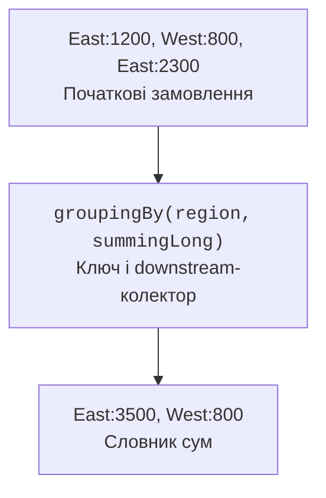

# Колектори та Gatherers

## Колектори та групування

`Collectors.groupingBy` будує словник груп. Downstream-колектор визначає, що зберігати для кожної групи: список, кількість, суму, множину перетворених значень або статистику. `partitioningBy` утворює дві логічні частини за Predicate й надає обидва ключі boolean, навіть якщо одна частина порожня.



Рис. 11.6. Класифікатор визначає ключ, downstream – результат групи. {.caption}

`toMap` без функції об’єднання відхиляє повторний ключ. Це корисний контроль унікальності, а не помилка, яку завжди треба прибрати. Якщо повтори очікувані, явно задайте політику: сума, перший, останній або об’єднання. Для передбачуваного порядку задайте фабрику словника, наприклад TreeMap.

### Приклад 3. Звіт за замовленнями

Замовлення згруповано за регіоном, а суми зберігаються в копійках. Окреме розбиття рахує дорогі й інші замовлення. Кожен звіт створює новий потік із того самого незмінного списку.

```java
import java.util.List;
import java.util.LongSummaryStatistics;
import java.util.Map;
import java.util.TreeMap;
import java.util.stream.Collectors;

public class Main {
    record Order(String region, long cents) {}

    public static void main(String[] args) {
        List<Order> orders = List.of(
            new Order("East", 1200), new Order("West", 800),
            new Order("East", 2300), new Order("West", 700)
        );
        Map<String, Long> sums = orders.stream().collect(
            Collectors.groupingBy(Order::region, TreeMap::new,
                Collectors.summingLong(Order::cents))
        );
        sums.forEach((key, value) ->
            System.out.println(key + ": " + value));
        Map<Boolean, Long> groups = orders.stream().collect(
            Collectors.partitioningBy(o -> o.cents() >= 1000,
                Collectors.counting())
        );
        System.out.println("large: " + groups.get(true));
        System.out.println("other: " + groups.get(false));
        LongSummaryStatistics stats = orders.stream()
            .mapToLong(Order::cents).summaryStatistics();
        System.out.println("total: " + stats.getSum());
        System.out.println("count: " + stats.getCount());
    }
}
```

```text
East: 3500
West: 1500
large: 2
other: 2
total: 5000
count: 4
```

Для порожньої статистики count дорівнює нулю, але службові min і max не слід показувати як реальні виміри. Перевіряйте кількість перед виведенням екстремумів. Для великих сум long також може переповнитися; предметна система повинна обмежувати діапазон або використовувати точну арифметику й перевірку.

## Примітивні потоки та Gatherers

IntStream, LongStream і DoubleStream мають спеціалізовані sum, average та summaryStatistics. Середнє повертається в OptionalDouble, бо для порожнього набору не існує визначеного середнього. `boxed()` повертає потік об’єктів; використовуйте його лише там, де наступна операція справді потребує об’єктної моделі.

Gatherers стали стабільною частиною Stream API у JDK 24. Вони розширюють проміжні операції, зокрема перетворення зі станом. `windowFixed` утворює неперекривні вікна, `windowSliding` – перекривні. `scan` повертає проміжні накопичення, тоді як звичайний reduce повертає лише остаточний результат.

### Приклад 4. Ковзне середнє

Вікно розміру три переміщується на один елемент. Контракт windowSliding має важливу межу: якщо весь непорожній потік коротший за вікно, повертається одне неповне вікно. Приклад показує цю поведінку явно, а не мовчки відкидає короткий ряд.

```java
import java.util.List;
import java.util.Locale;
import java.util.stream.Gatherers;
import java.util.stream.IntStream;

public class Main {
    static List<Double> averages(int[] values, int window) {
        if (window <= 0) {
            throw new IllegalArgumentException("window");
        }
        return IntStream.of(values).boxed()
            .gather(Gatherers.windowSliding(window))
            .map(items -> items.stream().mapToInt(Integer::intValue)
                .average().orElseThrow())
            .toList();
    }

    public static void main(String[] args) {
        for (double value : averages(new int[]{2, 4, 6, 8}, 3)) {
            System.out.printf(Locale.ROOT, "%.1f%n", value);
        }
        System.out.println(averages(new int[]{2, 4}, 3));
        System.out.println(averages(new int[0], 3));
        System.out.println(IntStream.rangeClosed(1, 4).sum());
    }
}
```

```text
4.0
6.0
[3.0]
[]
10
```

Якщо предметна задача допускає лише повні вікна, після gather додають filter за розміром. Це свідоме уточнення контракту. Вікна є незмінними списками; спроба модифікувати їх не є способом вплинути на джерело. Власні Gatherer потребують ретельного опису стану й правил об’єднання часткових результатів.
