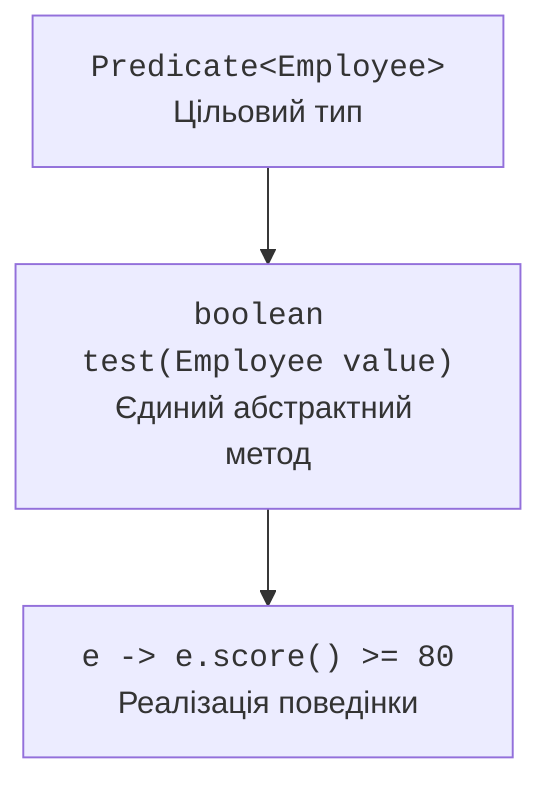

# Функціональні інтерфейси

## Функціональний інтерфейс і цільовий тип

Функціональний інтерфейс має один абстрактний метод, який задає контракт поведінки. Методи default і static не заважають цьому. Оголошення, що відповідають публічним методам Object, не додають другого функціонального контракту. Анотація `@FunctionalInterface` доручає компілятору перевірити намір автора.

Лямбда не має незалежного типу «функція з двома аргументами». Її тип визначає контекст: параметр методу, змінна або явне приведення до функціонального інтерфейсу. Тому оголошення `var rule = x -> x > 0` не дає достатньої інформації про тип. Два інтерфейси з однаковими сигнатурами не стають автоматично взаємозамінними типами.



Рис. 11.1. Цільовий інтерфейс визначає параметри та результат лямбди. {.caption}

Тіло може бути одним виразом або блоком. Для блоку, який має повернути значення, потрібен `return` на кожному допустимому шляху. Круглі дужки можна опустити для одного нетипізованого параметра, але для нуля або кількох параметрів вони потрібні. Явні типи чи `var` застосовують узгоджено до всіх параметрів.

Анонімний клас і лямбда мають важливу різницю: `this` усередині лямбди означає поточний об’єкт зовнішнього контексту. Анонімний клас має власний `this`. Лямбда не є способом оголосити новий стан об’єкта з полями й довільною кількістю методів.

Локальна змінна, яку захоплює лямбда, має бути final або ефективно final: її не переприсвоюють після ініціалізації. Це правило стосується посилання. Стан об’єкта за цим посиланням може бути змінюваним, але такі зміни створюють побічні ефекти й потребують окремого обґрунтування, особливо в паралельному потоці.

## Стандартні функціональні інтерфейси

Пакет `java.util.function` містить назви для поширених форм поведінки. Власний інтерфейс доречний, якщо предметний контракт має змістовну назву або особливі вимоги, наприклад перевірюваний виняток. Створювати власну копію Function без додаткового змісту зазвичай не потрібно.

| Інтерфейс | Метод | Контракт |
| --- | --- | --- |
| `Predicate<T>` | `test` | T → boolean |
| `Function<T,R>` | `apply` | T → R |
| `Consumer<T>` | `accept` | T → дія без результату |
| `Supplier<T>` | `get` | без аргументів → T |
| `UnaryOperator<T>` | `apply` | T → T |
| `BinaryOperator<T>` | `apply` | (T, T) → T |
| `BiFunction<T,U,R>` | `apply` | (T, U) → R |

Примітивні спеціалізації, наприклад `IntPredicate`, `ToIntFunction` і `IntUnaryOperator`, дозволяють обійтися без упаковки кожного значення в Integer. Це може бути суттєво для великих числових наборів, але вибір має залишатися читабельним і вимірюваним. Не плутайте `Function<Integer,Integer>` з `IntUnaryOperator`: це різні інтерфейси з різними назвами абстрактного методу.

`Predicate.and`, `or`, `negate` будують нові умови. `and` та `or` мають коротке замикання, тому друга умова може не виконатися. `Function.andThen` спочатку виконує поточну функцію, потім передану; `compose` задає зворотний порядок. Умова валідації повинна передувати операції, яка припускає коректні дані.

### Приклад 1. Відбір працівників за правилом

Власний інтерфейс відбору приймає поведінку, а стандартні Predicate компонують предметні умови. Мінімальний бал захоплено як effectively final. Програма не змінює початковий список.

```java
import java.util.ArrayList;
import java.util.List;
import java.util.function.Predicate;

public class Main {
    record Employee(String name, int score, boolean active) {}

    @FunctionalInterface
    interface Rule<T> {
        boolean accepts(T value);
    }

    static <T> List<T> select(List<T> source, Rule<? super T> rule) {
        List<T> result = new ArrayList<>();
        for (T item : source) {
            if (rule.accepts(item)) result.add(item);
        }
        return result;
    }

    public static void main(String[] args) {
        List<Employee> staff = List.of(
            new Employee("Ada", 90, true),
            new Employee("Bohdan", 95, false),
            new Employee("Ira", 70, true)
        );
        int minimum = 80;
        Predicate<Employee> active = Employee::active;
        Predicate<Employee> enough = e -> e.score() >= minimum;
        Predicate<Employee> combined = active.and(enough);
        List<Employee> result = select(staff, combined::test);
        result.forEach(e -> System.out.println(e.name()));
        System.out.println("source size: " + staff.size());
    }
}
```

```text
Ada
source size: 3
```

Посилання `combined::test` адаптує виклик до Rule, а не перетворює сам об’єкт Predicate на підтип Rule. Якщо предметна назва Rule не додає користі, метод select може безпосередньо приймати `Predicate<? super T>`.
