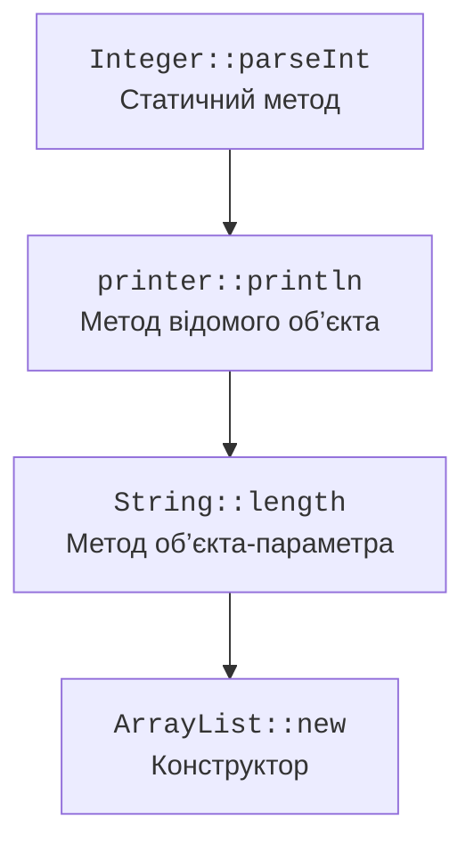

# Посилання на методи та Optional

## Посилання на методи та компаратори

Посилання на метод – короткий запис лямбди, яка делегує виклик наявному методу. Воно також потребує цільового типу. Існують статичні методи, методи конкретного об’єкта, методи довільного об’єкта певного типу та посилання на конструктор.



Рис. 11.2. Чотири форми посилання на наявну поведінку. {.caption}

У `String::length` перший параметр функції стає об’єктом, на якому викликають метод. У `printer::println` об’єкт printer вже відомий, а параметр стає аргументом println. Перевантаження розв’язуються за цільовою сигнатурою, тому неоднозначний виклик іноді потребує явного типу або звичайної лямбди.

`Comparator.comparing` і примітивні варіанти будують порядок за ключем. `thenComparing` визначає наступний ключ лише коли попередній рівний. Місце виклику `reversed()` має значення: воно може обернути весь уже побудований порядок або лише окремий компаратор. `nullsFirst` чи `nullsLast` задають політику для null, але не лікують відсутні вкладені поля автоматично.

### Приклад 2. Каталог товарів

Ціни зберігаються в цілих копійках. Товар з меншою ціною йде першим; за рівності порівнюємо назви. Лямбда перетворення та посилання на метод виконують різні ролі в одному прикладі.

```java
import java.util.ArrayList;
import java.util.Comparator;
import java.util.List;
import java.util.function.Function;

public class Main {
    record Product(String name, long cents) {}

    public static void main(String[] args) {
        List<Product> products = new ArrayList<>(List.of(
            new Product("Tea", 2500),
            new Product("Bread", 1800),
            new Product("Apple", 1800)
        ));
        products.sort(Comparator.comparingLong(Product::cents)
            .thenComparing(Product::name));
        Function<Product, String> name = Product::name;
        Function<String, String> bracket = value -> "[" + value + "]";
        Function<Product, String> label = name.andThen(bracket);
        products.forEach(p -> System.out.println(label.apply(p)));
        List<String> words = new ArrayList<>(
            List.of(" a ", " ", "b"));
        words.replaceAll(String::trim);
        words.removeIf(String::isEmpty);
        System.out.println(words);
    }
}
```

```text
[Apple]
[Bread]
[Tea]
[a, b]
```

Методи `forEach`, `removeIf`, `replaceAll`, `sort` та `Map.merge` показують, що лямбди корисні й без Stream API. Вони не обов’язково означають функціональний стиль без змін стану: replaceAll явно змінює колекцію, і це нормально, коли саме так визначено контракт.

## Optional і відсутність результату

`Optional<T>` позначає наявний ненульовий результат або його відсутність. `of` вимагає ненульового аргументу; `ofNullable` перетворює null на порожній Optional. Сам об’єкт Optional не повинен бути null: інакше він лише додає ще один спосіб відсутності.

`map` перетворює наявне значення, `filter` залишає його за умовою, `flatMap` поєднує операцію, яка вже повертає Optional. Звичайне `get` без перевірки переносить проблему null у виняток відсутнього значення. Краще сформулювати політику через `orElseThrow`, `orElseGet` або `ifPresentOrElse`.

Аргумент `orElse(buildDefault())` обчислюється перед викликом, навіть коли значення є. `orElseGet(() -> buildDefault())` викликає постачальника лише для порожнього Optional. Різниця суттєва, якщо запасне значення дороге або його обчислення має побічний ефект. Supplier відкладає поведінку, а не її результат.

Optional переважно корисний як тип повернення для звичайної відсутності. Він не замінює порожню колекцію, предметну помилку з поясненням або виняток читання файлу. Поля й параметри Optional потребують окремої причини: автоматично обгортати кожне nullable поле означає ускладнити модель без чіткої користі.
