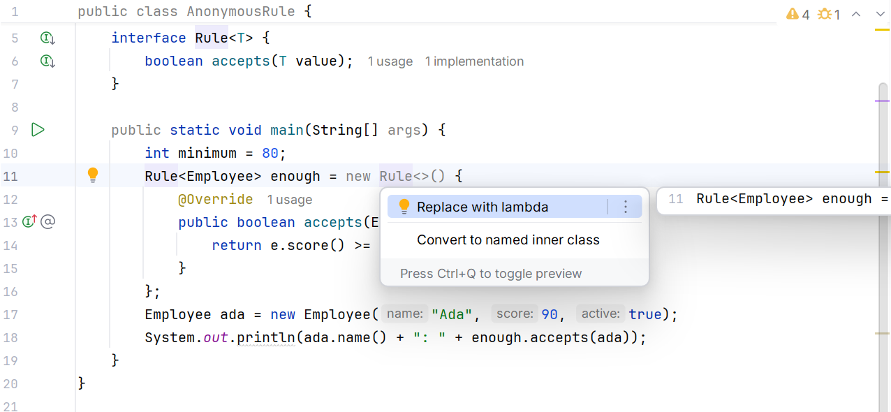
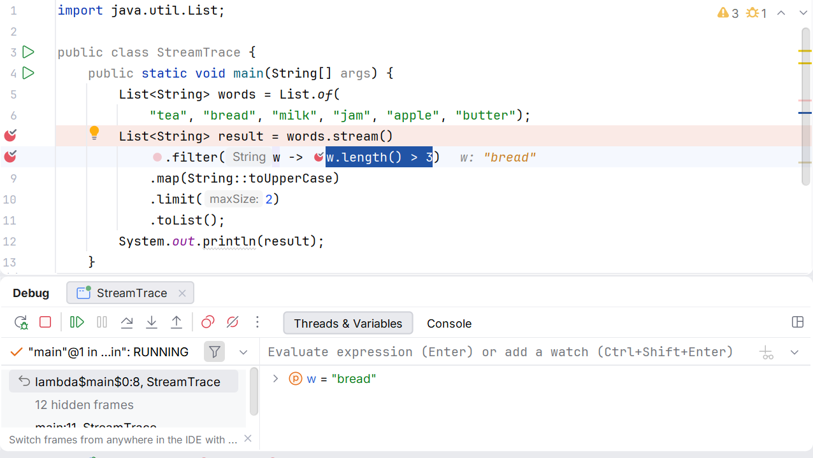

# Паралельність і перевірка конвеєра

## Паралельність, помилки та налагодження

`parallelStream` не гарантує прискорення. Розбиття, планування та злиття мають накладні витрати; невеликий набір або блокувальний ввід-вивід може працювати повільніше. Виграш перевіряють репрезентативним вимірюванням після прогріву JVM.

Побічний ефект `result.add(x)` у звичайний ArrayList з паралельного forEach некоректний. Колектор надає окремі накопичувачі та правила злиття. `forEachOrdered` зберігає порядок зустрічі, але може обмежувати паралельний виграш. `findAny` не обіцяє саме перший елемент; якщо це частина контракту, використовуйте findFirst і враховуйте порядок джерела.

Виняток усередині лямбди перериває виконання конвеєра. Не перетворюйте всі винятки на null: це приховує причину й створює нові помилки пізніше. Для очікуваних неправильних рядків краще отримати явний результат розбору з номером рядка, а для операційного збою дозволити визначеній межі програми його обробити.

## Контракт конвеєра та перевірка еквівалентності

Перед побудовою довгого конвеєра запишіть тип після кожного кроку. Наприклад, список замовлень перетворюється на потік замовлень, далі на потік позицій, потім на пари товар–кількість і нарешті на словник сум. Якщо назва змінної все ще orders, а всередині вже назви товарів, читачеві важче перевірити логіку. Короткий предметний метод часто кращий за вкладену лямбду.

Чисте перетворення зручніше тестувати: однаковий ввід дає однаковий результат і не змінює джерела. Парсинг, поточний час, випадковість і файловий доступ краще винести на межу програми або передати явно як залежності. Це не заборона побічних ефектів, а спосіб визначити місце, де вони очікувані й контрольовані.

Для важливого алгоритму корисно мати просту контрольну реалізацію циклом у тесті. Вона не повинна дослівно повторювати конвеєр: мета – незалежно перевірити суму, порядок і політику порожності. Порівняння на кількох малих наборах з дублікатами часто знаходить помилки, які непомітні на великому випадковому прикладі.

Для дробових чисел паралельне перегрупування додавання може змінити останні біти результату, бо машинне додавання double не є математично асоціативним. Перевірка має використовувати допуск, обґрунтований предметною задачею. Для грошей у прикладах обрано цілі копійки, але й там потрібно контролювати переповнення.

Не слід тестувати обов’язкову кількість викликів peek або побічної функції, якщо контракт потоку дозволяє оптимізацію. Натомість перевіряйте спостережуваний результат. Якщо виклик кожної дії є саме вимогою, наприклад запис кожного рядка, цю дію треба поставити в термінальну операцію з потрібним порядком і явно обробити її помилки.

| Ситуація | Питання до контракту |
| --- | --- |
| Порожнє джерело | Чи є результатом порожній список, Optional або помилка? |
| Повторний ключ | Чи відхиляємо, додаємо, беремо перший або останній? |
| Рівні значення | Який другий ключ визначає стабільний звіт? |
| Коротке вікно | Чи приймаємо неповне вікно? |
| Паралельне виконання | Чи асоціативне злиття і чи немає спільного стану? |

Нарешті, читабельність важливіша за кількість крапок у виразі. Якщо конвеєр потребує кількох try/catch, складного зовнішнього стану й умовного припинення з поверненням часткового звіту, звичайний цикл може краще показати політику. Stream API є інструментом вираження перетворень, а не обов’язковим стилем для кожної задачі з колекцією.

Рис. 11.7. Перетворення анонімного класу на лямбду {.caption}

Рис. 11.8. Спостереження за елементами конвеєра: точка зупинки в лямбді filter {.caption}
