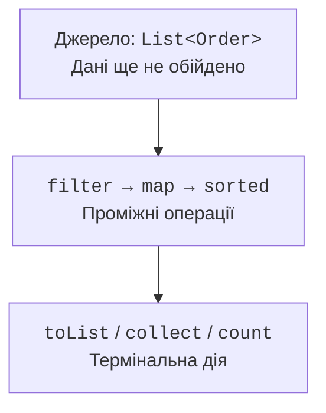
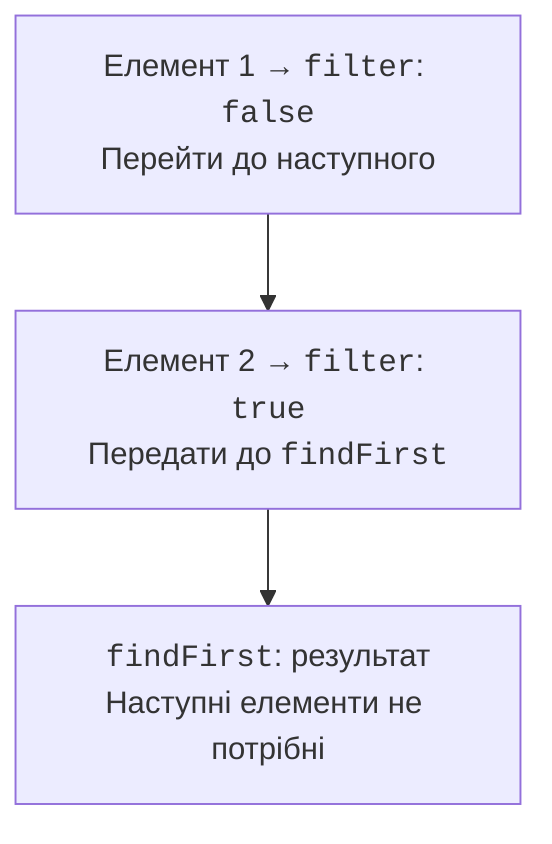
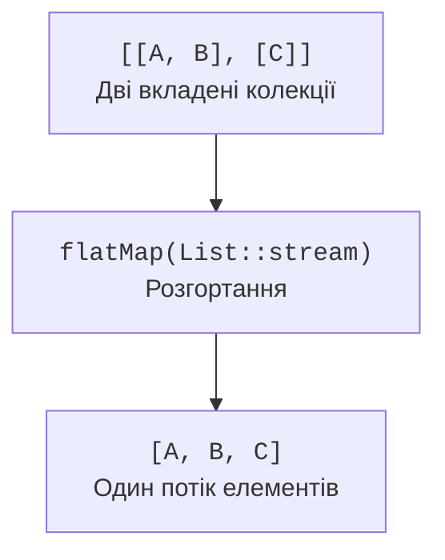

# Конвеєр Stream API

## Джерело, конвеєр і термінальна операція

Потік можна отримати з колекції, масиву, `Stream.of`, `Stream.iterate`, `Stream.generate` або примітивного діапазону. `IntStream.range(a,b)` не включає b, `rangeClosed` включає. Нескінченне джерело потребує обмеження, якщо термінальна дія має завершитися за скінченний час.

Рис. 11.3. Проміжні операції описують роботу, термінальна запускає її. {.caption}

Проміжна операція повертає потік і зазвичай не обходить джерело відразу. Термінальна операція, наприклад `toList`, `count` чи `forEach`, запускає обчислення. Після цього той самий потік повторно використовувати не можна. Для другого звіту треба створити новий stream із джерела або зберегти матеріалізований результат першого проходу.

Конвеєр часто обробляє елементи вертикально: один елемент проходить filter, map і далі, перш ніж читається наступний. Операції зі станом, наприклад sorted, можуть накопичувати дані перед видачею результату. `limit` і короткозамикальні термінальні операції дозволяють не читати все джерело.

Рис. 11.4. Коротке замикання може завершити обхід після першого збігу. {.caption}

Потік не повинен змінювати своє джерело під час обходу. Параметри поведінки зазвичай мають бути незалежними від змінюваного зовнішнього стану. `peek` призначений переважно для спостереження, але його виклик не гарантований для кожного елемента за всіх оптимізацій. Не розміщуйте в peek необхідне збереження даних чи єдиний механізм перевірки коректності.

## Перетворення та розгортання

`filter` залишає елементи за умовою, `map` перетворює кожен елемент на один результат. `flatMap` дозволяє отримати від одного елемента нуль, один або багато результатів і розгортає вкладені потоки в один. Наприклад, список замовлень перетворюють на спільний потік позицій усіх замовлень.

Рис. 11.5. Розгортання двох вкладених наборів в один потік елементів. {.caption}

`mapMulti` передає перетворювачу споживача результатів і може бути зручним для невеликої змінної кількості значень без створення окремого Stream для кожного елемента. Його не треба використовувати лише заради коротшого запису; flatMap часто краще показує, що джерело вже має вкладену структуру.

`distinct` визначає унікальність через equals, `sorted` – порядок через природне порівняння або Comparator. `skip` пропускає перші елементи, `limit` залишає обмежену кількість. `takeWhile` на впорядкованому потоці бере початковий префікс до першої невідповідності; це не синонім filter, який перевіряє весь набір. `dropWhile` пропускає лише початковий префікс.

Порядок операцій змінює значення результату. `sorted().limit(3)` знаходить три найменші елементи всього набору; `limit(3).sorted()` сортує лише перші три. Перенесення filter перед дорогою map може зекономити роботу, але лише якщо умова має той самий зміст для початкового типу й не змінює контракт.

## Термінальні операції та редукція

`anyMatch`, `allMatch`, `noneMatch`, `findFirst`, `findAny` можуть завершуватися достроково. Для порожнього потоку allMatch і noneMatch повертають true, anyMatch – false. Це логіка універсального й екзистенційного тверджень, а не випадкова особливість бібліотеки. Валідація «є хоча б один і всі коректні» потребує окремої перевірки непорожності.

`reduce` згортає елементи асоціативною операцією. Додавання цілих із прийнятою політикою переповнення є типовим прикладом; віднімання не асоціативне й не підходить для довільного розбиття. Початкове значення identity має бути нейтральним для операції, а не довільною початковою премією, яку паралельне виконання може врахувати кілька разів.

Для змінюваного накопичення використовують collect, а не reduce з одним спільним ArrayList. `Stream.toList()` повертає незмінний за структурою список. `Collectors.toList()` не обіцяє конкретний клас чи змінюваність; якщо потрібен ArrayList, задайте `Collectors.toCollection(ArrayList::new)`.
