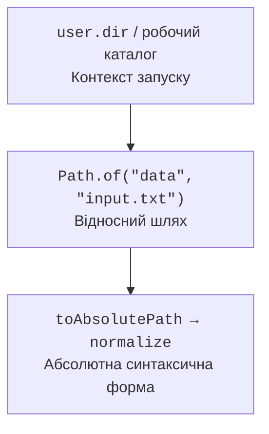
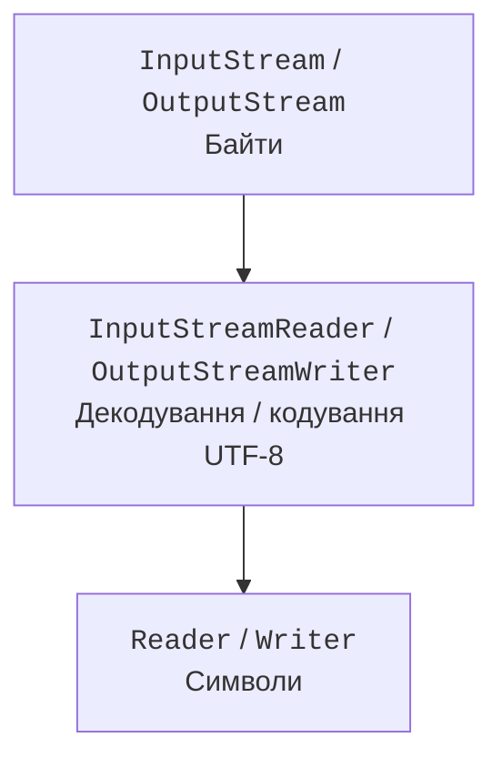
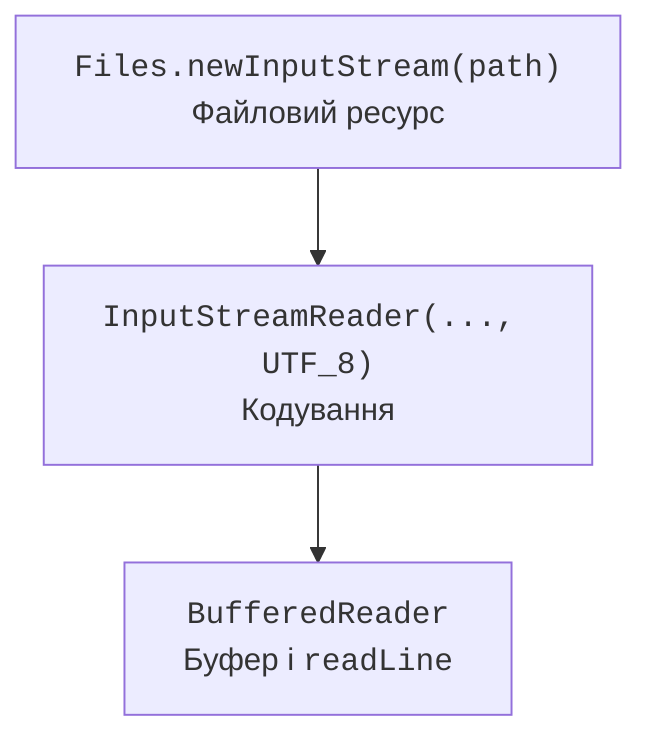

# Шляхи, потоки та кодування

## Шляхи та робочий каталог

`Path` представляє шлях у файловій системі. `Path.of("data", "input.txt")` будує його з компонентів без ручного вибору slash або backslash. `java.io.File` залишається сумісним старим API, але для нових операцій зазвичай зручніші Path і Files з NIO.2.

Рис. 12.1. Відносний шлях отримує значення в контексті робочого каталогу. {.caption}

Відносний шлях обчислюється від поточного робочого каталогу процесу, а не від папки з вихідним Main.java. IDE і термінал можуть запускати програму з різних каталогів. Для діагностики виведіть `Path.of("").toAbsolutePath()` або `user.dir`; для переносимості приймайте робочий шлях як параметр конфігурації.

`resolve` приєднує відносний шлях, `getFileName` повертає останній компонент, `getParent` може повернути null для шляху без батька. `normalize` прибирає синтаксичні крапки й подвійні крапки, але не звертається до файлової системи. `toRealPath` перевіряє існування та за правилами параметрів розв’язує символічні посилання. Ці операції не є взаємозамінними перевірками безпеки.

Шлях, отриманий від користувача, не варто довільно поєднувати з коренем каталогу й одразу записувати. Для обмеженого робочого каталогу перевіряють нормалізований результат і політику символічних посилань. Перевірка, а потім використання можуть бути розділені зміною файлової системи іншою програмою.

::: info Знімок екрана
У IntelliJ IDEA відкрийте Run Configuration Main та покажіть Working directory. Поруч у терміналі виведіть абсолютний шлях відносного input.txt; приховайте приватні шляхи.
:::

Рис. 12.2. Робочий каталог конфігурації запуску {.caption}

## Байти, символи та ресурси

`InputStream` і `OutputStream` працюють з байтами. `Reader` і `Writer` – з символами. Перехід між ними потребує кодування: InputStreamReader декодує байти, OutputStreamWriter кодує символи. Буферовані обгортки скорочують кількість дрібних звернень до нижнього рівня, але не змінюють формат даних.

Рис. 12.3. Дві родини потоків та явний міст кодування. {.caption}

Ресурс потрібно закривати навіть якщо всередині циклу виникне виняток. `try-with-resources` викликає close у зворотному порядку оголошення ресурсів. Якщо головна операція й закриття обидва завершилися винятком, виняток закриття зберігається як suppressed; його не треба мовчки губити власним порожнім catch.

Закриття зовнішньої стандартної обгортки зазвичай закриває внутрішній ресурс. Водночас бібліотечний метод не повинен самовільно закривати потік, яким володіє його викликач, якщо контракт цього не передбачає. Особливо обережно працюйте з System.in, System.out та потоками, спільними для кількох дій.

Рис. 12.4. Кожна обгортка додає одну відповідальність до читання. {.caption}

`read()` повертає int, щоб поряд із байтом або символом представити -1 – кінець. Не перетворюйте результат на char до перевірки кінця. Для читання в буфер кількість прочитаного може бути меншою за розмір буфера; записувати потрібно саме діапазон від нуля до фактично отриманої кількості.

`flush` передає буферизовані дані нижньому рівню, але не є універсальною гарантією фізичного запису на носій. Закриття Writer виконує необхідне завершення кодування. Надійність збереження після раптового вимкнення потребує окремого аналізу файлової системи, каналів і операцій синхронізації.

## Кодування та рядки

У сучасному JDK стандартне кодування за замовчуванням – UTF-8, але зовнішній формат краще задавати явно через `StandardCharsets.UTF_8`. Консоль має окремі особливості; не робіть висновок про вміст файлу лише за тим, як термінал намалював кирилицю. Файл без BOM і файл із BOM теж можуть потребувати різного правила читання першого поля.

`BufferedReader.readLine` повертає рядок без символів завершення або null наприкінці. `newLine` у BufferedWriter використовує системний роздільник. Якщо протокол вимагає саме LF, записуйте `"\n"` явно. Не використовуйте readLine для довільного бінарного файлу: декодування може зіпсувати або відхилити байти.

`Files.readString` і `readAllLines` зручні для невеликих файлів, але завантажують усе в пам’ять. `Files.lines` повертає Stream, який тримає відкритий ресурс і потребує try-with-resources. Виняток під час лінивого обходу може бути обгорнуто в UncheckedIOException; він не обов’язково виникає при створенні stream.

`PrintWriter` має зручні print і printf, проте частину помилок запису зберігає у внутрішньому прапорці. Після важливого запису перевіряйте checkError або оберіть Writer, який поширює IOException. Scanner корисний для токенів, але має власну локаль та правила роздільників; його не слід сприймати як універсальний CSV-парсер.

::: info Знімок екрана
Покажіть справжній UTF-8 файл з українськими літерами, індикатор кодування IDEA та його правильний вивід програмою. Не демонструйте перетворення без резервної копії як безпечну дію.
:::

Рис. 12.5. Перевірка кодування текстового файлу {.caption}
