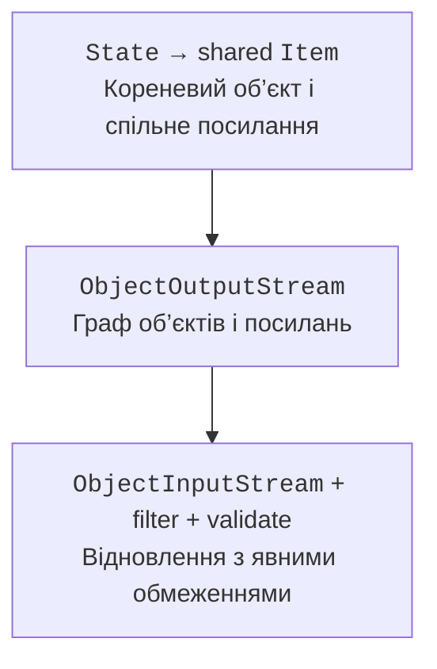

# Серіалізація об’єктів

## Серіалізація графа об’єктів

Serializable позначає участь класу в стандартному бінарному механізмі Java. ObjectOutputStream зберігає граф досяжних об’єктів, а не лише плоский набір полів. Спільні посилання та цикли можуть зберігатися. Об’єкти в графі теж повинні підтримувати серіалізацію, якщо відповідне поле не transient.



Рис. 12.6. Спільне посилання є частиною графа, а не двома незалежними об’єктами. {.caption}

`serialVersionUID` задає ідентифікатор сумісності звичайного серіалізованого класу. Він не є автоматичною системою міграцій: зміна семантики полів може потребувати окремої логіки навіть при однаковому UID. Static-поля не є станом екземпляра, transient-поля не зберігаються стандартним способом.

При десеріалізації звичайного Serializable-класу його звичайний конструктор не виконує повторну валідацію полів. Потрібна перевірка відновленого стану. Для serializable records канонічний конструктор має особливу роль у відновленні, але це не означає, що довільний граф із мережі стає безпечним.

### Приклад 4. Збереження навчального стану

Приклад працює лише з власним локальним файлом і дозволяє один клас стану. Ліміти файла й ObjectInputFilter доповнюють перевірку предметних полів після читання. Transient-поле token не зберігається; у реальній системі секрети не слід включати в об’єкт збереження взагалі.

```java
import java.io.IOException;
import java.io.ObjectInputFilter;
import java.io.ObjectInputStream;
import java.io.ObjectOutputStream;
import java.io.Serial;
import java.io.Serializable;
import java.nio.file.Files;
import java.nio.file.Path;

public class Main {
    static final class State implements Serializable {
        @Serial private static final long serialVersionUID = 1L;
        final String name;
        final int level;
        transient String token;

        State(String name, int level) {
            this.name = name;
            this.level = level;
            validate();
        }

        void validate() {
            if (name == null || name.isBlank() || name.length() > 80
                    || level < 0 || level > 100) {
                throw new IllegalArgumentException("invalid state");
            }
        }
    }

    static State load(Path path) throws IOException,
            ClassNotFoundException {
        if (Files.size(path) > 100_000) {
            throw new IOException("file too large");
        }
        try (ObjectInputStream input = new ObjectInputStream(
                Files.newInputStream(path))) {
            input.setObjectInputFilter(info -> {
                if (info.depth() > 5 || info.references() > 20
                        || info.streamBytes() > 100_000
                        || info.arrayLength() > 1000) {
                    return ObjectInputFilter.Status.REJECTED;
                }
                Class<?> type = info.serialClass();
                if (type == null) {
                    return ObjectInputFilter.Status.UNDECIDED;
                }
                return type == State.class || type == String.class
                    ? ObjectInputFilter.Status.ALLOWED
                    : ObjectInputFilter.Status.REJECTED;
            });
            Object value = input.readObject();
            if (!(value instanceof State state)) {
                throw new IOException("unexpected root type");
            }
            state.validate();
            return state;
        }
    }

    public static void main(String[] args) throws Exception {
        Path path = Files.createTempFile("java12-state-", ".bin");
        try {
            State source = new State("Ada", 3);
            source.token = "temporary";
            try (ObjectOutputStream output = new ObjectOutputStream(
                    Files.newOutputStream(path))) {
                output.writeObject(source);
            }
            State restored = load(path);
            System.out.println(restored.name + ": " + restored.level);
            System.out.println("token: " + restored.token);
        } finally {
            Files.deleteIfExists(path);
        }
    }
}
```

```text
Ada: 3
token: null
```

Фільтр не викликається для всіх примітивних значень і конкретно закодованих String так само, як для звичайних об’єктів. Тому лише перевірки serialClass чи streamBytes у callback недостатньо для універсального контролю розміру. Перевірка Files.size теж має часовий проміжок до читання; для недовіреного або паралельно змінюваного джерела потрібен обмежений вхідний потік чи попередній обмежений знімок, а краще інший формат.

Стандартна Java-серіалізація не є рекомендованим універсальним форматом обміну з невідомими сторонами. CSV або JSON зі схемою, явними лімітами й валідацією полів часто простіші для перевірки та еволюції. База даних вирішує інший клас задач – узгоджені зміни багатьох записів, пошук і конкурентний доступ.

## Перевірка файлової програми

Тест має працювати в окремому тимчасовому каталозі й не залежати від особистих файлів користувача. Перевіряють не лише рядки консолі, а й байти результату, кількість записів, кодування та збереження попереднього файла після невдалого оновлення. Звичайний сценарій, порожній файл, неправильний заголовок, обірваний запис і відсутній шлях – різні випадки.

Код завершення й повідомлення повинні відділяти неправильний формат даних від операційної відмови. Повний стек корисний розробнику, але користувачу потрібні шлях, дія й зрозуміла причина без розкриття секретів. Перехоплювати Exception і друкувати «готово» після невдачі неприпустимо.
