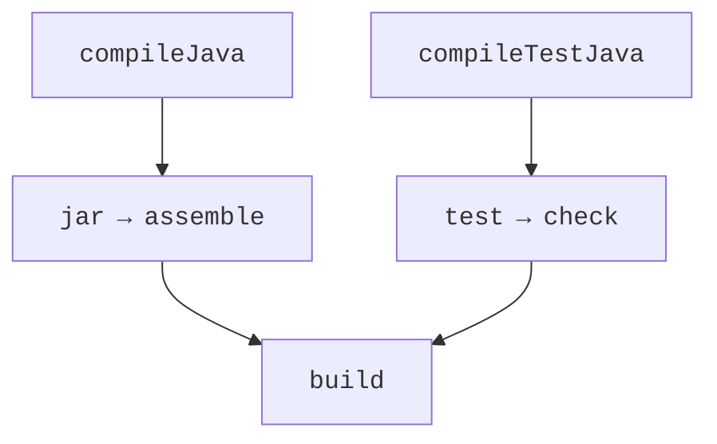

# Той самий проєкт у Gradle

## Приклад 3. Той самий код у Gradle

Код Loan та LoanTest залишається незмінним. Для порівняння створіть окрему копію проєкту й замініть POM наведеними файлами. Так видно, що правила збирання відокремлені від предметної логіки. Не підтримуйте два незалежні build-файли одного продукту без визначеного основного джерела версій.

`settings.gradle.kts`:

```kotlin
rootProject.name = "loan"
```

`build.gradle.kts`:

```kotlin
plugins { java; application }
repositories { mavenCentral() }
java {
    toolchain {
        languageVersion.set(JavaLanguageVersion.of(27))
    }
}
tasks.withType<JavaCompile>().configureEach {
    options.release.set(27)
    options.encoding = "UTF-8"
}
dependencies {
    testImplementation(platform("org.junit:junit-bom:6.1.3"))
    testImplementation("org.junit.jupiter:junit-jupiter")
    testRuntimeOnly("org.junit.platform:junit-platform-launcher")
}
tasks.test { useJUnitPlatform() }
application { mainClass.set("ua.knu.loan.Loan") }
```

Gradle 9.7.0 у перевіреній конфігурації запускається на JDK 25, а Java toolchain компілює та тестує на JDK 27. Це два різні вибори. Для локального JDK можна задати `org.gradle.java.installations.paths` у `gradle.properties`. Не переносіть абсолютний шлях іншої машини без змін. <https://docs.gradle.org/current/userguide/compatibility.html>.

```powershell
gradle wrapper --gradle-version 9.7.0
.\gradlew.bat test
.\gradlew.bat run
.\gradlew.bat build
```

**Wrapper** фіксує Gradle у проєкті. Файли wrapper зберігають у Git, а локальні кеші `.gradle` – ні. Для довіри до завантаження можна зафіксувати контрольну суму дистрибутива. Після зміни wrapper перевіряйте запуск і в CI, а не тільки у власній IDE.



Рис. 13.7. Gradle виконує граф залежностей завдань {.caption}

`implementation` додає залежність основного коду; `testImplementation` – тестового. Gradle планує граф задач, а не послідовність Maven-фаз. `build` залежить від збирання та перевірок; `run` є окремим завданням application-плагіна. UP-TO-DATE означає, що перевірені входи й виходи не змінилися, а не що задача взагалі непотрібна.

### Каталог версій та кілька проєктів

У `gradle/libs.versions.toml` можна задати версії та бібліотечні псевдоніми. Це централізує запис координат; автоматичного оновлення до найновішого релізу не відбувається. Великі проєкти розділяють на `core` і `cli`, а залежність між ними задають `implementation(project(":core"))`.

```toml
[versions]
junit = "6.1.3"

[libraries]
junit-bom = { module = "org.junit:junit-bom", version.ref = "junit" }
junit-jupiter = { module = "org.junit.jupiter:junit-jupiter" }
```

Після оголошення каталогу можна використати `testImplementation(platform(libs.junit.bom))` та `testImplementation(libs.junit.jupiter)`. Назви аксесорів походять від ключів каталогу. Наявність запису в TOML ще не підключає бібліотеку до жодного модуля.
