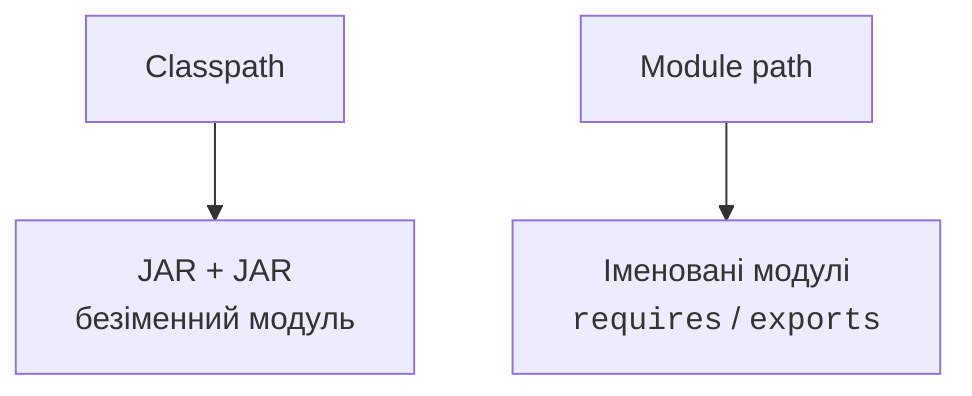
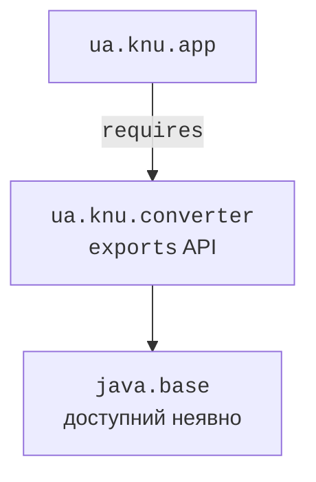

# Classpath і модулі JPMS

## Від окремих файлів до відтворюваного проєкту

Команда `javac Main.java` добре пояснює компіляцію, але великий проєкт має ресурси, тести, кілька бібліотек і правила пакування. Якщо кожний розробник сам добирає JAR-файли та параметри запуску, однакові джерела можуть працювати по-різному. **Система збирання** фіксує ці правила у файлі, який зберігається разом із кодом.

**Модульна система Java** (JPMS) вирішує інше питання: які модулі потрібні застосунку й які пакети вони відкривають. Maven-модуль, Gradle-проєкт і JPMS-модуль не є синонімами. Один Gradle-проєкт може збирати звичайний JAR без module-info, а JPMS-програму можна зібрати вручну без Maven.

У цій темі основний інструмент – Maven 3.9.16, Gradle 9.7.0 розглядаємо на тому самому коді. JDK 27 компілює та виконує Java-код; JUnit 6.1.3 перевіряє його поведінку. Maven 4.0.0-rc-6 на дату перевірки є попереднім релізом, тому відтворювані приклади використовують стабільну гілку 3.9. <https://maven.apache.org/download.cgi>.

## Classpath і JPMS

**Classpath** – список тек та архівів, у яких JVM шукає класи. Класи з classpath належать безіменному модулю. Конфлікти однакових класів, випадкова залежність від внутрішнього пакета та відсутня бібліотека часто виявляються лише при запуску. Модульний опис робить частину цих умов явними раніше.



Рис. 13.1. Classpath і module path задають різні межі доступу {.caption}

Іменований модуль має файл `module-info.java` у корені своїх джерел. Ім’я модуля стабільне й зазвичай подібне до імені пакета, наприклад `ua.knu.converter`. Воно не зобов’язане дорівнювати назві JAR-файла. Пакет – простір імен класів; модуль – одиниця залежностей та інкапсуляції кількох пакетів.

`requires other.module` задає читаність іншого модуля. `exports some.package` відкриває його публічний API іншим модулям. Сам модифікатор `public` не обходить закритий пакет. Модуль `java.base` доступний неявно й не потребує requires; для `java.sql` чи `java.logging` залежність указують явно.

`requires transitive` передає читаність користувачам вашого API. Він доречний, якщо публічний метод повертає тип іншого модуля, який клієнту теж потрібно бачити. Це не «експорт усіх класів залежності» й не аналог транзитивного завантаження бібліотек Maven.

`opens` дозволяє глибоку рефлексію під час виконання. Для JavaFX FXML контролер часто відкриває пакет лише `to javafx.fxml`, а не всім модулям. `exports` не надає доступу до приватних полів рефлексією, а `opens` не є звичайним дозволом імпортувати типи при компіляції.



Рис. 13.2. Явна залежність і публічна поверхня бібліотеки {.caption}

Офіційний посібник JPMS: <https://dev.java/learn/modules/>. Команда `java --list-modules` показує модулі поточного runtime. Не припускайте, що мінімальний образ jlink містить стільки ж модулів, скільки повний установлений JDK.

## Приклад 1. Два модулі конвертера

Створіть чотири наведені файли. Каталог `src` містить теки з точними іменами модулів; усередині них пакети відповідають деклараціям `package`. Публічна функція перевіряє вхід до обчислення, тому її можна перевикористати поза консольним UI.

`src/ua.knu.converter/module-info.java`:

```java
module ua.knu.converter {
    exports ua.knu.converter;
}
```

`src/ua.knu.converter/ua/knu/converter/Temperature.java`:

```java
package ua.knu.converter;

public final class Temperature {
    private Temperature() {}

    public static double fahrenheit(double celsius) {
        if (!Double.isFinite(celsius) || celsius < -273.15) {
            throw new IllegalArgumentException("Invalid temperature");
        }
        double value = celsius * 9 / 5 + 32;
        if (!Double.isFinite(value)) {
            throw new IllegalArgumentException("Result overflow");
        }
        return value;
    }
}
```

`src/ua.knu.app/module-info.java`:

```java
module ua.knu.app {
    requires ua.knu.converter;
}
```

`src/ua.knu.app/ua/knu/app/Main.java`:

```java
package ua.knu.app;

import ua.knu.converter.Temperature;

public final class Main {
    public static void main(String[] args) {
        System.out.println(Temperature.fahrenheit(20));
    }
}
```

Команди виконуються в корені проєкту з JDK 27 у PATH. Каталог `image` до jlink не повинен існувати; для повторного експерименту оберіть інше ім’я, зберігши попередній образ.

```powershell
javac --release 27 --module-source-path src -d out `
  -m ua.knu.converter,ua.knu.app
java --module-path out -m ua.knu.app/ua.knu.app.Main
jdeps --module-path out --list-deps --module ua.knu.app
jlink --module-path out --add-modules ua.knu.app `
  --output image
.\image\bin\java -m ua.knu.app/ua.knu.app.Main
```

Обидва запуски програми виводять `68.0`. `jdeps` аналізує статичні залежності байткоду; він не здогадається про всі назви класів, побудовані рядками для рефлексії. Образ jlink створюється для конкретної платформи й не є універсальним Windows/Linux-архівом. `jpackage` додає до runtime застосунок та платформний launcher.


Рис. 13.3. Компіляція модулів і запуск власного runtime {.caption}

### Безіменні й автоматичні модулі

JAR без module-info на module path стає **автоматичним модулем**. Ім’я визначається `Automatic-Module-Name` або виводиться з назви архіву. Для залежності краще перевірити його через `jar --describe-module --file library.jar`, а не вгадувати. Той самий JAR на classpath має іншу роль – безіменний модуль.

Автоматичні модулі допомагають поступовій міграції, але мають ширший доступ і не вирішують усі проблеми jlink. Розділені між модулями пакети та цикли залежностей слід усунути. Параметри `--add-opens` і `--add-reads` корисні для спеціальних сценаріїв сумісності, але не замінюють продуману архітектуру.

`uses` оголошує споживання сервісу, `provides ... with ...` реєструє реалізацію. `ServiceLoader` знаходить провайдери без жорсткого імпорту конкретного класу. Лабораторний приклад показує окремі модулі API, провайдера й клієнта.
