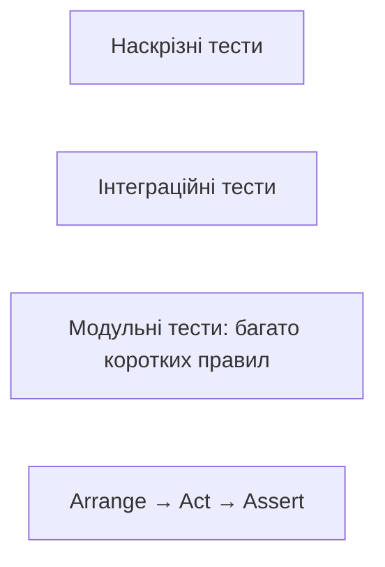
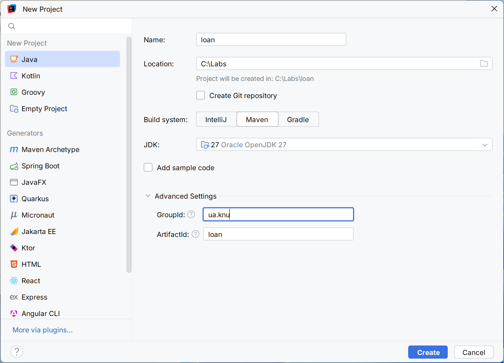
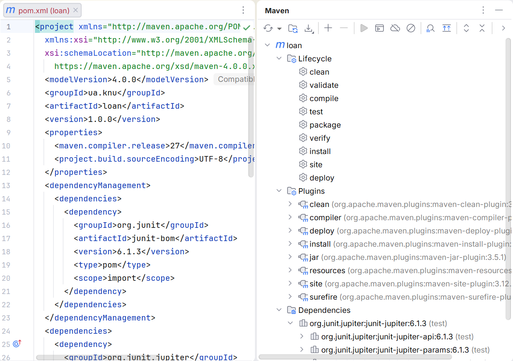
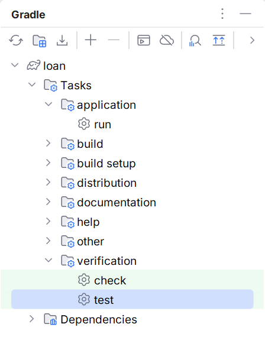
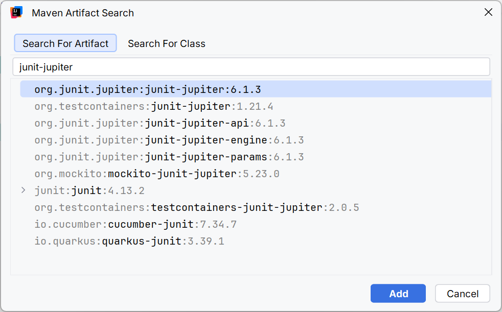
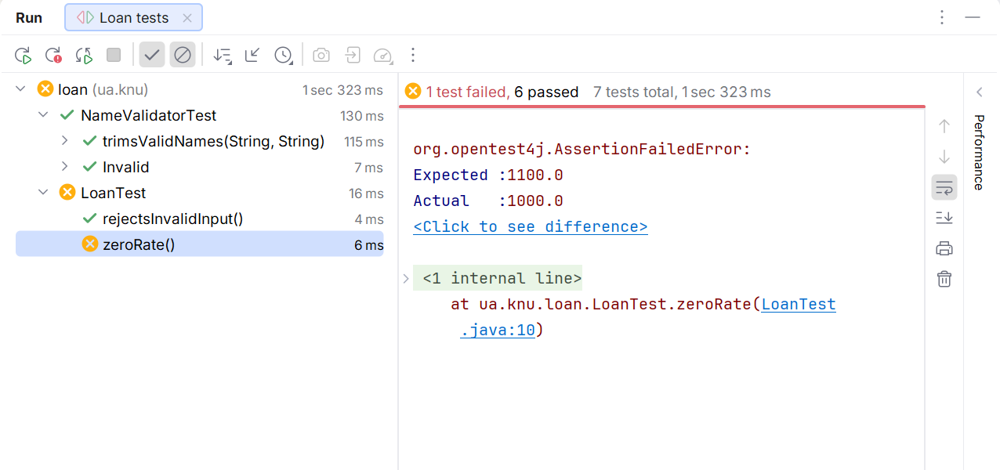
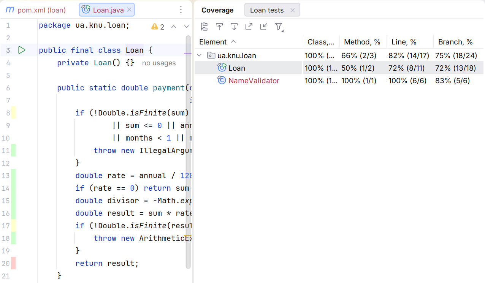

# Тестування з JUnit

## JUnit: перевірка поведінки

**JUnit Platform** запускає тестові рушії, **Jupiter** надає модель написання сучасних тестів. JUnit 6 потребує Java не нижче 17; JDK 27 курсу задовольняє цю умову. Не змішуйте старий імпорт `org.junit.Test` із `org.junit.jupiter.api.Test`. <https://docs.junit.org/current/user-guide/>.

Тест за схемою **Arrange–Act–Assert** спочатку готує дані, виконує дію, потім перевіряє результат. Назва описує правило, а не номер: `rejectsNegativeAmount` корисніша за `test3`. Очікуване значення не слід обчислювати тією самою реалізацією, яку перевіряють: така перевірка повторить її помилку.



Рис. 13.8. Рівні перевірки та будова одного тесту {.caption}

`assertTrue` перевіряє умову, `assertEquals` – значення, `assertThrows` – очікуваний тип винятку. Він також повертає виняток для додаткової перевірки. `assertAll` запускає групу перевірок і показує всі її помилки, а не лише першу. Повідомлення тесту має пояснювати правило, не дублювати фактичний результат.

`assertTimeout` перевіряє час після завершення дії; це не механізм примусового переривання завислого сервісу. Preemptive-варіант має інший потік і наслідки для thread-local стану. Для мережі та БД потрібні власні тайм-аути драйвера. Тести не повинні залежати від випадкового навантаження ноутбука.

### Життєвий цикл і незалежність

`@BeforeEach` готує новий стан перед кожним тестом, `@AfterEach` прибирає ресурси. `@BeforeAll` за типової моделі має бути static. `@DisplayName` задає читабельну назву; `@Nested` групує сценарії. `@Tag` дозволяє відбирати перевірки. `@Disabled` документує тимчасовий пропуск, але не означає успіх.

Тести мають бути швидкими, незалежними, повторюваними, самоперевірними та написаними вчасно – принципи FIRST. Залежність від порядку виконання чи спільного змінного списку порушує незалежність. Тимчасові файли й окрема база для тесту кращі за дані особистого профілю розробника.

## Приклад 4. Параметризований валідатор

Додайте клас у `src/main/java/ua/knu/loan/NameValidator.java`, тест – у відповідний пакет `src/test/java`. Правило навмисно просте: після trim потрібно 2–40 символів. Це не універсальна перевірка імен людей, а навчальний контракт текстового поля.

```java
package ua.knu.loan;

public final class NameValidator {
    private NameValidator() {}

    public static String normalize(String value) {
        if (value == null) {
            throw new IllegalArgumentException("Missing name");
        }
        String text = value.trim();
        if (text.length() < 2 || text.length() > 40) {
            throw new IllegalArgumentException("Length 2..40");
        }
        return text;
    }
}
```

```java
package ua.knu.loan;

import org.junit.jupiter.api.Nested;
import org.junit.jupiter.api.Test;
import org.junit.jupiter.params.ParameterizedTest;
import org.junit.jupiter.params.provider.CsvSource;
import static org.junit.jupiter.api.Assertions.*;

class NameValidatorTest {
    @ParameterizedTest
    @CsvSource({"'  Олена  ', Олена", "Тарас, Тарас", "AB, AB"})
    void trimsValidNames(String input, String expected) {
        assertEquals(expected, NameValidator.normalize(input));
    }

    @Nested
    class Invalid {
        @Test
        void rejectsMissing() {
            assertThrows(IllegalArgumentException.class,
                () -> NameValidator.normalize(null));
        }

        @Test
        void rejectsShort() {
            assertThrows(IllegalArgumentException.class,
                () -> NameValidator.normalize(" A "));
        }
    }
}
```

`@CsvSource` створює окремий запуск для кожного рядка. `@ValueSource` придатний для одного аргументу, `@EnumSource` – для переліків, `@MethodSource` – для складних об’єктів. Параметризований тест не приховує багато різних правил в одному: кожна таблиця прикладів має перевіряти один зрозумілий контракт.

## IDE, звіти та покриття

В IntelliJ IDEA відкрийте POM або Gradle-проєкт і дочекайтеся синхронізації. Інструментальне вікно Maven показує Lifecycle, Plugins і Dependencies; Gradle – дерево задач. Після зміни залежності виконайте Reload. Ручне додавання JAR через Project Structure не робить командне збирання відтворюваним.



Рис. 13.9. Вибір Maven та JDK під час створення проєкту {.caption}



Рис. 13.10. Фази, плагіни та залежності Maven {.caption}



Рис. 13.11. Завдання перевірки Gradle {.caption}



Рис. 13.12. Пошук бібліотеки в середовищі розробки {.caption}

Запуск зеленою піктограмою біля тесту зручний для одного сценарію. Перед здачею запустіть wrapper із термінала: IDE може використовувати інший JDK або власний runner. Звіти Surefire лежать у `target/surefire-reports`, Gradle – у `build/reports/tests/test`. Нуль знайдених тестів не є підтвердженням правильності програми.



Рис. 13.13. Результати тестів і діагностика невідповідності {.caption}



Рис. 13.14. Покриття виконаних рядків у тестах {.caption}

Високе покриття означає, що код виконувався, але не доводить сили тверджень. Тест без перевірки може виконати всі рядки. Цикл TDD «red → green → refactor» спочатку фіксує відсутню поведінку невдалим тестом, потім реалізує її та очищує код без зміни контракту. Не слід навмисно залишати червоний тест у зданому основному наборі заради красивого скриншота.

## Типові несправності

`module not found` означає, що потрібний модуль не знайдений на module path або має інше ім’я. `package is not visible` може вказувати на відсутній exports чи requires. Розміщення модульного JAR на classpath не рівнозначне правильному виправленню залежностей, хоча іноді допомагає діагностиці.

Якщо тести не знайдено, перевірте каталог, назву класу, імпорт Test, залежність Jupiter та налаштування Surefire або `useJUnitPlatform`. Якщо програма працює лише в IDE, порівняйте JDK, робочу теку, ресурси й фактичні аргументи запуску. Якщо конфліктують версії, починайте з dependency tree, а не з ручного видалення випадкових JAR із кешу.
