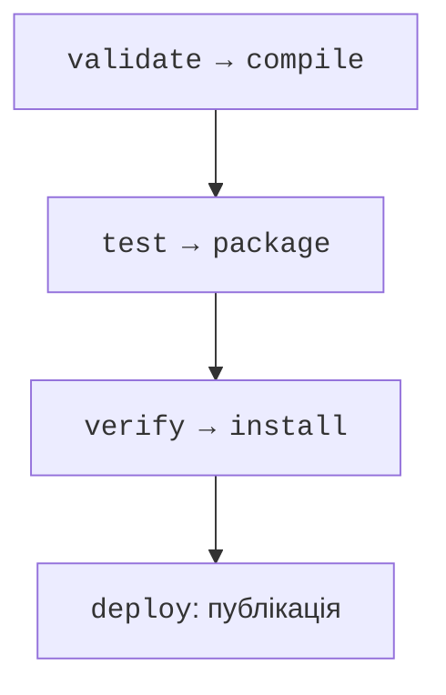
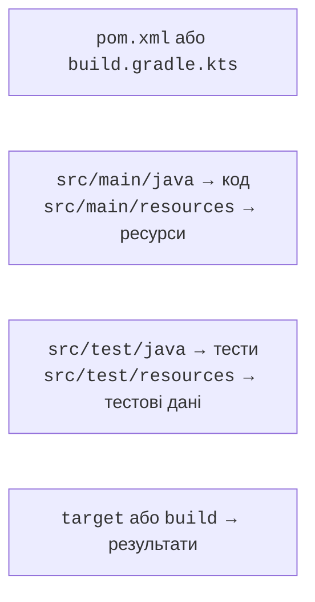

# Збирання з Maven

## Maven: координати та життєвий цикл

Файл **POM** (`pom.xml`) описує координати, залежності й плагіни. Координати мають форму `groupId:artifactId:version`. GroupId зазвичай пов’язаний із доменом організації, artifactId – із конкретною бібліотекою. Версія артефакту незалежна від JDK. Maven Central – репозиторій артефактів, а не каталог довільних вихідних Git-репозиторіїв.

Залежність може мати власні залежності. Maven будує дерево та обирає версії за своїми правилами; конфлікт не обов’язково означає, що буде обрано найновішу версію. Команда `mvn dependency:tree` пояснює фактичний набір. BOM централізовано узгоджує версії пов’язаних компонентів, але сам не додає їх до коду.

Область `compile` є типовою; `test` потрібна лише тестам; `runtime` додає бібліотеку виконання, а `provided` означає, що середовище має надати її. Не оголошуйте драйвер БД `provided`, якщо запускаєте звичайний консольний застосунок без контейнера.



Рис. 13.4. Фази Maven виконуються до обраної включно {.caption}

`validate` перевіряє структуру; `compile` компілює основний код; `test` запускає модульні тести; `package` створює JAR; `verify` виконує додаткові перевірки; `install` кладе артефакт у локальний Maven-репозиторій; `deploy` публікує у віддаленому. Команда `mvn package` проходить попередні фази, а `clean` належить до окремого життєвого циклу й видаляє результати збирання.

`install` у Maven не встановлює програму в Windows. `deploy` не запускають лише заради перевірки локального коду: це операція публікації. Звичайний навчальний цикл – `mvn test` і `mvn package`, без зовнішнього репозиторію.

### Структура проєкту й Wrapper

Основний код лежить у `src/main/java`, ресурси – `src/main/resources`, тести – у `src/test/java`. Результати Maven потрапляють у `target`; Gradle – у `build`. Згенеровані класи та кеші не слід копіювати в джерела або Git. Стандартна структура дозволяє інструментам працювати без зайвої конфігурації.



Рис. 13.5. Код, ресурси й тести мають окремі каталоги {.caption}

Maven Wrapper складається зі скриптів `mvnw`, `mvnw.cmd` та службових файлів `.mvn/wrapper`. Він фіксує версію Maven, але не встановлює автоматично правильний JDK. Після початкового встановлення Maven створіть wrapper і надалі запускайте його. У PowerShell Windows команда має вигляд `.\mvnw.cmd test`.

```powershell
mvn wrapper:wrapper -Dmaven=3.9.16
.\mvnw.cmd --version
.\mvnw.cmd test
```

Офіційний початок роботи: <https://maven.apache.org/guides/getting-started/>. У `--version` перевірте Java 27 і правильний JAVA\_HOME. Параметр `release` обмежує не лише версію байткоду, а й доступний Java API цільового випуску. Старий javac не може компілювати `--release 27`, навіть якщо число правильно записане у POM.

## Приклад 2. Maven-проєкт кредитного калькулятора

Створіть `pom.xml` і два файли Java. Приклад показує фіксований ануїтетний платіж для навчальної моделі. Комісії, календарні особливості та реальні договори не моделюються. Розрахунок у double тут використано для демонстрації числових тестів; бухгалтерський облік вимагає точних сум і правил округлення.

```xml
<project xmlns="http://maven.apache.org/POM/4.0.0"
  xmlns:xsi="http://www.w3.org/2001/XMLSchema-instance"
  xsi:schemaLocation="http://maven.apache.org/POM/4.0.0
    https://maven.apache.org/xsd/maven-4.0.0.xsd">
  <modelVersion>4.0.0</modelVersion>
  <groupId>ua.knu</groupId>
  <artifactId>loan</artifactId>
  <version>1.0.0</version>
  <properties>
    <maven.compiler.release>27</maven.compiler.release>
    <project.build.sourceEncoding>UTF-8</project.build.sourceEncoding>
  </properties>
  <dependencyManagement>
    <dependencies>
      <dependency>
        <groupId>org.junit</groupId>
        <artifactId>junit-bom</artifactId>
        <version>6.1.3</version>
        <type>pom</type>
        <scope>import</scope>
      </dependency>
    </dependencies>
  </dependencyManagement>
  <dependencies>
    <dependency>
      <groupId>org.junit.jupiter</groupId>
      <artifactId>junit-jupiter</artifactId>
      <scope>test</scope>
    </dependency>
  </dependencies>
  <build>
    <plugins>
      <plugin>
        <artifactId>maven-compiler-plugin</artifactId>
        <version>3.16.0</version>
      </plugin>
      <plugin>
        <artifactId>maven-surefire-plugin</artifactId>
        <version>3.6.0</version>
      </plugin>
      <plugin>
        <artifactId>maven-jar-plugin</artifactId>
        <version>3.5.1</version>
        <configuration>
          <archive><manifest>
            <mainClass>ua.knu.loan.Loan</mainClass>
          </manifest></archive>
        </configuration>
      </plugin>
    </plugins>
  </build>
</project>
```

`src/main/java/ua/knu/loan/Loan.java`:

```java
package ua.knu.loan;

public final class Loan {
    private Loan() {}

    public static double payment(double sum, double annual,
                                 int months) {
        if (!Double.isFinite(sum) || !Double.isFinite(annual)
                || sum <= 0 || annual < 0 || annual > 100
                || months < 1 || months > 600) {
            throw new IllegalArgumentException("Invalid loan");
        }
        double rate = annual / 1200;
        if (rate == 0) return sum / months;
        double divisor = -Math.expm1(-months * Math.log1p(rate));
        double result = sum * rate / divisor;
        if (!Double.isFinite(result)) {
            throw new ArithmeticException("Payment overflow");
        }
        return result;
    }

    public static void main(String[] args) {
        System.out.printf(java.util.Locale.ROOT, "%.2f%n",
            payment(12000, 0, 12));
    }
}
```

`src/test/java/ua/knu/loan/LoanTest.java`:

```java
package ua.knu.loan;

import org.junit.jupiter.api.Test;
import static org.junit.jupiter.api.Assertions.*;

class LoanTest {
    @Test
    void zeroRate() {
        double actual = Loan.payment(12000, 0, 12);
        assertEquals(1000, actual, 0.000001);
    }

    @Test
    void rejectsInvalidInput() {
        assertAll(
            () -> assertThrows(IllegalArgumentException.class,
                () -> Loan.payment(-1, 10, 12)),
            () -> assertThrows(IllegalArgumentException.class,
                () -> Loan.payment(1000, Double.NaN, 12)),
            () -> assertThrows(IllegalArgumentException.class,
                () -> Loan.payment(1000, 10, 0)),
            () -> assertThrows(ArithmeticException.class,
                () -> Loan.payment(Double.MAX_VALUE, 100, 1))
        );
    }
}
```

```powershell
.\mvnw.cmd test
.\mvnw.cmd package
java -jar target/loan-1.0.0.jar
```

Програма виводить `1000.00`. Тести перевіряють нульову ставку й відхилення неправильних даних. Допуск у `assertEquals` задає предметно допустиму похибку, а не приховує будь-яку різницю. Для додатної ставки додайте незалежно перевірений контрольний приклад і перевірку монотонного зростання платежу зі ставкою.

::: info Знімок екрана
Run mvnw.cmd package; show real test count and BUILD SUCCESS.
:::

Рис. 13.6. Maven компілює, тестує та пакує програму {.caption}
