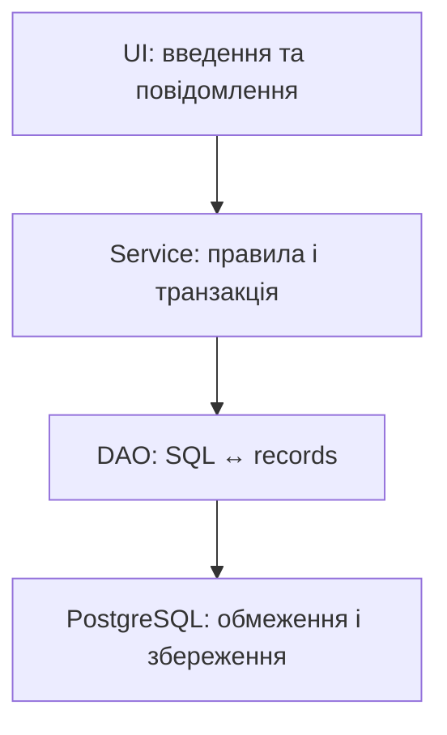

# DAO, DataSource і перевірка

## DAO і пакетні зміни

**DAO** приховує SQL за методами `add`, `find`, `list`. Сервіс координує кілька DAO в одній транзакції, а консольний UI читає дані та формує повідомлення. DAO не повинен самостійно друкувати меню чи запитувати пароль із клавіатури.



Рис. 14.11. Предметні дані передаються між шарами без ResultSet {.caption}

### Приклад 4. Читачі, згенерований ключ і batch

Інтерфейс та реалізація вкладені в один клас лише для компактного друку. У проєкті їх можна винести в окремі файли. Цей DAO використовує передане з’єднання, не закриває його і не виконує прихований commit – транзакцією керує викликач.

```java
package demo;

import java.sql.*;
import java.util.List;

public final class ReadersMain {
    interface ReaderDao {
        long add(String name) throws SQLException;
        void addAll(List<String> names) throws SQLException;
    }

    static final class JdbcReaders implements ReaderDao {
        private final Connection connection;
        JdbcReaders(Connection connection) {
            this.connection = connection;
        }

        public long add(String name) throws SQLException {
            try (PreparedStatement insert =
                    connection.prepareStatement(
                    "INSERT INTO j14_readers(name) VALUES (?)",
                    new String[]{"id"})) {
                insert.setString(1, name);
                insert.executeUpdate();
                try (ResultSet keys = insert.getGeneratedKeys()) {
                    if (!keys.next()) {
                        throw new SQLException("No key");
                    }
                    return keys.getLong(1);
                }
            }
        }

        public void addAll(List<String> names) throws SQLException {
            try (PreparedStatement insert =
                    connection.prepareStatement(
                    "INSERT INTO j14_readers(name) VALUES (?)")) {
                for (String name : names) {
                    insert.setString(1, name);
                    insert.addBatch();
                }
                insert.executeBatch();
            }
        }
    }

    public static void main(String[] args) throws Exception {
        try (Connection connection = Db.open();
             Statement setup = connection.createStatement()) {
            setup.executeUpdate("""
                CREATE TEMP TABLE j14_readers (
                  id bigint GENERATED ALWAYS AS IDENTITY PRIMARY KEY,
                  name text NOT NULL CHECK (length(trim(name)) > 0))
                """);
            connection.setAutoCommit(false);
            try {
                ReaderDao dao = new JdbcReaders(connection);
                System.out.println("id: " + dao.add("Олена"));
                dao.addAll(List.of("Тарас", "Марія"));
                connection.commit();
            } catch (SQLException error) {
                connection.rollback();
                throw error;
            }
            try (ResultSet rows = setup.executeQuery(
                    "SELECT count(*) FROM j14_readers")) {
                rows.next();
                System.out.println("Читачів: " + rows.getLong(1));
            }
        }
    }
}
```

```text
id: 1
Читачів: 3
```

`RETURN_GENERATED_KEYS` або список імен ключових стовпців вказує драйверу повернути ключі. Не шукайте новий id через `SELECT max(id)`: між вставкою та читанням може працювати інший клієнт. Послідовності PostgreSQL можуть мати пропуски після відкату; id не є безперервним номером рядка у звіті.

Результат executeBatch містить кількість змін для елементів або спеціальні значення JDBC, зокрема SUCCESS\_NO\_INFO. Не підсумовуйте їх як звичайні додатні числа. Batch сам не гарантує атомарність – її забезпечує транзакція.

## DataSource, метадані та помилки

`DataSource` є фабрикою з’єднань. `PGSimpleDataSource` налаштовує PostgreSQL без ручного складання DriverManager-виклику, але не є пулом. HikariCP – приклад окремого пулу, який повторно використовує обмежену кількість з’єднань. Його власник закриває пул при завершенні застосунку.

Пул не означає спільний Connection для всіх потоків. Коротка операція бере власне з’єднання й повертає його через close. Одночасне використання одного Connection різними фоновими задачами ускладнює транзакції й не є заміною правильної архітектури доступу.

DatabaseMetaData описує сервер, драйвер, таблиці та можливості; ResultSetMetaData – стовпці конкретного результату. Вони корисні для діагностики й універсальних звітів, але предметний DAO зазвичай має явні імена й типи полів.

SQLException містить SQLState, код виробника та ланцюжок причин. Клас стану `23` позначає порушення обмежень; точний код допомагає відрізнити дублікат від зовнішнього ключа. Повідомлення драйвера може містити значення даних, тому користувачеві показують зрозумілий текст без витоку секретів.

`Connection refused` змушує перевірити сервер, порт і адресу; `password authentication failed` – роль і автентифікацію; `No suitable driver` – залежність та URL. Вимкнення перевірки сертифіката не є універсальним способом виправити мережу. Для віддаленого сервера TLS і доступ налаштовує його власник.

## Перевірка DAO та транзакцій

Інтеграційні тести запускайте у власній навчальній базі або унікальній схемі. Перевірте вставку й повторне читання новим з’єднанням, порожній результат, апостроф, nullable дату, дублікат, невідомий зовнішній ключ та видалення відсутнього id. Відкат слід перевіряти не повідомленням у консолі, а даними.

Для переказу перевірте збереження суми двох балансів, недостатній залишок, штучний збій після списання та два конкурентні запити. Тест на SQLite чи H2 не доводить правильність блокувань PostgreSQL, тому основні транзакційні сценарії курсу виконуються саме на PostgreSQL.

::: info Знімок екрана
Run isolated CRUD/transaction demos; show rows before and after failure.
:::

Рис. 14.12. Предметний результат і підтвердження відкату {.caption}
