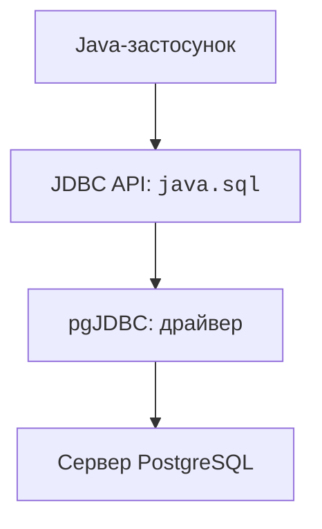
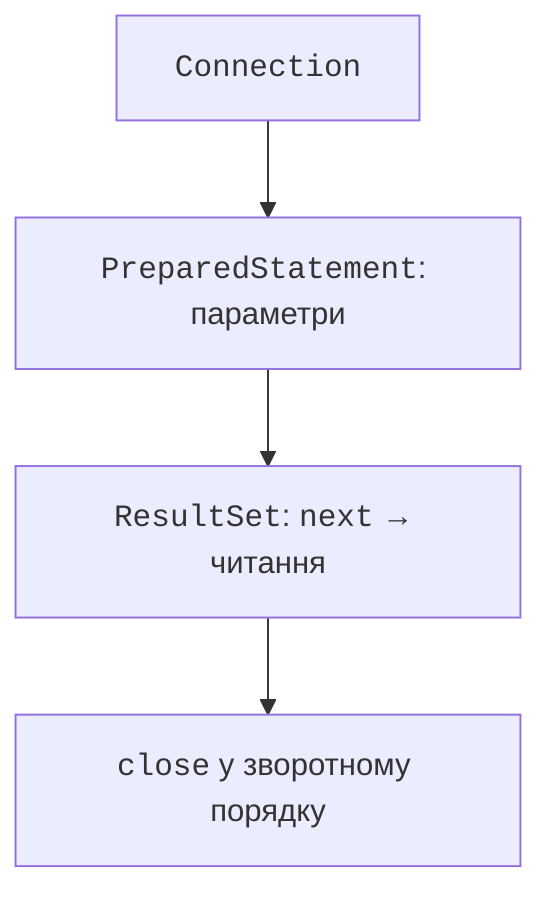
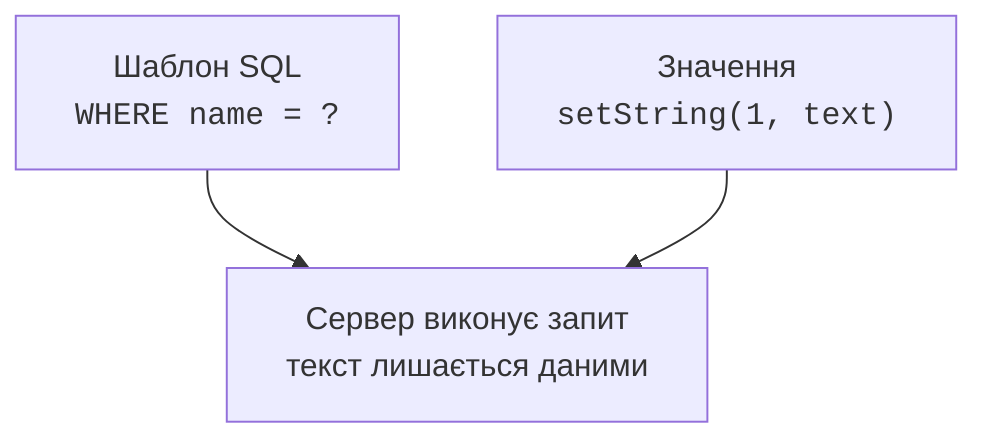
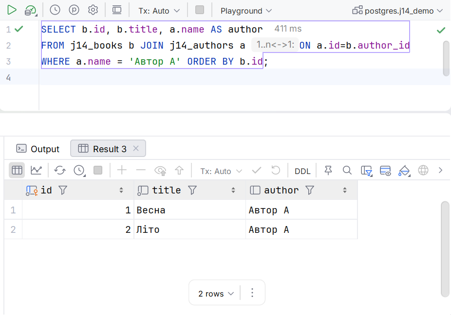

# JDBC і запити

## JDBC: API, драйвер і з’єднання

**JDBC** – API платформи Java для доступу до реляційних БД. Інтерфейси Connection, PreparedStatement і ResultSet належать `java.sql`. Драйвер PostgreSQL реалізує ці інтерфейси та перетворює виклики на протокол сервера. Зміна драйвера не робить довільний SQL автоматично переносним між СКБД.



Рис. 14.5. Драйвер відділяє Java API від протоколу PostgreSQL {.caption}

Додайте в Maven POM теми 13 залежність pgJDBC. Для програми на module path дескриптор має `requires java.sql`. У цій темі консольні приклади працюють на classpath, щоб увага залишалася на JDBC; JPMS повернеться у JavaFX-проєкті. <https://jdbc.postgresql.org/documentation/>.

```xml
<dependency>
  <groupId>org.postgresql</groupId>
  <artifactId>postgresql</artifactId>
  <version>42.7.13</version>
</dependency>
```

Сучасний JDBC-драйвер реєструється автоматично через механізм сервісів, якщо JAR доступний під час виконання. Старий `Class.forName("org.postgresql.Driver")` зазвичай не потрібний. `No suitable driver` спочатку змушує перевірити runtime classpath і JDBC URL, а не додавати випадкові try/catch.

::: info Знімок екрана
pom.xml 42.7.13 and Maven dependency tree.
:::

Рис. 14.6. pgJDBC у Maven-залежностях застосунку {.caption}

### Спільний клас конфігурації

У кожний окремий приклад цієї теми додайте наведений `src/main/java/demo/Db.java`. Він є повним спільним допоміжним класом, а не зовнішньою прихованою бібліотекою. Решту програм запускайте окремо, задаючи відповідний mainClass.

Налаштуйте `DB_URL`, `DB_USER`, `DB_PASSWORD` для дочірнього процесу запуску. URL має форму `jdbc:postgresql://localhost:5432/library`. Пароль не друкують у журналі й не додають до репозиторію.

```java
package demo;

import java.sql.Connection;
import java.sql.DriverManager;
import java.sql.SQLException;
import java.util.Properties;

public final class Db {
    private Db() {}

    private static String required(String key) {
        String value = System.getenv(key);
        if (value == null || value.isBlank()) {
            throw new IllegalStateException("Missing " + key);
        }
        return value;
    }

    public static Connection open() throws SQLException {
        Properties properties = new Properties();
        properties.setProperty("user", required("DB_USER"));
        properties.setProperty("password", required("DB_PASSWORD"));
        properties.setProperty("connectTimeout", "5");
        properties.setProperty("socketTimeout", "10");
        return DriverManager.getConnection(required("DB_URL"),
            properties);
    }
}
```

`Properties` передає параметри окремо від URL. Ліміт очікування підключення й socket timeout допомагають уникнути нескінченного очікування мережі. Вони не замінюють предметної обробки помилки. Секрети середовища доступні процесу; не показуйте їх у звіті або скриншоті налаштувань запуску.

## Приклад 1. Перше підключення

`src/main/java/demo/ConnectMain.java`:

```java
package demo;

import java.sql.Connection;
import java.sql.DatabaseMetaData;

public final class ConnectMain {
    public static void main(String[] args) throws Exception {
        try (Connection connection = Db.open()) {
            DatabaseMetaData metadata = connection.getMetaData();
            System.out.println(metadata.getDatabaseProductName());
            System.out.println(metadata.getDatabaseMajorVersion());
            System.out.println(metadata.getDriverVersion());
        }
    }
}
```

Для перевіреного сервера результат – назва `PostgreSQL`, основна версія `18` і версія драйвера `42.7.13`. Номер драйвера й версія сервера незалежні. Якщо сервер має інший підтримуваний випуск, його метадані закономірно відрізнятимуться.

`try-with-resources` закриває Connection навіть при винятку. Порядок закриття вкладених ресурсів зворотний: ResultSet, Statement, Connection. Не повертайте відкритий ResultSet із методу, який одразу закриває його з’єднання.



Рис. 14.7. Короткий життєвий цикл JDBC-ресурсів {.caption}

## Параметри та результати запиту

`executeQuery` використовують для запиту з ResultSet, `executeUpdate` – для INSERT/UPDATE/DELETE та деяких DDL. Повернена кількість змінених рядків важлива: нуль при зміні за id означає відсутній запис або невиконану умову. `execute` потрібний, коли форма результату може відрізнятися.

Параметри PreparedStatement позначаються `?` і нумеруються з одиниці. `setString`, `setLong`, `setBigDecimal`, `setObject` передають значення окремо від синтаксису SQL. Змінну назву стовпця або ASC/DESC не можна підставити як параметр значення: такі частини обирають із дозволеного списку.



Рис. 14.8. Значення параметра не стає частиною SQL-синтаксису {.caption}

Небезпечна конкатенація може перетворити рядок користувача на умову SQL. У PreparedStatement той самий текст залишається одним значенням. Це правило діє також для «звичайних» назв з апострофом, які ламають ручне вставляння лапок. Для LIKE символи `%` та `_` лишаються шаблонними; буквальний пошук потребує окремого екранування шаблону.

ResultSet спочатку стоїть перед першим рядком. Цикл `while (rows.next())` переходить до кожного результату. Індекс стовпця теж починається з одиниці; назва або alias часто читабельніші. `getInt` для SQL NULL повертає нуль, тому за потреби перевіряють `wasNull` або читають nullable-тип через `getObject`. Не втрачайте відмінність між нулем і відсутністю.

## Приклад 2. Каталог книг із JOIN

Програма створює власні тимчасові таблиці, додає два рядки та читає книги конкретного автора. Record Book містить звичайні дані, тому залишається придатним після закриття ResultSet.

```java
package demo;

import java.sql.*;
import java.util.ArrayList;
import java.util.List;

public final class CatalogMain {
    record Book(long id, String title, String author) {}

    static List<Book> find(Connection connection, String author)
            throws SQLException {
        String sql = """
            SELECT b.id, b.title, a.name AS author
            FROM j14_books b JOIN j14_authors a ON a.id=b.author_id
            WHERE a.name = ? ORDER BY b.id
            """;
        List<Book> books = new ArrayList<>();
        try (PreparedStatement query =
                connection.prepareStatement(sql)) {
            query.setString(1, author);
            try (ResultSet rows = query.executeQuery()) {
                while (rows.next()) {
                    books.add(new Book(rows.getLong("id"),
                        rows.getString("title"),
                        rows.getString("author")));
                }
            }
        }
        return List.copyOf(books);
    }

    public static void main(String[] args) throws Exception {
        try (Connection connection = Db.open();
             Statement setup = connection.createStatement()) {
            setup.executeUpdate("""
                CREATE TEMP TABLE j14_authors (
                  id bigint PRIMARY KEY, name text NOT NULL)
                """);
            setup.executeUpdate("""
                CREATE TEMP TABLE j14_books (
                  id bigint PRIMARY KEY, title text NOT NULL,
                  author_id bigint REFERENCES j14_authors(id))
                """);
            setup.executeUpdate("""
                INSERT INTO j14_authors VALUES (1, 'Автор A')
                """);
            setup.executeUpdate("""
                INSERT INTO j14_books VALUES
                  (1, 'Весна', 1), (2, 'Літо', 1)
                """);
            find(connection, "Автор A").forEach(System.out::println);
            System.out.println("Невідомий: " +
                find(connection, "' OR '1'='1").size());
        }
    }
}
```

```text
Book[id=1, title=Весна, author=Автор A]
Book[id=2, title=Літо, author=Автор A]
Невідомий: 0
```

Без ORDER BY порядок результату не гарантується. INNER JOIN повертає лише збіги, LEFT JOIN зберігає всі рядки лівої таблиці. Для звіту «автори без книг також» потрібний LEFT JOIN і COUNT ключа книги; `COUNT(*)` матиме інший зміст для штучного рядка з NULL справа.



Рис. 14.9. Перевірка JOIN у SQL-консолі {.caption}
