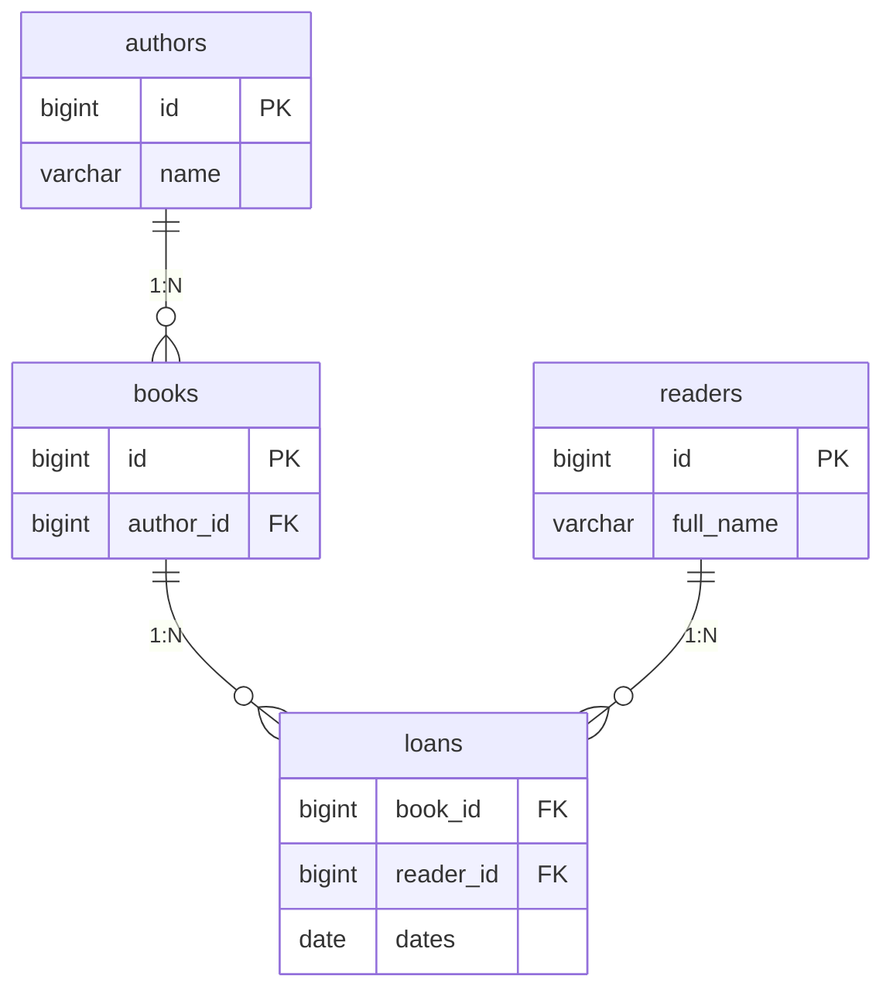

# Реляційна модель і PostgreSQL

## Постійні дані та реляційна модель

Колекція Java зберігає об’єкти до завершення процесу. Файл може зберегти їх довше, але перевірку зв’язків і узгоджену роботу кількох клієнтів доведеться реалізувати самим. **Система керування базами даних** забезпечує запити, обмеження, транзакції та контроль одночасного доступу.

У курсі основна СКБД – **PostgreSQL**. Це сервер: Java-клієнт підключається до процесу PostgreSQL через мережевий протокол, навіть якщо обидва працюють на одному комп’ютері. Файл конфігурації JDBC не містить саму базу даних. Офіційна документація: <https://www.postgresql.org/docs/current/>.

Таблиця описує набір рядків із типізованими стовпцями. Первинний ключ однозначно визначає рядок. Зовнішній ключ посилається на іншу таблицю, а UNIQUE, NOT NULL і CHECK захищають предметні обмеження. Перевірка Java-форми не замінює обмежень сервера, до якого можуть звертатися інші клієнти.



Рис. 14.1. Книги, автори, читачі та історія видач {.caption}

Книги не ідентифікують лише назвою: різні видання можуть мати однакові назви. Зв’язок із автором зберігається ключем, а не копією його імені. Таблиця видач є окремою, бо одна книга може видаватися багато разів у різні дати.

## Підготовка PostgreSQL

Використайте офіційне завантаження: <https://www.postgresql.org/download/>. Для Windows майстер дозволяє вибрати сервер, командні засоби, каталог даних і порт; типовий порт 5432. На Linux і macOS дотримуйтеся інструкції для конкретного дистрибутива, бо назви пакетів і служби відрізняються. Приклади перевірено на PostgreSQL 18.6.

Створіть окрему навчальну базу та роль. Не запускайте повсякденну програму як адміністратор `postgres`. Пароль установіть інтерактивною командою psql, щоб він не залишився в скопійованому SQL-файлі. Наведені адміністративні команди виконує власник локального навчального сервера.

```sql
CREATE ROLE lab LOGIN;
```

У psql виконайте `\password lab`, потім:

```sql
CREATE DATABASE library OWNER lab;
```

Підключіться `psql -h localhost -p 5432 -U lab -d library`. Для нестандартного порту замініть його і в psql, і в JDBC URL. Перевірте `SELECT current_user, current_database();`. Зміна пароля ролі не змінює автоматично збережену конфігурацію Java.

::: info Знімок екрана
PostgreSQL 18 installer: server and command line tools; no secrets.
:::

Рис. 14.2. Вибір компонентів локального PostgreSQL {.caption}

::: info Знімок екрана
psql: CREATE ROLE, password prompt hidden, CREATE DATABASE, connection.
:::

Рис. 14.3. Окрема роль і база для лабораторної {.caption}

У DataGrip або Database-вікні IntelliJ IDEA створіть джерело PostgreSQL: host, port, database, user. Завантажте запропонований драйвер і виконайте *Test Connection*. У консолі SQL запит виконується через **Ctrl+Enter**. Не плутайте підключення IDE із підключенням програми: це різні клієнти зі своїми параметрами. <https://www.jetbrains.com/help/datagrip/connecting-to-a-database.html>.

Умови ліцензування IDE перевіряйте на офіційній сторінці продукту для свого способу використання; сам факт навчальної роботи не є технічною вимогою JDBC. Для всіх прикладів достатньо безкоштовного psql і термінального Maven-збирання.

::: info Знімок екрана
DataGrip PostgreSQL library/lab, Test Connection; hide credentials.
:::

Рис. 14.4. Підключення до навчальної бази {.caption}

### DDL, DML та точні типи

DDL описує структуру: CREATE TABLE, ALTER TABLE, CREATE INDEX. DML змінює рядки: INSERT, UPDATE, DELETE. SELECT читає дані. Тип `generated always as identity` надає серверний числовий ключ. Для грошей придатні `numeric(12,2)` і Java BigDecimal або цілі копійки; double не гарантує точного десяткового представлення.

`date` відповідає календарній даті без часу; JDBC може читати її як LocalDate. Для моменту події у різних часових поясах потрібний інший узгоджений контракт. NULL означає відсутність значення, а не порожній рядок, нуль або дата «01.01.1970».

```sql
CREATE TABLE authors (
  id bigint GENERATED ALWAYS AS IDENTITY PRIMARY KEY,
  name varchar(120) NOT NULL
);
CREATE TABLE books (
  id bigint GENERATED ALWAYS AS IDENTITY PRIMARY KEY,
  title varchar(200) NOT NULL,
  author_id bigint NOT NULL REFERENCES authors(id),
  price numeric(12,2) NOT NULL CHECK (price >= 0)
);
```

Це схема для власної навчальної бази. Повторне CREATE TABLE існуючого об’єкта є помилкою; реальний проєкт змінює схему міграціями. Демонстраційні програми нижче створюють тимчасові таблиці, які зникають після закриття їхнього з’єднання. Вони не видаляють наявні таблиці вашої бази.
