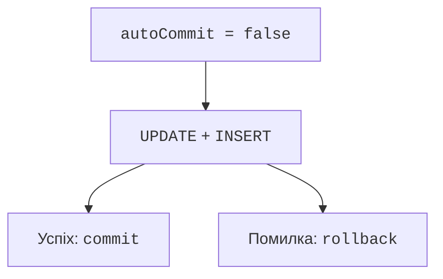

# Транзакції та конкурентність

## Транзакції та конкурентність

За замовчуванням JDBC працює в auto-commit: кожна завершена SQL-операція фіксується окремо. Якщо видача книги складається зі зміни доступності та запису журналу, потрібна одна транзакція: `setAutoCommit(false)`, усі дії, `commit`. При помилці викликають `rollback` і передають її далі.



Рис. 14.10. Видача змінює доступність і журнал атомарно {.caption}

Після SQL-помилки PostgreSQL поточна транзакція зазвичай перебуває у стані помилки до відкату. Простий catch із друком повідомлення не відновлює її. Відкат теж може завершитися винятком, тому початкову причину зберігають, а вторинну додають через `addSuppressed`.

Якщо Connection передається ззовні, метод має чітко домовитися, хто керує транзакцією. При поверненні з’єднання в пул налаштування слід відновити. У повних прикладах власник відкриває нове з’єднання на операцію й закриває його після commit або rollback, тому воно не використовується повторно випадково.

### Приклад 3. Видача книги

Умовний UPDATE змінює рядок лише коли книга доступна. Це важливіше за попередній SELECT без блокування: інший клієнт може змінити стан між читанням і записом. Кількість змінених рядків визначає, чи отримано право на видачу.

```java
package demo;

import java.sql.*;

public final class LoanMain {
    static void issue(Connection connection, long book,
                      String reader, boolean fail)
            throws SQLException {
        connection.setAutoCommit(false);
        try {
            try (PreparedStatement update =
                    connection.prepareStatement(
                    "UPDATE j14_stock SET available=false " +
                    "WHERE id=? AND available=true")) {
                update.setLong(1, book);
                if (update.executeUpdate() != 1) {
                    throw new SQLException(
                        "Book unavailable", "P0001");
                }
            }
            if (fail) throw new SQLException("Simulated failure");
            try (PreparedStatement insert =
                    connection.prepareStatement(
                    "INSERT INTO j14_loans(book_id,reader) "
                    + "VALUES (?,?)")) {
                insert.setLong(1, book);
                insert.setString(2, reader);
                insert.executeUpdate();
            }
            connection.commit();
        } catch (SQLException error) {
            try { connection.rollback(); }
            catch (SQLException rollback) {
                error.addSuppressed(rollback);
            }
            throw error;
        }
    }

    static boolean available(Connection connection)
            throws SQLException {
        try (Statement statement = connection.createStatement();
             ResultSet rows = statement.executeQuery(
                 "SELECT available FROM j14_stock WHERE id=1")) {
            if (!rows.next()) throw new SQLException("Missing book");
            return rows.getBoolean(1);
        }
    }

    public static void main(String[] args) throws Exception {
        try (Connection connection = Db.open();
             Statement setup = connection.createStatement()) {
            setup.executeUpdate("""
                CREATE TEMP TABLE j14_stock (
                  id bigint PRIMARY KEY, available boolean NOT NULL)
                """);
            setup.executeUpdate("""
                CREATE TEMP TABLE j14_loans (
                  book_id bigint REFERENCES j14_stock(id),
                  reader text)
                """);
            setup.executeUpdate(
                "INSERT INTO j14_stock VALUES (1,true)");
            try { issue(connection, 1, "Олена", true); }
            catch (SQLException expected) {
                System.out.println(
                    "Відкат: " + available(connection));
            }
            issue(connection, 1, "Олена", false);
            System.out.println(
                "Після видачі: " + available(connection));
        }
    }
}
```

```text
Відкат: true
Після видачі: false
```

Тест має перевіряти також кількість рядків журналу: після невдалої дії 0, після успішної 1. Другий запит видачі тієї самої книги повинен відхилятися, а не створювати другий журнал. Тимчасові таблиці цього прикладу придатні для одного з’єднання; тест двох конкурентних клієнтів потребує спільної ізольованої схеми.

### Ізоляція й точки збереження

Ізоляція визначає, які зміни інших транзакцій видно. PostgreSQL зазвичай починає з READ COMMITTED: кожний оператор бачить свій актуальний знімок. REPEATABLE READ і SERIALIZABLE надають сильніші гарантії, але можуть вимагати повторення цілої транзакції після конфлікту. Повторюйте лише операції з визначеною політикою та обмеженою кількістю спроб.

`SELECT ... FOR UPDATE` блокує вибрані рядки для узгодженої зміни. При блокуванні кількох рахунків беріть їх у сталому порядку id, щоб зменшити ризик взаємного блокування. Транзакцію не тримають відкритою, поки користувач думає над діалогом: форму перевіряють до початку короткої операції.

`setSavepoint` створює точку часткового відкату; `rollback(savepoint)` повертає до неї. Це не незалежний commit усередині іншої транзакції. Після часткового відкату потрібно явно вирішити, чи дозволений подальший результат предметними правилами.
