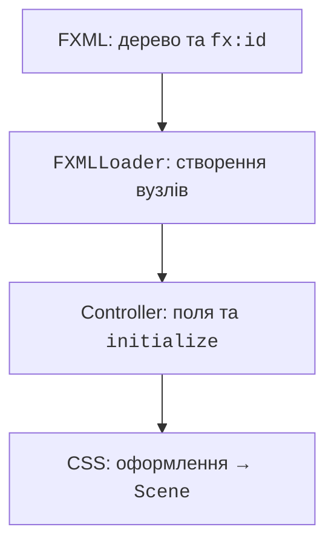
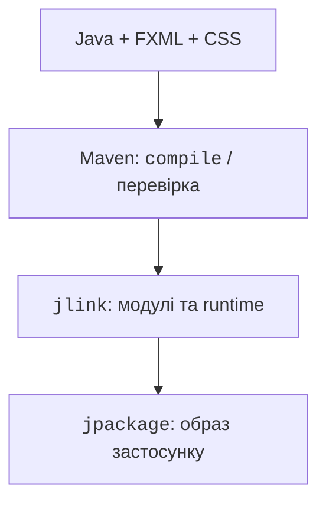

# CSS, FXML і розповсюдження

## CSS і ресурси

JavaFX CSS задає оформлення контролів через селектори класу, id і псевдокласу. Це не повна реалізація браузерного CSS. Властивості JavaFX мають префікс `-fx-`. Стиль `.button` поширюється на кнопки, `#status` – на вузол із відповідним id. Зовнішній CSS зручніший за багато повторених setStyle.

Ресурс шукають через getResource, відносно classpath або пакета класу. Початковий слеш означає корінь classpath. Objects.requireNonNull одразу пояснює відсутність ресурсу; інакше випадковий NullPointerException виникне пізніше. Перевіряйте ресурси також у зібраному JAR, а не лише з IDE.

## Приклад 4. FXML-форма привітання

FXML описує дерево об’єктів декларативно; контролер містить обробники. Це не HTML і не мова обчислень. FXMLLoader читає XML, створює вузли, передає поля з fx:id контролеру й лише після цього викликає initialize. Конструктор контролера ще не має доступу до ін’єктованих `@FXML` полів.



Рис. 15.8. Завантажувач поєднує розмітку, контролер і CSS {.caption}

Файл `src/main/resources/demo/greeting.fxml`:

```xml
<?xml version="1.0" encoding="UTF-8"?>
<?import javafx.scene.control.*?>
<?import javafx.scene.layout.VBox?>
<?import javafx.geometry.Insets?>
<VBox xmlns:fx="http://javafx.com/fxml/1" spacing="12"
  fx:controller="demo.GreetingController">
  <padding><Insets top="16" right="16"
    bottom="16" left="16"/></padding>
  <Label text="Ваше ім’я:"/>
  <TextField fx:id="name" promptText="Ім’я"/>
  <Button fx:id="greet" text="Привітати"
    onAction="#greet" defaultButton="true"/>
  <Label fx:id="status" wrapText="true"/>
</VBox>
```

Файл `src/main/java/demo/GreetingController.java`:

```java
package demo;

import javafx.fxml.FXML;
import javafx.scene.control.Label;
import javafx.scene.control.TextField;

public final class GreetingController {
    @FXML private TextField name;
    @FXML private Label status;

    @FXML
    private void initialize() {
        status.setText("Введіть ім’я та натисніть кнопку");
    }

    @FXML
    private void greet() {
        String value = name.getText().strip();
        if (value.isEmpty() || value.length() > 40) {
            status.setText("Потрібно від 1 до 40 символів");
            name.requestFocus();
            return;
        }
        status.setText("Вітаємо, " + value + "!");
    }
}
```

Файл `src/main/java/demo/GreetingMain.java`:

```java
package demo;

import java.util.Objects;
import javafx.application.Application;
import javafx.fxml.FXMLLoader;
import javafx.scene.Scene;
import javafx.stage.Stage;

public final class GreetingMain extends Application {
    @Override
    public void start(Stage stage) throws Exception {
        var fxml = Objects.requireNonNull(
            getClass().getResource("/demo/greeting.fxml"),
            "Missing greeting.fxml");
        var css = Objects.requireNonNull(
            getClass().getResource("/demo/app.css"),
            "Missing app.css");
        Scene scene = new Scene(FXMLLoader.load(fxml), 400, 210);
        scene.getStylesheets().add(css.toExternalForm());
        stage.setScene(scene);
        stage.setTitle("Привітання");
        stage.show();
    }

    public static void main(String[] args) { launch(args); }
}
```

Файл `src/main/resources/demo/app.css`:

```css
.root {
  -fx-font-family: "Arial";
  -fx-font-size: 14px;
  -fx-background-color: #f4f4f4;
}
.button { -fx-padding: 8 16 8 16; }
#status { -fx-font-weight: bold; }
```

Очікуваний результат після введення ` Олена ` – `Вітаємо, Олена!`. Порожнє ім’я залишає форму відкритою й показує вимогу до довжини. Це привітання, а не перевірка особи: справжню автентифікацію не можна замінити порівнянням рядка чи приховуванням поля через PasswordField.

Scene Builder редагує FXML візуально. У Library обирають контроли, Hierarchy показує дерево, Inspector – Layout, Properties і Code. У Code задайте fx:id і назву обробника без початкового решітки; у збереженому FXML onAction має `#`. Версія Scene Builder має підтримувати використані контроли. Код контролера і залежності проєкту редактор не генерує.

::: info Знімок екрана
Open greeting.fxml; show Hierarchy and Code fx:id.
:::

Рис. 15.9. Дерево та властивості FXML у Scene Builder {.caption}

::: info Знімок екрана
Run GreetingMain, enter Olena and activate greeting.
:::

Рис. 15.10. FXML-форма після застосування CSS {.caption}

## Перевірка і розповсюдження

Чисті перетворення тестуйте JUnit без запуску графічної підсистеми. UI-сценарій окремо перевіряє натискання, фокус, ресурси й стан контролів. Створення вузла не доводить, що форма коректна на іншому масштабі Windows: потрібна ручна перевірка вузького вікна, клавіатури та великого шрифту.

Модульний застосунок можна зібрати в образ виконання:

```text
mvn clean javafx:jlink
```

Плагін використовує module-info та модулі поточної платформи. Отриманий runtime image не потребує окремого JDK, але є платформним: Windows-образ не запускається на Linux. Перевіряйте старт із каталогу, відмінного від кореня проєкту, щоб виявити помилкові відносні шляхи ресурсів.

jpackage додає launcher і за потреби інсталятор. Спочатку створюють app-image та перевіряють його, потім формують інсталятор потрібного формату. Для наведеного модуля образ створює команда PowerShell:

```powershell
jpackage --type app-image --name JavaFxCourse `
  --dest package --runtime-image target/image `
  --module demo.fx/demo.CounterMain
```

Вона створює `package/JavaFxCourse` без інсталяції в систему. Пакувальник не вирішує питання підпису, оновлень, ліцензій чи міграції даних. Інструменти платформи, потрібні для MSI/EXE, установлюються окремо. У наступній темі додамо багатошарову архітектуру і доступ до PostgreSQL без блокування вікна.



Рис. 15.11. Від джерел до перевірюваного образу застосунку {.caption}
