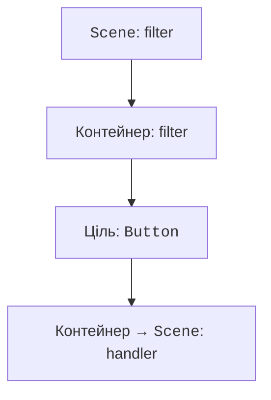
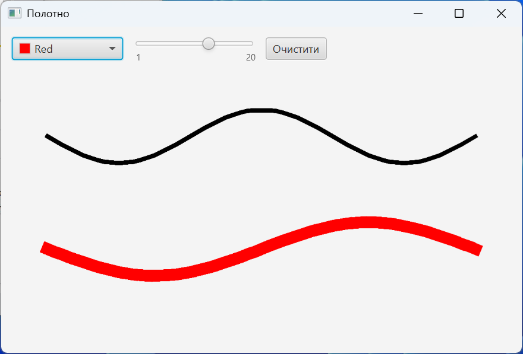

# Події та потік інтерфейсу

## Поширення подій і потік інтерфейсу

Шлях події проходить від сцени до цільового вузла (**capturing**, фільтри), а потім назад (**bubbling**, обробники). `addEventFilter` придатний для попереднього контролю, `addEventHandler` – для реакції. `consume` припиняє подальше поширення; застосовуйте його лише з конкретною потребою, щоб випадково не зламати клавіатурну навігацію.



Рис. 15.6. Фільтр бачить подію раніше за обробник цілі {.caption}

JavaFX Application Thread обслуговує події, компонування й оновлення сцени. Довгий цикл, Thread.sleep або JDBC-запит у setOnAction заморожує вікно. Обчислення чи введення-виведення виконують у фоновому Task; зміни живих контролів повертають на FX-потік. Platform.runLater ставить коротку дію в чергу, але сам по собі не переносить важку роботу у фон.

## Приклад 3. Простий графічний редактор

Canvas зберігає намальовані пікселі; окремий штрих не є вузлом Scene Graph. Після зміни розмірів полотна для надійного відновлення потрібна власна модель штрихів. Тут розмір фіксований, а ColorPicker і Slider задають параметри пера.

```java
package demo;

import javafx.application.Application;
import javafx.geometry.Insets;
import javafx.scene.Scene;
import javafx.scene.canvas.Canvas;
import javafx.scene.control.*;
import javafx.scene.layout.VBox;
import javafx.scene.layout.HBox;
import javafx.scene.paint.Color;
import javafx.stage.Stage;

public final class PaintMain extends Application {
    @Override
    public void start(Stage stage) {
        Canvas canvas = new Canvas(560, 300);
        canvas.setId("canvas");
        var pen = canvas.getGraphicsContext2D();
        ColorPicker color = new ColorPicker(Color.BLACK);
        Slider width = new Slider(1, 20, 3);
        width.setShowTickLabels(true);
        Button clear = new Button("Очистити");
        clear.setId("clear");
        canvas.setOnMousePressed(event -> {
            pen.setStroke(color.getValue());
            pen.setLineWidth(width.getValue());
            pen.beginPath();
            pen.moveTo(event.getX(), event.getY());
        });
        canvas.setOnMouseDragged(event -> {
            pen.lineTo(event.getX(), event.getY());
            pen.stroke();
        });
        clear.setOnAction(event -> pen.clearRect(0, 0,
            canvas.getWidth(), canvas.getHeight()));
        VBox root = new VBox(10,
            new HBox(10, color, width, clear), canvas);
        root.setPadding(new Insets(12));
        stage.setTitle("Полотно");
        stage.setScene(new Scene(root));
        stage.show();
    }

    public static void main(String[] args) { launch(args); }
}
```

Перетягування після натискання малює лінію; очищення прибирає пікселі, але не змінює колір і товщину пера. Для редактора з Undo потрібен список команд чи штрихів, а не спроба вивести початкові об’єкти з готового растрового зображення.

Анімацію слід задавати через Timeline, KeyFrame або Transition. Timeline оновлює властивості за часом, а не покладається на точну кількість кадрів. AnimationTimer отримує час кадру й придатний для симуляцій. Після закриття відповідної сцени довготривалу анімацію треба зупинити, інакше вона утримує посилання на вже непотрібні об’єкти.

Діаграми LineChart, BarChart і PieChart призначені для даних, а не довільного малювання. CategoryAxis представляє категорії, NumberAxis – числову шкалу. Підписуйте осі, одиниці й серії; порожній набір має давати порожню діаграму з поясненням, а не вигаданий нульовий вимір. Не використовуйте колір як єдиний спосіб відрізнити серії у друкованому звіті.



Рис. 15.7. Полотно зі штрихами різної товщини {.caption}
