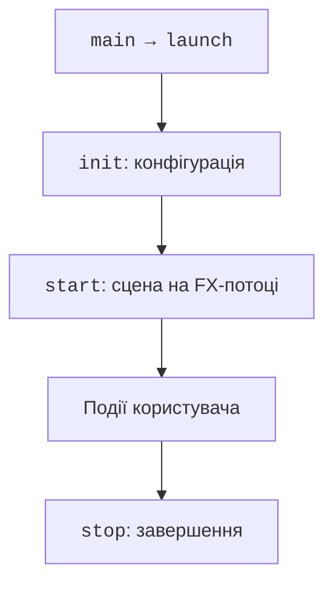
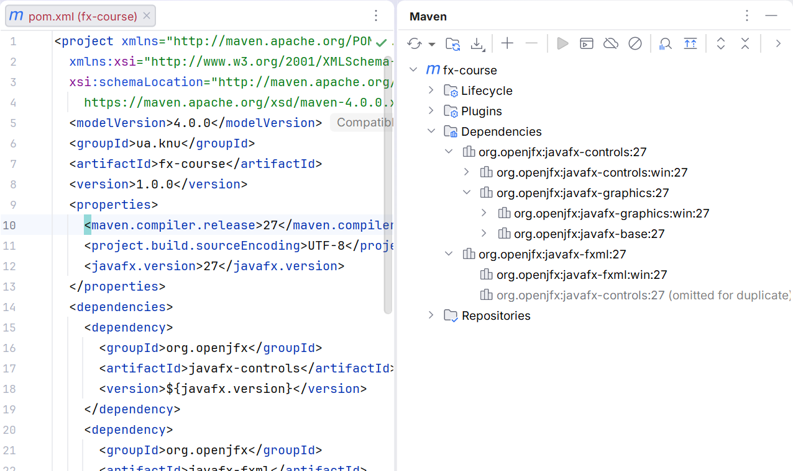
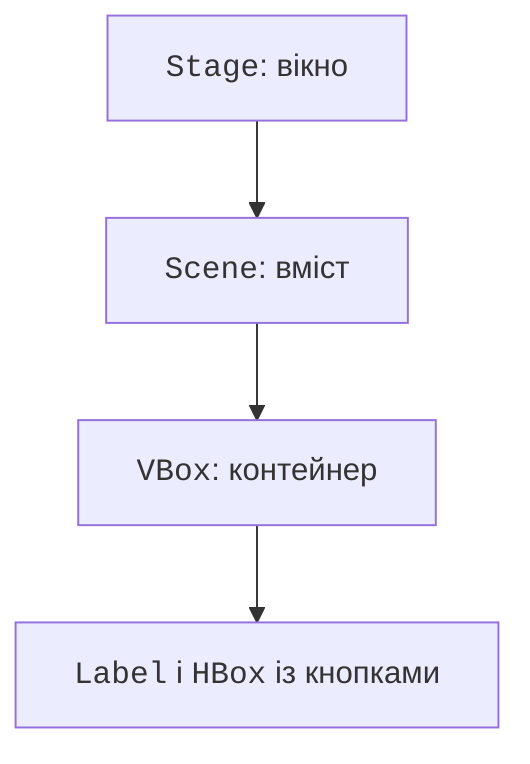

# Перший застосунок JavaFX

## Від консольного алгоритму до графічного застосунку

Консольна програма зазвичай сама визначає порядок введення. У вікні користувач може натиснути кнопку кілька разів, змінити попереднє поле або закрити форму. Тому GUI є **подієвою програмою**: вона очікує подій і виконує короткі обробники, які переводять модель та інтерфейс у новий стан.

JavaFX – окрема бібліотека для графічних застосунків JVM. Вона не входить до стандартної поставки JDK. Проєкт OpenJFX надає модулі, нативні бібліотеки для конкретної операційної системи та документацію. У курсі використовуємо **JavaFX 27** із **JDK 27**; Maven завантажує потрібні платформні артефакти. Документація: <https://openjfx.io/openjfx-docs/>.

Клас `Application` визначає життєвий цикл. `launch` запускає середовище лише один раз у процесі. `init` придатний для підготовки конфігурації, але не для створення Stage чи Scene. `start(Stage)` працює на JavaFX Application Thread та створює вікно. `stop` звільняє ресурси після завершення застосунку. Не слід викликати start вручну як звичайний main.



Рис. 15.1. Послідовність створення та закриття застосунку {.caption}

**Stage** – вікно операційної системи, **Scene** – його вміст, а **Node** – вузол дерева елементів. Кнопка, напис, контейнер і Canvas є вузлами. Вузол має одного батька: ту саму кнопку не можна одночасно розмістити у двох контейнерах.

## Відтворюваний Maven-проєкт

Створіть `src/main/java/demo` та `src/main/resources/demo`. Java-класи зберігаються в першому каталозі, FXML і CSS – у другому. Maven копіює ресурси у classpath; абсолютний шлях на власному диску не є переносним способом їх знайти. Повний POM нижче придатний для всіх прикладів цієї теми. Для запуску іншого прикладу змініть лише `mainClass`.

```xml
<project xmlns="http://maven.apache.org/POM/4.0.0"
  xmlns:xsi="http://www.w3.org/2001/XMLSchema-instance"
  xsi:schemaLocation="http://maven.apache.org/POM/4.0.0
    https://maven.apache.org/xsd/maven-4.0.0.xsd">
  <modelVersion>4.0.0</modelVersion>
  <groupId>ua.knu</groupId>
  <artifactId>fx-course</artifactId>
  <version>1.0.0</version>
  <properties>
    <maven.compiler.release>27</maven.compiler.release>
    <project.build.sourceEncoding>UTF-8</project.build.sourceEncoding>
    <javafx.version>27</javafx.version>
  </properties>
  <dependencies>
    <dependency>
      <groupId>org.openjfx</groupId>
      <artifactId>javafx-controls</artifactId>
      <version>${javafx.version}</version>
    </dependency>
    <dependency>
      <groupId>org.openjfx</groupId>
      <artifactId>javafx-fxml</artifactId>
      <version>${javafx.version}</version>
    </dependency>
  </dependencies>
  <build>
    <plugins>
      <plugin>
        <groupId>org.apache.maven.plugins</groupId>
        <artifactId>maven-compiler-plugin</artifactId>
        <version>3.16.0</version>
      </plugin>
      <plugin>
        <groupId>org.openjfx</groupId>
        <artifactId>javafx-maven-plugin</artifactId>
        <version>0.0.8</version>
        <configuration>
          <mainClass>demo.fx/demo.CounterMain</mainClass>
        </configuration>
      </plugin>
    </plugins>
  </build>
</project>
```

Модульний дескриптор `src/main/java/module-info.java` експортує пакет для запуску та відкриває контролери FXML для рефлексії завантажувача. `opens` не замінює `exports`: це різні види доступу, розглянуті в попередній темі.

```java
module demo.fx {
    requires javafx.controls;
    requires javafx.fxml;
    exports demo;
    opens demo to javafx.fxml;
}
```

```text
mvn -version
mvn clean compile
mvn javafx:run
```

Перевірте JDK у першій команді: налаштування Project SDK в IDE не завжди збігається з JAVA\_HOME термінала. Помилка `JavaFX runtime components are missing` означає, що шлях запуску не налаштував модулі JavaFX. Запуск Maven-плагіна допомагає відтворити правильний module path.



Рис. 15.2. JavaFX 27 у залежностях Maven-проєкту {.caption}

## Приклад 1. Лічильник натискань

Створимо самодостатній клас `demo.CounterMain`. Змінна count належить об’єкту застосунку, а не локальному обробнику. Кнопка збільшує значення, друга повертає початковий стан. Компонування VBox автоматично розташовує елементи вертикально.

```java
package demo;

import javafx.application.Application;
import javafx.geometry.Insets;
import javafx.scene.Scene;
import javafx.scene.control.Button;
import javafx.scene.control.Label;
import javafx.scene.layout.HBox;
import javafx.scene.layout.VBox;
import javafx.stage.Stage;

public final class CounterMain extends Application {
    private int count;

    @Override
    public void start(Stage stage) {
        Label value = new Label("0");
        value.setId("value");
        Button add = new Button("Додати");
        add.setId("add");
        Button reset = new Button("Скинути");
        reset.setId("reset");
        add.setOnAction(event -> {
            count = Math.incrementExact(count);
            value.setText(Integer.toString(count));
        });
        reset.setOnAction(event -> {
            count = 0;
            value.setText("0");
        });
        VBox root = new VBox(12, value, new HBox(8, add, reset));
        root.setPadding(new Insets(16));
        stage.setTitle("Лічильник");
        stage.setScene(new Scene(root, 320, 160));
        stage.show();
    }

    public static void main(String[] args) { launch(args); }
}
```

Після трьох натискань напис містить `3`, після скидання – `0`. Обробник отримує ActionEvent, але тут не потребує його полів. Лямбда захоплює посилання value; змінюється об’єкт Label, а не значення локальної змінної. Це відповідає правилу effectively final для захоплених змінних Java.



Рис. 15.3. Дерево першого застосунку {.caption}

Більшість контролів реагує на семантичні події. setOnAction кнопки підтримує і мишу, і клавіатуру. setOnMouseClicked не є рівнозначною заміною: він прив’язує дію саме до миші. Підписи мають описувати дію, а порядок фокусу – відповідати послідовності введення. Не передавайте стан лише кольором.
