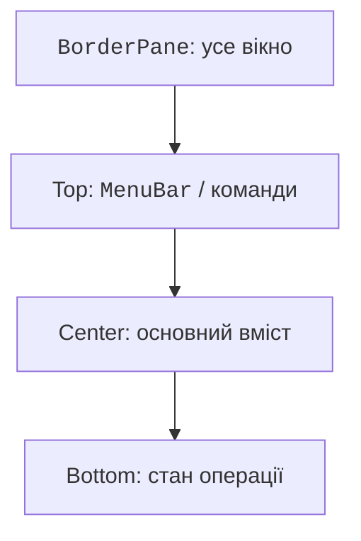

# Компонування та елементи керування

## Компонування без фіксованих координат

Контейнери обчислюють розміри дітей із мінімального, бажаного й максимального розмірів. `setPrefWidth` задає побажання; він не гарантує незмінну ширину. Прив’язувати кожний контрол до layoutX/layoutY зазвичай не потрібно: після зміни шрифту або розміру вікна така форма руйнується.

| Контейнер | Призначення |
| --- | --- |
| VBox / HBox | Один вертикальний або горизонтальний ряд. |
| BorderPane | Центр і чотири краї; центр отримує залишок. |
| GridPane | Таблиця рядків і стовпців для форми. |
| StackPane | Накладання вузлів: фон, вміст, повідомлення. |
| FlowPane / TilePane | Перенесення елементів за браком місця. |
| AnchorPane | Відступи від країв; зручний для окремих сцен. |

Padding – внутрішнє поле контейнера, spacing – проміжок між дітьми, margin – зовнішній відступ конкретного вузла. У HBox можна дозволити полю розтягуватися через HBox.hgrow; у GridPane для цього застосовують ColumnConstraints. ScrollPane додає прокручування, а не автоматично зменшує текст до непридатного для читання розміру.



Рис. 15.4. Типові області вікна та їх відповідальність {.caption}

## Приклад 2. Конвертер температури

Обчислення винесемо в чистий метод: його можна перевірити без JavaFX. Поле приймає крапку або кому як десятковий роздільник. Порожнє значення, NaN, нескінченність і температура нижче абсолютного нуля мають дати зрозуміле повідомлення.

```java
package demo;

import java.util.Locale;
import javafx.application.Application;
import javafx.geometry.Insets;
import javafx.scene.Scene;
import javafx.scene.control.*;
import javafx.scene.layout.GridPane;
import javafx.stage.Stage;

public final class TemperatureMain extends Application {
    public static double fahrenheit(String input) {
        double c = Double.parseDouble(
            input.strip().replace(',', '.'));
        if (!Double.isFinite(c) || c < -273.15 || c > 1_000_000) {
            throw new IllegalArgumentException("Поза межами");
        }
        return c * 1.8 + 32;
    }

    @Override
    public void start(Stage stage) {
        TextField input = new TextField();
        input.setId("input");
        input.setPromptText("Наприклад, 20,5");
        Label output = new Label("Введіть температуру");
        output.setId("output");
        Label caption = new Label("Градуси Цельсія:");
        caption.setLabelFor(input);
        Button convert = new Button("Обчислити");
        convert.setId("convert");
        convert.setDefaultButton(true);
        convert.setOnAction(event -> {
            try {
                double result = fahrenheit(input.getText());
                output.setText(String.format(Locale.ROOT,
                    "%.2f °F", result));
            } catch (IllegalArgumentException error) {
                output.setText(
                    "Потрібне число від -273,15 до 1000000");
                input.requestFocus();
            }
        });
        GridPane root = new GridPane();
        root.setHgap(10);
        root.setVgap(12);
        root.setPadding(new Insets(16));
        root.addRow(0, caption, input);
        root.addRow(1, convert, output);
        stage.setTitle("Температура");
        stage.setScene(new Scene(root, 540, 150));
        stage.show();
    }

    public static void main(String[] args) { launch(args); }
}
```

Контрольний приклад `20` дає `68.00 °F`, `0` – `32.00 °F`. Рядок `NaN` технічно розбирається Double.parseDouble, тому перевірка скінченності є необхідною частиною контракту. Верхня межа – явне обмеження навчального інструмента. У точних фінансових обчисленнях слід обрати BigDecimal, а не переносити double із температурного прикладу.


Рис. 15.5. Стан форми після некоректного введення {.caption}

## Контроли, діалоги та вибір

Label показує текст, TextField приймає один рядок, TextArea – кілька. PasswordField маскує символи, але не шифрує їх і не реалізує автентифікацію. CheckBox задає незалежний прапорець, RadioButton у ToggleGroup – взаємовиключний вибір. ComboBox поєднує список і поле вибору; DatePicker повертає LocalDate.

ListView відображає список, TableView – стовпці об’єктів, TreeView – ієрархію. Усі вони мають модель вибору. Коли нічого не вибрано, selectedItem може бути null: обробник видалення має це врахувати. ObservableList повідомляє інтерфейс про зміни; звичайний ArrayList не забезпечує таких повідомлень. Властивості й таблиці детально розглянемо в наступній темі.

Alert придатний для коротких повідомлень, TextInputDialog – для одного значення, FileChooser – для вибору файла. Результат showAndWait діалогу є Optional; натискання Escape чи хрестика не означає підтвердження. FileChooser повертає null при скасуванні. Не перетворюйте скасування на помилку.
