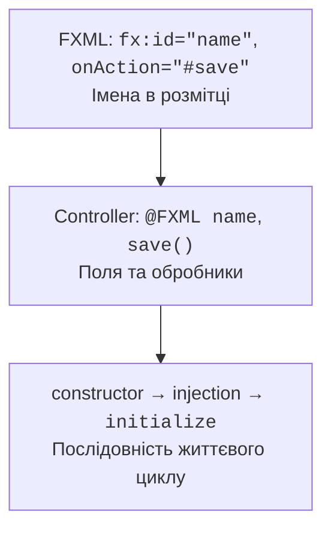
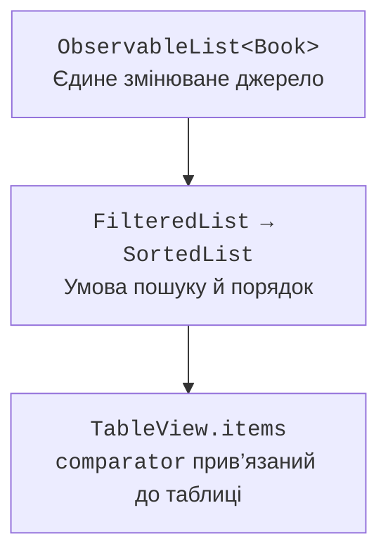
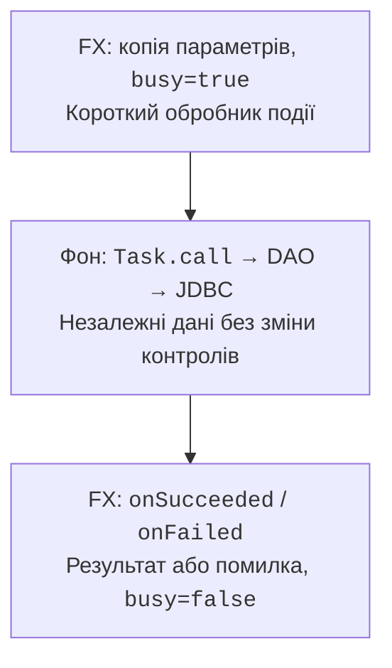

# Контролери, таблиці та фонові задачі

## FXML і створення контролера

FXML описує граф об’єктів і посилається на клас контролера, ідентифікатори полів та обробники подій. FXMLLoader створює контролер, впроваджує позначені поля й лише після цього викликає initialize. У конструкторі поля TextField ще можуть бути null; там приймають залежності, а не налаштовують контроли.



Рис. 16.5. Імена fx:id та обробників мають збігатися з контролером. {.caption}

Фабрика `setControllerFactory` дозволяє передати сервіс через конструктор контролера. Не створюйте контролер через new окремо від того, який використовує loader. `getController` повертає завантажений екземпляр після load. Альтернативний `setController` застосовують до FXML без fx:controller; одночасне подвійне призначення є помилкою.

Для другої сцени дані передають як незмінний id, DTO або чернетку через метод контролера. Статичне глобальне поле «поточний користувач» приховує залежність і ускладнює тести. Модальне вікно повинно мати owner і визначений результат скасування; закриття хрестиком не означає автоматичне Save.


Рис. 16.6. Ідентифікатори та обробники в Scene Builder {.caption}

## Спостережувані списки та таблиці

ObservableList повідомляє про структурні зміни: додавання, вилучення, перестановку. Зміна поля звичайного об’єкта сама по собі не є зміною списку. Extractor у FXCollections дозволяє спостерігати конкретні властивості елементів і генерувати оновлення, потрібні фільтрам та сортуванню.

FilteredList і SortedList є поданнями одного джерела. Змінюють вихідну ObservableList, а не намагаються довільно додавати елементи до відфільтрованого списку. Comparator SortedList прив’язують до comparatorProperty таблиці, щоб натискання заголовка стовпця керувало порядком.



Рис. 16.7. Одне джерело даних, окремі подання фільтра й порядку. {.caption}

Cell value factory повертає ObservableValue для клітинки, cell factory створює її візуальне представлення. Це різні фабрики. Лямбда з прямим зверненням до property перевіряється компілятором і не потребує рефлексивного PropertyValueFactory. Для незмінного record можна повернути read-only wrapper; для змінюваного поля краще повертати справжню властивість.

### Приклад 3. Таблиця з пошуком

Програма зберігає незмінні рядки, тому заміна даних виконується заміною елемента, а не прихованою зміною його полів. Пошук не залежить від регістру; за відсутності фільтра видно всі книги.

```java
package demo;

import java.util.Locale;
import javafx.application.Application;
import javafx.beans.property.ReadOnlyStringWrapper;
import javafx.collections.FXCollections;
import javafx.collections.transformation.FilteredList;
import javafx.collections.transformation.SortedList;
import javafx.scene.Scene;
import javafx.scene.control.TableColumn;
import javafx.scene.control.TableView;
import javafx.scene.control.TextField;
import javafx.scene.layout.VBox;
import javafx.stage.Stage;

public class TableMain extends Application {
    record Book(String title) {}

    @Override public void start(Stage stage) {
        var source = FXCollections.observableArrayList(
            new Book("Java"), new Book("SQL"), new Book("JavaFX"));
        var filtered = new FilteredList<>(source, book -> true);
        var sorted = new SortedList<>(filtered);
        TableView<Book> table = new TableView<>();
        TableColumn<Book, String> title = new TableColumn<>("Title");
        title.setCellValueFactory(cell ->
            new ReadOnlyStringWrapper(cell.getValue().title()));
        table.getColumns().add(title);
        sorted.comparatorProperty().bind(table.comparatorProperty());
        table.setItems(sorted);
        TextField search = new TextField();
        search.setPromptText("Search title");
        search.textProperty().addListener((value, oldText, text) -> {
            String query = text.strip().toLowerCase(Locale.ROOT);
            filtered.setPredicate(book -> book.title()
                .toLowerCase(Locale.ROOT).contains(query));
        });
        stage.setScene(new Scene(
            new VBox(10, search, table), 400, 300));
        stage.setTitle("Book search");
        stage.show();
    }

    public static void main(String[] args) { launch(args); }
}
```

Початково видно Java, SQL, JavaFX. Запит `java` залишає Java та JavaFX; заголовок Title змінює їхній порядок. Виділення рядка є окремим станом: після фільтрації раніше вибраний рядок може зникнути, тому Save/Delete повинні перевіряти актуальний selection і не використовувати старий індекс джерела.


Рис. 16.8. Структура TableView у Scene Builder {.caption}

## Фоновий запит і стан операції

JavaFX Application Thread має виконувати короткі обробники і оновлення сцени. JDBC, читання великих файлів та очікування мережі виконують у фоні. Task.call повертає незалежні дані; onSucceeded, onFailed і onCancelled застосовують результат на FX-потоці. Усередині call не читають TextField і не змінюють ObservableList, прив’язану до таблиці.



Рис. 16.9. Стан UI змінюється на FX-потоці, JDBC виконується у фоні. {.caption}

Значення форми копіюють до незмінних локальних змінних до старту Task. Стан busy встановлюють одразу, щоб подвійне натискання не створило два запити. Кнопки блокують прив’язкою, а після будь-якого кінцевого стану повертають доступність. Успішний commit і невдале повторне читання є різними подіями: повідомлення не повинно стверджувати, що збереження відкотилося, якщо база вже прийняла зміну.

Task є одноразовим. Service створює новий Task для повторних запусків і має власний життєвий цикл. cancel – кооперативний сигнал, а не гарантований rollback JDBC. Після початку commit не слід обіцяти користувачу, що скасування «нічого не змінило». Для довгих запитів використовують таймаути, Statement.cancel за продуманим контрактом і повторне читання стану після невизначеного результату мережевої операції.
