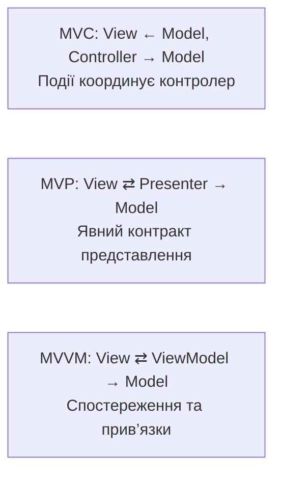
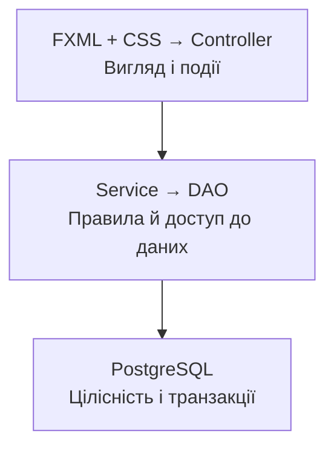

# Архітектурні шаблони та проєкт

## MVC, MVP і MVVM

У MVC модель представляє стан і правила, view показує його, controller інтерпретує дії користувача. У MVP presenter керує представленням через явний інтерфейс. У MVVM viewmodel надає властивості та команди, з якими view працює через прив’язки. Назви описують напрям залежностей, а не магічні властивості папок з відповідними назвами.



Рис. 16.1. Різні способи розділити представлення та поведінку. {.caption}

FXML-контролер JavaFX часто поєднує координацію подій і частину стану представлення. Це практичний MVC-подібний поділ, але наявність FXML сама по собі не доводить чистоту архітектури. SQL усередині onSave залишається SQL усередині контролера, навіть якщо розмітка винесена в окремий файл.



Рис. 16.2. Напрям залежностей від представлення до PostgreSQL. {.caption}

Зручно мати пакети model, controller, service, dao та ресурси view і css. Предметні записи можуть бути звичайними records без JavaFX. Властивості JavaFX доречні у моделі представлення, яка живе на FX Application Thread. Не передавайте змінювану ObservableList з інтерфейсу в DAO: фоновий запит повинен повертати незалежний List незмінних даних.

## Налаштування проєкту

Використайте повний Maven-проєкт JavaFX 27 з попередньої теми: JDK 27, модулі javafx.controls і javafx.fxml, compiler plugin 3.16.0 та javafx-maven-plugin 0.0.8. Кожен приклад нижче є окремою програмою в пакеті demo; mainClass у POM змінюють на її назву. Для прикладів з PostgreSQL додайте залежність:

```xml
<dependency>
  <groupId>org.postgresql</groupId>
  <artifactId>postgresql</artifactId>
  <version>42.7.13</version>
</dependency>
```

Дескриптор модуля `src/main/java/module-info.java`:

```java
module demo.fx {
    requires javafx.controls;
    requires javafx.fxml;
    requires java.sql;
    requires org.postgresql.jdbc;
    exports demo;
    opens demo to javafx.fxml;
}
```

opens дозволяє FXMLLoader доступ до позначених полів і методів через рефлексію. exports відкриває публічний API пакета, але не замінює opens для приватного FXML-доступу. Якщо контролери перенесено до demo.controller, відкривають саме цей пакет. Приклади без PostgreSQL не потребують відповідної залежності, але можуть запускатися в тому самому повному проєкті.

::: info Знімок екрана
Покажіть у справжньому Maven-проєкті model, controller, service, dao, resources/view і module-info.java. Не показуйте конфігурацію з паролем або приватний URL бази.
:::

Рис. 16.3. Пакети та ресурси MVC-проєкту {.caption}
