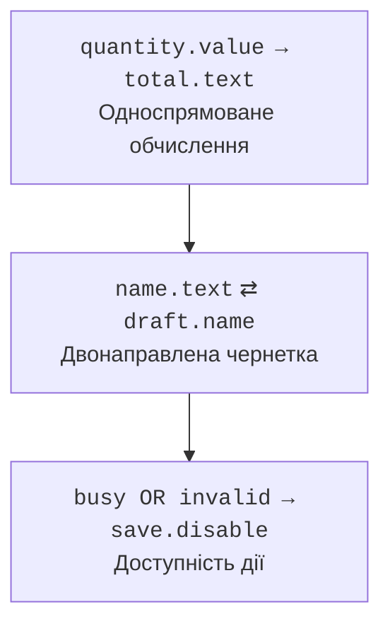

# Властивості та прив’язки

## Властивості та спостереження

Property поєднує значення з можливістю спостерігати зміни. StringProperty, IntegerProperty та ObjectProperty мають типізовані операції. Угода JavaFX Beans задає три форми доступу: getName, setName і nameProperty. Остання повертає стабільний об’єкт властивості, а не створює новий на кожен виклик.

ReadOnlyProperty дозволяє спостерігати, не надаючи setter клієнту. Для внутрішньої зміни й зовнішнього читання корисні ReadOnlyStringWrapper та аналогічні обгортки. Це захист API, але не автоматична потокобезпечність чи глибока незмінність.

### Приклад 1. Модель книги зі слухачем

Ця програма використовує лише javafx.base й не відкриває вікна. Слухач спостерігає зміну назви; після removeListener наступне перейменування не викликає callback. Зовнішній код може встановити неправильне значення через property, тому модель представлення не повинна бути єдиною межею предметної валідації.

```java
package demo;

import javafx.beans.property.SimpleStringProperty;
import javafx.beans.property.StringProperty;
import javafx.beans.value.ChangeListener;

public class PropertyMain {
    static final class Book {
        private final StringProperty title =
            new SimpleStringProperty(this, "title", "Draft");

        String getTitle() { return title.get(); }
        void setTitle(String value) { title.set(value); }
        StringProperty titleProperty() { return title; }
    }

    public static void main(String[] args) {
        Book book = new Book();
        ChangeListener<String> listener = (value, oldText, newText) ->
            System.out.println(oldText + " -> " + newText);
        book.titleProperty().addListener(listener);
        book.setTitle("Java");
        book.titleProperty().removeListener(listener);
        book.setTitle("Java 27");
        System.out.println(book.getTitle());
    }
}
```

```text
Draft -> Java
Java 27
```

ChangeListener отримує старе й нове значення. InvalidationListener лише повідомляє, що обчислене значення стало недійсним; лінива прив’язка може відкласти перерахунок до читання. Не покладайтеся на однакову кількість цих подій. Довгоживуче джерело слухача може утримувати закриту форму в пам’яті; знімайте реєстрацію при завершенні її життєвого циклу.

WeakChangeListener послаблює посилання на слухача, але автор повинен зберігати сильне посилання на оригінальний listener, доки він потрібний. Інакше він може зникнути раніше очікуваного. Слабкі слухачі не замінюють зрозуміле володіння ресурсами форми.

## Прив’язки та стан форми

`target.bind(source)` задає односпрямовану залежність. Пряме set зв’язаної властивості зазвичай відхиляється; спочатку потрібен unbind. `bindBidirectional` дозволяє зміни з обох боків, але створює спільний поточний стан, а не чернетку. Для кнопки Cancel це принципово: редагування має відбуватися в окремій копії, яку застосовують лише після Save.



Рис. 16.4. Значення форми визначають підсумок і доступність збереження. {.caption}

Bindings.createStringBinding та createBooleanBinding отримують обчислення й явний список залежностей. Якщо залежність забути, напис може не оновитися. `when(...).then(...).otherwise(...)` зручний для простих умов; складну предметну логіку краще винести в звичайний метод і протестувати без GUI.

StringConverter перетворює між текстом та типом, але сама прив’язка не визначає доброзичливу політику частково введеного числа. Порожнє поле, знак мінус без цифр і завершене число є різними станами редагування. Для складного вводу корисні TextFormatter, окремий текст чернетки й явне повідомлення.

### Приклад 2. Калькулятор кількості

Ціну задано в копійках, кількість обмежено Spinner. Напис і доступність кнопки повністю залежать від властивостей. Нульова кількість дозволена як стан редагування, але не як готове замовлення. Вивід у консоль з’являється після натискання.

```java
package demo;

import javafx.application.Application;
import javafx.beans.binding.Bindings;
import javafx.scene.Scene;
import javafx.scene.control.Button;
import javafx.scene.control.Label;
import javafx.scene.control.Spinner;
import javafx.scene.layout.VBox;
import javafx.stage.Stage;

public class BindingMain extends Application {
    @Override public void start(Stage stage) {
        Spinner<Integer> quantity = new Spinner<>(0, 100, 2);
        Label total = new Label();
        total.textProperty().bind(Bindings.createStringBinding(
            () -> "Total cents: " + quantity.getValue() * 250L,
            quantity.valueProperty()));
        Button save = new Button("Save");
        save.disableProperty().bind(Bindings.createBooleanBinding(
            () -> quantity.getValue() == 0,
            quantity.valueProperty()));
        save.setOnAction(event ->
            System.out.println(total.getText()));
        stage.setScene(new Scene(new VBox(10, quantity, total, save),
            340, 180));
        stage.setTitle("Order binding");
        stage.show();
    }

    public static void main(String[] args) { launch(args); }
}
```

Початковий напис: `Total cents: 500`. Після встановлення 0 кнопка Save недоступна; після 3 напис показує 750. Ці переходи перевіряють на FX Application Thread, а не зміною контролів із довільного потоку тесту.
