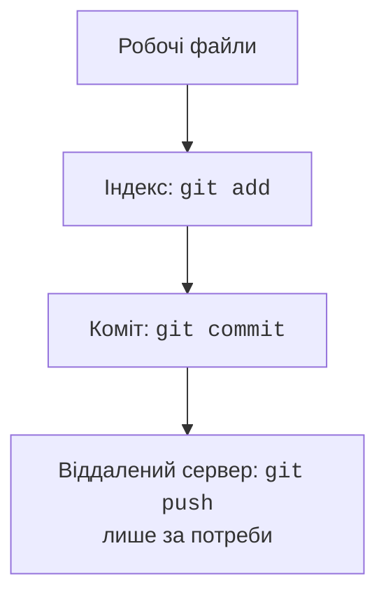

# Збирання, передавання та Git

## Збирання та передавання програми

### Обгортка і налаштування Java

Після створення проєкту перевірте файл `gradle/wrapper/gradle-wrapper.properties`. Рядок distributionUrl визначає версію Gradle. Обгортка не означає, що Gradle можна запустити на довільній Java. Для курсу зафіксуйте Gradle 9.7.0 й використайте JDK 25 як JVM процесу збирання.

У поточному терміналі PowerShell це можна задати так:

```powershell
$env:JAVA_HOME = 'C:\Java\jdk-25'
.\gradlew.bat --version
```

Зміна `$env:JAVA_HOME` у цьому вікні не змінює постійні налаштування Windows. Після закриття термінала налаштування потрібно відновити або використати конфігурацію IDE. Звіт `--version` слід зберегти: він дозволяє відокремити проблему середовища від помилки власної програми.

Якщо Gradle не знаходить установлену JDK 27, у локальному `gradle.properties` можна зазначити шлях до неї. Такий шлях належить конкретному комп’ютеру й не повинен бути обов’язковим для інших студентів:

```properties
org.gradle.java.installations.paths=C:/Java/jdk-27
```

Обгортку зазвичай створює майстер IDE. Якщо проєкт створюється вручну, спочатку потрібен завантажений Gradle, після чого команда `gradle wrapper --gradle-version 9.7.0` створює файли обгортки. Не намагайтеся виконати `gradlew`, коли цього файла ще немає в каталозі.

::: info Знімок екрана
Show Project SDK27 and Gradle JVM25, actual –version output.
:::

Рис. 1.7. Окремі налаштування JVM Gradle та JDK проєкту {.caption}

### Результат збирання

Основні задачі Gradle: `build` компілює й запускає перевірки, `run` запускає застосунок, `clean` видаляє згенерований результат цього проєкту. `installDist` від плагіна application створює каталог зі сценаріями запуску та залежностями.

```powershell
.\gradlew.bat --version
.\gradlew.bat build
.\gradlew.bat installDist
```

У `build/install/hello-kotlin/bin/` з’явиться сценарій запуску, а в `lib/` – JAR-файли. Передайте каталог цілком, а не лише один власний JAR. Сценарій потребує Java; під час перевірки використайте JDK 27 і новий робочий каталог.

Компілятор `kotlinc` дозволяє працювати без IDE. Для невеликого одного файла можна створити JAR зі стандартною бібліотекою:

```powershell
kotlinc Main.kt -jvm-target 26 -include-runtime -d hello.jar
java -jar hello.jar
```

Це додатковий спосіб перевірки, а не заміна Gradle-проєкту з декількома бібліотеками. Порівняйте результати запуску з IDE, через Gradle й через JAR: предметний результат повинен збігатися за однакових вхідних даних.

## Git і відтворюваність

::: info Знімок екрана
Show build/install/hello-kotlin bin and lib folders and actual launch from another working directory.
:::

Рис. 1.8. Повний дистрибутив і запуск поза IDE {.caption}

Перед збереженням проєкту перевірте, що дистрибутив не містить особистих файлів або прихованих налаштувань. Каталог результату можна відновити командою збирання; вихідний код і конфігурацію відновлює саме історія Git.

Git зберігає історію змін, але не створює резервну копію незбережених файлів автоматично. Робочий каталог, індекс і коміт – різні стани. Спочатку переглядають зміни, потім додають потрібні файли до індексу й створюють коміт.



Рис. 1.9. Робочі файли, індекс та історія Git {.caption}

Встановіть Git із <https://git-scm.com/downloads>. Для навчального репозиторію можна задати ім’я й адресу локально, не змінюючи глобальні налаштування комп’ютера:

```powershell
git init -b main
git config user.name "Student"
git config user.email "student@example.invalid"
git status
git add .
git commit -m "Create Kotlin project"
git log --oneline
```

Перед `git add .` створіть `.gitignore`:

```text
.gradle/
.kotlin/
build/
.idea/
*.iml
local.properties
```

Не виключайте `gradlew`, `gradlew.bat` і `gradle/wrapper/`. Перед комітом перевіряйте `git diff` та `git diff --staged`. Якщо файл уже відстежується, додавання його до `.gitignore` не вилучає з історії. Не додавайте паролі, токени, бази з реальними персональними даними та кеші інструментів.

::: info Знімок екрана
Commit tool window and Git Log, three meaningful commits.
:::

Рис. 1.10. Перегляд змін та історії локального репозиторію {.caption}

У IntelliJ IDEA можна увімкнути інтеграцію Git, відкрити *Commit* і переглянути *Git Log*. Команда `push` надсилає коміти на віддалений сервер; звичайний `commit` цього не робить. Для здачі роботи достатньо локального репозиторію; публікація на GitHub є окремою додатковою дією.
