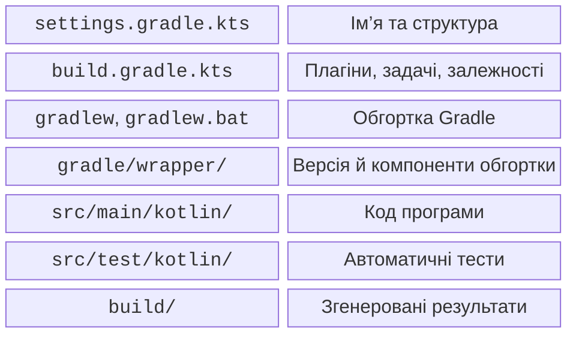

# IntelliJ IDEA і Gradle-проєкт

## IntelliJ IDEA та перший проєкт

IntelliJ IDEA надає редактор, аналіз коду, запуск, налагоджувач та інтеграцію Gradle і Git. Починаючи з 2025.3, продукт має єдиний дистрибутив; базові можливості Java/Kotlin доступні безкоштовно. Для цього курсу не потрібно купувати підписку на розширені можливості. Поточні умови перевіряють на <https://www.jetbrains.com/idea/download/>.

Встановіть актуальну IntelliJ IDEA через офіційний інсталятор або Toolbox App. IDE має власне середовище виконання, однак це не означає, що JDK навчального проєкту вже налаштована. Вимоги до системи та інструкція: <https://www.jetbrains.com/help/idea/installation-guide.html>. Залиште достатньо дискового простору для кешів Gradle й залежностей.

Створіть проєкт через *New Project → Kotlin*. Оберіть *Build system: Gradle*, *Gradle DSL: Kotlin*, JDK 27 для проєкту та простий шлях без особистих даних, наприклад `C:\Labs\Hello`. Додайте зразок коду й дочекайтеся синхронізації. Якщо майстер створив інші версії плагінів, зіставте їх із конфігурацією курсу.

::: info Знімок екрана
New Project: Kotlin, Gradle, Kotlin DSL, Project JDK27.
:::

Рис. 1.4. Параметри нового проєкту Kotlin {.caption}

У *Settings → Build, Execution, Deployment → Build Tools → Gradle* встановіть сумісну JVM 25 для Gradle. Проєктний SDK і JVM Gradle не обов’язково однакові. У вікні *Project* відкрийте `src/main/kotlin/Main.kt`, а результати запуску шукайте у *Run*. *Build* містить діагностику збирання; *Terminal* – звичайну оболонку.

Довідка майстра: <https://www.jetbrains.com/help/idea/create-your-first-kotlin-app.html>. Імена окремих перемикачів можуть змінюватися між версіями IDE. Орієнтуйтеся на призначення параметра й запишіть версію IDE у звіті. Не додавайте персональні шляхи до спільного файлу збирання.

## Структура Gradle-проєкту

Gradle автоматизує отримання залежностей, компіляцію, тести та створення дистрибутива. **Gradle Wrapper** фіксує версію самого Gradle для проєкту. Файли обгортки зберігають у Git; згенерований `build/` і кеш `.gradle/` – ні.



Рис. 1.5. Основні файли навчального проєкту {.caption}

`settings.gradle.kts` задає структуру та ім’я проєкту:

```kotlin
rootProject.name = "hello-kotlin"
```

`build.gradle.kts` описує плагіни, залежності й задачі. Розширення `.kts` означає сценарій Kotlin; це конфігурація збирання, а не звичайний файл програми з `main`. Початкова конфігурація курсу:

```kotlin
import org.jetbrains.kotlin.gradle.dsl.JvmTarget

plugins {
    kotlin("jvm") version "2.4.20"
    application
}

repositories { mavenCentral() }

kotlin {
    jvmToolchain(27)
    compilerOptions { jvmTarget.set(JvmTarget.JVM_26) }
}

tasks.withType<JavaCompile>().configureEach {
    options.release.set(26)
}

application { mainClass.set("MainKt") }
tasks.named<JavaExec>("run") {
    standardInput = System.`in`
}
```

JDK інструментів та версія байт-коду – різні поняття. Тут програма використовує JDK 27, а ціль байт-коду явно узгоджена для Java й Kotlin. Не вимикайте перевірку узгодженості JVM target заради приховування помилки. Програмам цієї теми не потрібні API, що існують лише в Java 27.

`mavenCentral()` – сховище залежностей; перша синхронізація потребує мережі. Наступний запуск часто використовує кеш, але наявність кешу на комп’ютері автора не замінює правильних декларацій залежностей. Не копіюйте випадкові JAR-файли із форумів у системні каталоги.

У великих проєктах версії можуть бути винесені до `gradle/libs.versions.toml`. Для першої роботи явного короткого файлу достатньо. Залежності й плагіни мають різні ролі: перші потрібні коду, другі змінюють процес збирання.
