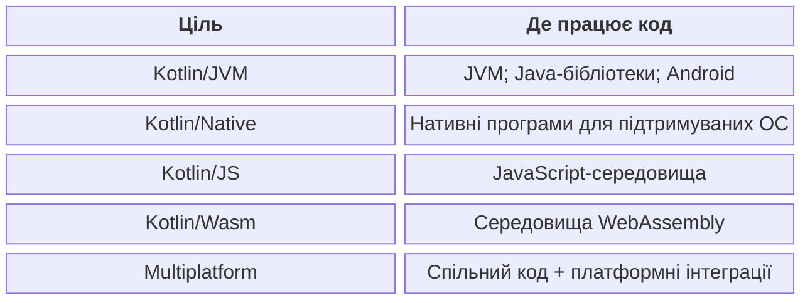
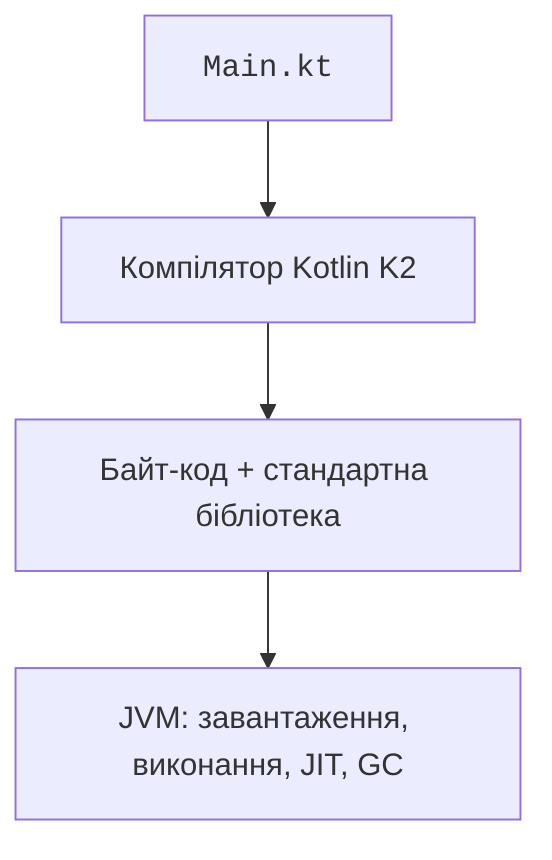

# Kotlin, JVM і JDK

## Kotlin як мова програмування

**Kotlin** – статично типізована мова, яку розробляє JetBrains. Проєкт представлено у 2011 році, версію 1.0 випущено у 2016 році. Статична типізація означає, що компілятор перевіряє типи до запуску. Виведення типу дозволяє часто не записувати його явно, але не перетворює Kotlin на мову з динамічною типізацією.

У курсі використовуємо Kotlin/JVM: код працює на віртуальній машині Java й може використовувати бібліотеки Java. Kotlin також має інші цілі, однак наявність спільного синтаксису не означає, що будь-яка JVM-бібліотека працюватиме в браузері або iOS. Офіційна документація: <https://kotlinlang.org/docs/home.html>.



Рис. 1.1. Платформи Kotlin та межі спільного коду {.caption}

**Kotlin Multiplatform** дозволяє спільно використовувати частину коду між платформами. Спільний модуль містить доступні всюди абстракції, а платформний – конкретні інтеграції. Наприклад, `java.time` є API JVM, а не універсальним API всіх цілей Kotlin. У завершальних темах створюватимемо настільні застосунки; встановлення Android Studio не потрібне для базових робіт.

Компілятор K2 став основним у Kotlin 2.0. Сімейство 2.4 містить мовні та інструментальні оновлення; точна версія плагіна має бути записана у файлі збирання. Під час підготовки перевірено 2.4.20. Не підміняйте цю версію попередньою, спираючись лише на назву «Kotlin» у меню IDE: редактор і Gradle мають різні механізми вибору компонентів.

## Як виконується програма на JVM

Текст `Main.kt` компілюється в байт-код. Завантажувач класів знаходить потрібні класи, JVM перевіряє та виконує їх. Часто виконувані ділянки можуть компілюватися JIT у машинний код. Збирач сміття керує звільненням недосяжних об’єктів, але не закриває довільні файли чи транзакції замість автора.



Рис. 1.2. Від файла Kotlin до виконання на JVM {.caption}

Файл із функцією верхнього рівня `main` компілюється до класу з іменем, утвореним від файла: для `Main.kt` це зазвичай `MainKt`. Якщо оголошено пакет `course`, повна назва буде `course.MainKt`. Саме цю назву зазначають для запуску Gradle. Регістр символів має значення навіть у Windows.

Стандартна бібліотека Kotlin надає `println`, колекції й багато функцій-розширень. Вона має бути доступною під час виконання. Тому файл JAR із власними класами не завжди можна запустити подвійним клацанням: можуть бути відсутні залежності, маніфест точки входу або налаштування запуску.

Компіляція й запуск – різні етапи. Неправильний тип аргументу може зупинити компіляцію, а ділення на нуль чи неправильне число з консолі – виконання вже зібраної програми. Перш ніж шукати помилку, визначте, на якому етапі вона виникла.

## JDK, JRE та вибір версії

**JDK** містить інструменти розробки та середовище виконання. **JRE** означає середовище виконання без повного набору засобів розробника. Для курсу встановлюємо JDK, а не шукаємо окреме старе JRE. OpenJDK – відкритий проєкт, на основі якого постачальники створюють свої дистрибутиви.

JDK 27 випущено 15 вересня 2026 року. Це не LTS-випуск; позначення LTS і строк підтримки залежать від постачальника. JDK 25 є попереднім LTS-випуском у поширених дистрибутивах. У курсі JDK 27 обрано для програм, а сумісну JDK 25 – для процесу збирання Gradle. Це два незалежні налаштування.

::: tip Сумісність процесу збирання
На дату підготовки поточна таблиця Gradle не включає JVM 27 до підтримуваних середовищ запуску Gradle. Не слід мовчки ігнорувати попередження або вважати найновішу JDK автоматично сумісною з усіма плагінами. Підтримувана JVM процесу Gradle й JDK програми можуть відрізнятися.
:::

Джерела для перевірки: <https://jdk.java.net/27/>, <https://docs.gradle.org/current/userguide/compatibility.html>, <https://kotlinlang.org/docs/gradle-configure-project.html>. У звіті записуйте фактичні версії, а не лише назви інструментів.

Для Windows завантажте офіційний архів OpenJDK 27 для x64, перевірте контрольну суму й розпакуйте в постійний каталог. Не використовуйте тимчасову папку завантажень як єдине місце зберігання JDK. Альтернатива – *Download JDK* у IntelliJ IDEA. Не перейменовуйте файли бібліотек усередині дистрибутива.

::: info Знімок екрана
Run java -version and javac -version using the actual JDK27 path.
:::

Рис. 1.3. Перевірка встановленої JDK 27 {.caption}

Перевірка через абсолютний шлях у PowerShell не залежить від порядку каталогів у PATH. Нижче `C:\Java\jdk-27` – приклад місця встановлення; замініть його власним.

```powershell
& 'C:\Java\jdk-27\bin\java.exe' -version
& 'C:\Java\jdk-27\bin\javac.exe' -version
Get-Command java -All
```

`JAVA_HOME` має вказувати на корінь JDK, а не на `bin`. Якщо на комп’ютері кілька Java, `java -version` може показувати іншу версію, ніж очікується. Порівняйте абсолютний шлях, налаштування IDE і JVM, зазначену у звіті `gradlew --version`.

У Linux і macOS імена команд подібні, але роздільник PATH та спосіб встановлення інші. Не переписуйте системну Java лише заради одного проєкту. Використовуйте окремо встановлену JDK та налаштування інструментів конкретного проєкту.
