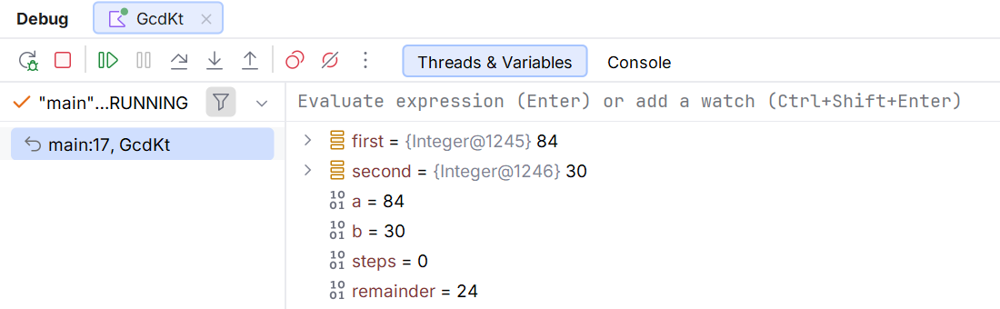

# Контракти та граничні перевірки

## Контракти та граничні перевірки

### Приклад. Пошук найбільшого спільного дільника

Алгоритм Евкліда замінює пару додатних чисел `(a, b)` парою `(b, a % b)`, доки друга складова не стане нульовою. Спільні дільники при цьому зберігаються. Для додатного дільника остача менша за нього, тому процес завершується.

```kotlin
fun main() {
    print("Перше число 1–1000000: ")
    val first = readlnOrNull()?.toIntOrNull()
    print("Друге число 1–1000000: ")
    val second = readlnOrNull()?.toIntOrNull()
    if (first == null || second == null ||
        first !in 1..1000000 || second !in 1..1000000
    ) {
        println("Потрібні два додатні цілі числа")
        return
    }
    var a: Int = first
    var b: Int = second
    var steps = 0
    while (b != 0) {
        val remainder = a % b
        a = b
        b = remainder
        steps++
    }
    println("НСД: $a")
    println("Кроків: $steps")
}
```

Для `84` і `30` результат – НСД `6`, кількість кроків `3`. Проміжні пари: `(30,24)`, `(24,6)`, `(6,0)`. Тимчасова змінна `remainder` потрібна, щоб не втратити старе значення `a` до обчислення остачі.

Для двох рівних чисел алгоритм виконує один крок. Для пари, де одне число ділить інше, результат має дорівнювати меншому. Нуль тут відхиляється контрактом; узагальнення алгоритму на нулі потребувало б окремого визначення для пари `(0,0)`.

### Приклад. Перевірка простого числа

Число є простим, якщо воно більше за одиницю й має лише дільники 1 та саме себе. Перевіряти всі числа до `n - 1` не потрібно: якщо є нетривіальна пара дільників, один із них не перевищує квадратного кореня.

```kotlin
fun main() {
    print("Число 0–1000000000: ")
    val n = readlnOrNull()?.toIntOrNull()
    if (n == null || n !in 0..1000000000) {
        println("Некоректне число")
        return
    }
    var prime = n >= 2
    var divisor = 2
    while (prime && divisor <= n / divisor) {
        if (n % divisor == 0) {
            prime = false
        } else {
            divisor++
        }
    }
    println(if (prime) "Просте" else "Не просте")
}
```

Для `97` друкується `Просте`, для `49` – `Не просте`. Умова `divisor <= n / divisor` дозволяє уникнути переповнення добутку `divisor * divisor`. Дільник починається з 2, тому ділення на нуль немає.

Перевірте 0, 1, 2, 3, 4, 49 та 97. Квадрат простого числа особливо важливий: помилкова строга нерівність замість `<=` може пропустити єдиний потрібний дільник. Прапорець `prime` змінюється лише після доказу складеності.

### Приклад. Нормалізація напрямку

Задано цілу кількість градусів від −1000000 до 1000000. Потрібно отримати еквівалентний кут 0–359. Звичайна остача від від’ємного кута може бути від’ємною, тому додаємо повний оберт перед повторним взяттям остачі.

```kotlin
fun main() {
    print("Кут у градусах: ")
    val angle = readlnOrNull()?.toIntOrNull()
    if (angle == null || angle !in -1000000..1000000) {
        println("Некоректний кут")
        return
    }
    val normal = ((angle % 360) + 360) % 360
    val direction = when (normal) {
        0 -> "північ"
        90 -> "схід"
        180 -> "південь"
        270 -> "захід"
        else -> "проміжний напрямок"
    }
    println("$normal: $direction")
}
```

Для `-90` результат – `270: захід`; для `720` – `0: північ`. Напрямок відліку тут задано за годинниковою стрілкою від півночі. У математичній системі координат домовленість часто інша, тому її потрібно записати.

Зверніть увагу, що вираз нормалізації спочатку зменшує модуль значення. Додавання 360 до довільного максимально великого `Int` могло б переповнитися; до остачі 0–359 воно безпечне. Порядок операцій є частиною коректності.



Рис. 2.7. Інваріант та завершення циклу Евкліда {.caption}

### Як побудувати таблицю тестів

Для завершення пошуку в парі вкладених циклів використаємо мітку. Знайдемо першу пару цілих координат 1–5 із сумою 8. Порядок перебору є частиною визначення «першої» пари.

```kotlin
fun main() {
    var found = false
    outer@ for (row in 1..5) {
        for (column in 1..5) {
            if (row + column == 8) {
                println("$row, $column")
                found = true
                break@outer
            }
        }
    }
    if (!found) println("Пари немає")
}
```

Результат: `3, 5`. Звичайний `break` завершив би лише внутрішній цикл, і пошук продовжився б для наступного рядка. Мітка дозволяє чітко вказати потрібний цикл. Після винесення пошуку в окрему функцію в темі 3 ранній `return` часто стане простішим способом завершення.

Для меню доречний `do-while`, оскільки його потрібно показати хоча б раз. Нижче EOF також завершує програму; невідома команда не змінює стану.

```kotlin
fun main() {
    var command: String
    do {
        println("1 – довідка; 0 – вихід")
        command = readlnOrNull() ?: "0"
        when (command) {
            "1" -> println("Навчальний приклад меню")
            "0" -> println("Завершено")
            else -> println("Невідома команда")
        }
    } while (command != "0")
}
```

Для вводу `1`, потім `0` меню з’являється двічі, після першої команди друкується довідка, після другої – `Завершено`. Відсутність вводу дає один показ меню й коректне завершення, а не нескінченне повторення.

Перевірка вводу складається з кількох незалежних етапів: рядок існує, його можна перетворити, значення скінченне, воно належить діапазону, а одиниці відповідають формулі. Успішний `toDoubleOrNull` не замінює останні етапи.

Для діапазону 1–100 перевірте 0, 1, 100, 101, нечисловий рядок та кінець вводу. Для циклу – 0, 1 і декілька ітерацій. Для `when` – кожну гілку й сусідні значення біля меж. Для дробового числа – `NaN`, нескінченність та допустимий нуль.

Під час налагодження дивіться не лише кінцевий підсумок, а й інваріант циклу. Наприклад, після кожної ітерації `count` дорівнює кількості прийнятих значень, а `sum` – їхній сумі. Неправильний рядок не повинен змінювати жоден із цих двох показників.

Офіційні джерела: <https://kotlinlang.org/docs/numbers.html>, <https://kotlinlang.org/docs/null-safety.html>, <https://kotlinlang.org/docs/control-flow.html>, <https://kotlinlang.org/docs/typecasts.html>.
