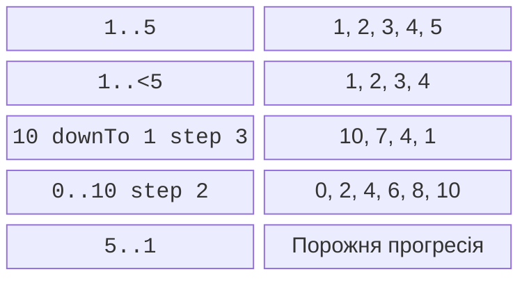
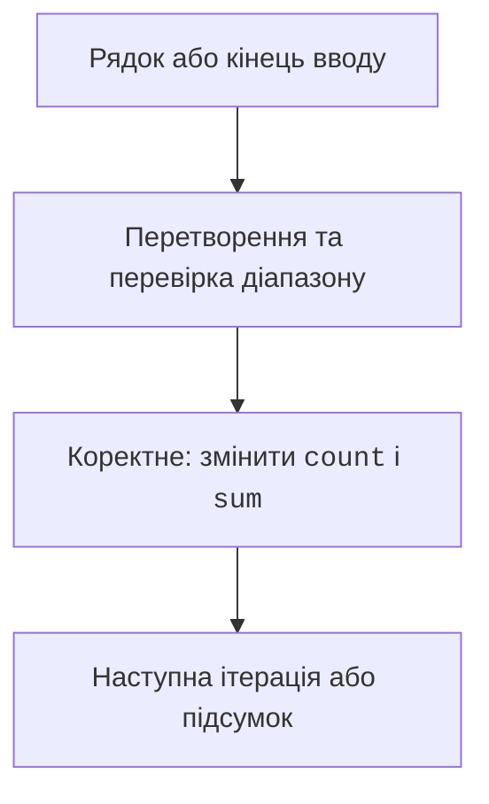

# Діапазони та цикли

## Діапазони та цикл for

`1..5` включає обидві межі, `1..<5` не включає праву. Для спадання використовують `downTo`, а додатний крок задають через `step`. Крок не повинен бути нульовим або від’ємним.



Рис. 2.5. Межі та напрямок прогресій {.caption}

```kotlin
fun main() {
    var total = 0
    for (i in 1..5) total += i
    println("Сума: $total")
    for (i in 10 downTo 1 step 3) print("$i ")
    println()
    for (i in 0..<3) print("$i ")
    println()
}
```

Результат: `Сума: 15`, далі `10 7 4 1`, потім `0 1 2`. Порожній висхідний діапазон, наприклад `5..1`, не означає автоматичного спадання. Індексний цикл часто використовує виключну верхню межу, щоб не звернутися за останній елемент.

У цій темі не потрібно зберігати всі введені числа в масиві, щоб знайти суму або кількість. Достатньо накопичувача. Це зменшує кількість станів, які потрібно пояснити, і працює для потоку даних.

## while, do-while та завершення циклу

`while` спочатку перевіряє умову, тому тіло може не виконатися жодного разу. `do-while` спочатку виконує тіло, тому має щонайменше одну ітерацію. `break` завершує цикл, `continue` переходить до наступної ітерації. `return` завершує функцію.



Рис. 2.6. Читання, перевірка та накопичення {.caption}

```kotlin
fun main() {
    var sum = 0L
    var count = 0
    while (true) {
        val text = readlnOrNull() ?: break
        if (text == "stop") break
        val value = text.toIntOrNull()
        if (value == null || value !in -1000..1000) {
            println("Пропущено некоректний рядок")
            continue
        }
        if (count == 1000) {
            println("Ліміт даних")
            break
        }
        sum += value
        count++
    }
    println("n=$count; sum=$sum")
}
```

Для рядків `10`, `bad`, `-3`, `stop` результат після повідомлення про пропуск – `n=2; sum=7`. Порожній потік дає `n=0; sum=0`, що є коректним підсумком підрахунку. Для середнього в такому випадку потрібне окреме повідомлення, бо ділення на нуль не є визначенням середнього порожньої вибірки.

Ліміт 1000 записів і межі кожного числа дозволяють пояснити діапазон суми. Умова `while (true)` сама по собі не гарантує нескінченність: тут є чіткі умови виходу. Без зміни стану або виходу цикл може зависнути й потребуватиме зупинки користувачем.

Для вкладених циклів мітка `outer@` дозволяє `break@outer`. Вона доречна для завершення пошуку першого збігу, але надмірна кількість міток робить потік керування важким для перевірки. `repeat(n)` виконує блок `n` разів; явний `for` тут простіший.
