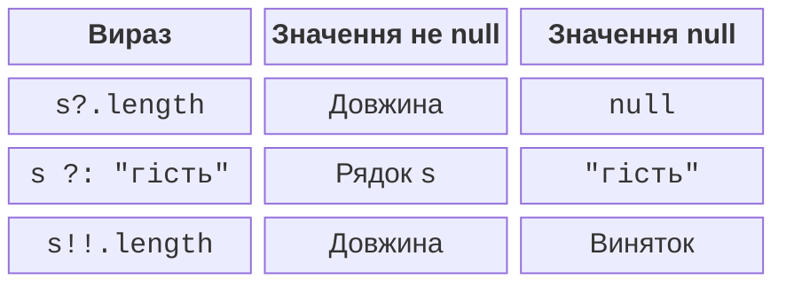
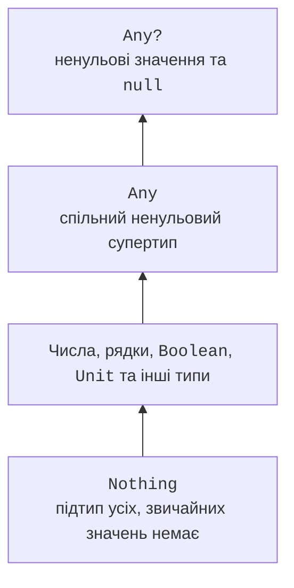

# Null-безпека та особливі типи

## Nullable-типи та безпечне введення

Тип `String` не допускає `null`, а `String?` допускає. Питальний знак є частиною статичного контракту. Саме тому не можна викликати `.length` на довільному `String?` без перевірки або безпечної операції.



Рис. 2.2. Три способи обробки nullable-значення {.caption}

Оператор `?.` виконує доступ тільки для ненульового значення й інакше повертає `null`. Оператор Елвіса `?:` визначає результат для `null`. Оператор `!!` стверджує, що значення не є `null`, і кидає виняток, якщо автор помилився. Він не виправляє відсутні дані.

```kotlin
fun main() {
    print("Кількість 1–100: ")
    val text = readlnOrNull()
    val count = text?.trim()?.toIntOrNull()
    if (count == null || count !in 1..100) {
        println("Некоректна кількість")
        return
    }
    println("Прийнято: $count")
    println("Подвоєно: ${count * 2}")
}
```

Для `12` отримаємо `Прийнято: 12` і `Подвоєно: 24`. Для `abc`, `0`, порожнього рядка або завершеного потоку виводиться повідомлення про помилку. Після перевірки компілятор знає, що `count` має ненульове значення. Це приклад розумного приведення (*smart cast*).

Правий операнд `||` не обчислюється, коли лівий уже істинний; правий операнд `&&` – коли лівий хибний. Це коротке замикання дозволяє безпечно впорядкувати умови. Вираз із побічними ефектами в умовах ускладнює розуміння; для початківця краще окрема перевірка.

`let` іноді використовують після `?.`, щоб виконати блок для ненульового значення. Блок є лямбдою, яку докладно вивчатимемо в темі 11. У цій темі явний `if` часто простіший і краще показує всі гілки.

## Any, Unit, Nothing та перевірка типу

`Any` є спільним супертипом ненульових типів Kotlin; `Any?` також допускає `null`. `Unit` є типом результату функції без змістовного значення. `Nothing` не має звичайних екземплярів і описує шлях, що не повертається нормально, наприклад безумовний `throw`.



Рис. 2.3. Спрощені зв’язки типів Kotlin {.caption}

Перевірка `is` дозволяє дізнатися, чи значення має потрібний тип. Після успішної перевірки стабільного значення компілятор дозволяє операції цього типу. `as` кидає виняток за невдалого приведення, а `as?` повертає `null`. Приведення не перетворює рядок цифр на число: для цього потрібен числовий розбір.

```kotlin
fun main() {
    val value: Any = "Kotlin"
    if (value is String) {
        println(value.length)
    }
    val number = value as? Int
    println(number ?: -1)
}
```

Результат: `6`, потім `-1`. Значення за замовчуванням потрібно обирати обережно: якщо `-1` є допустимим результатом предметної задачі, воно не може одночасно однозначно означати помилку. Іноді краще залишити `null`.

Smart cast може бути неможливим для властивості, значення якої здатне змінитися між перевіркою й читанням. Для такого випадку збережіть результат в локальний `val` і перевіряйте саме його. Пізніше це правило допоможе у роботі з об’єктами та станом графічного інтерфейсу.
