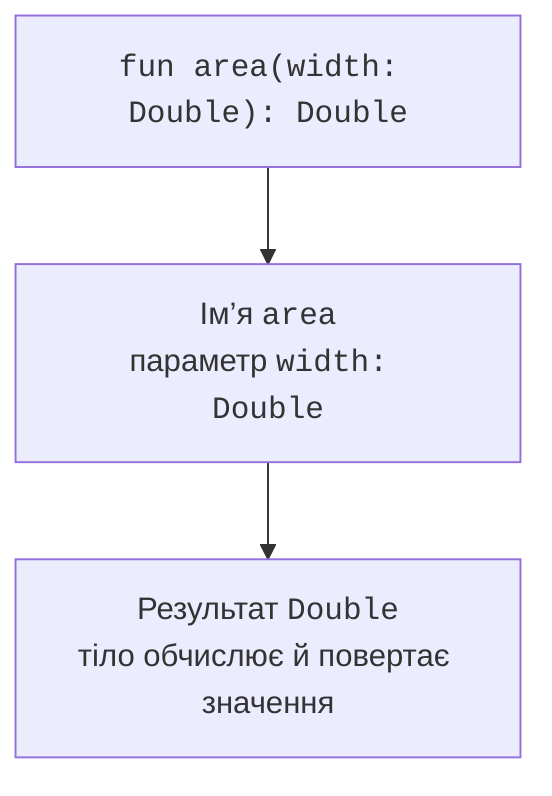

# Оголошення та види функцій

## Оголошення та виклик

Після `fun` записують ім’я, параметри в дужках і тип результату. Кожен параметр має ім’я та тип. У тілі-блоці значення повертають оператором `return`. Тіло-вираз після знака `=` зручне для короткого обчислення; тип результату часто можна вивести, але явний тип залишається корисним для публічного контракту.

```kotlin
fun rectangleArea(width: Double, height: Double): Double {
    require(width.isFinite() && height.isFinite())
    require(width >= 0.0 && height >= 0.0)
    val area = width * height
    require(area.isFinite())
    return area
}

fun square(value: Int): Long = value.toLong() * value

fun main() {
    println(rectangleArea(3.0, 4.0))
    println(square(50_000))
}
```

```text
12.0
2500000000
```



Рис. 3.1. Сигнатура функції описує вхідні дані та результат. {.caption}

У `square` перетворення на `Long` відбувається до множення. Якщо спочатку обчислити `value * value` як `Int`, а потім перетворити результат, переповнення вже сталося. Тип результату функції не змінює автоматично тип усіх проміжних операцій.

Параметри всередині функції не переприсвоюють. Якщо потрібне змінюване проміжне значення, оголошують локальну `var`. Передача об’єкта означає передачу значення посилання: функція не може замінити змінну викликача, але може змінити доступний змінюваний об’єкт. Для рядків такої зміни вмісту немає, бо `String` є незмінним.

## Unit, Nothing і передумови

Функція, яка виконує дію без корисного результату, має тип `Unit`. Для тіла-блоку його можна не записувати явно. Наприклад, `fun greet(name: String) { println(name) }` повертає `Unit`; друк у консолі не є поверненням рядка викликачу.

Тип `Nothing` описує функцію, яка не завершується звичайним поверненням. Типовий приклад – `error("message")`, який кидає виняток. Тому вираз `value ?: error("missing")` може мати не-null тип: гілка помилки не створює альтернативного значення. Повна обробка винятків розглядається в наступній темі.

`require(condition)` задає передумову аргументу. Якщо вона порушена, виникає `IllegalArgumentException`. На цьому етапі достатньо розуміти, що це явна відмова контракту, а не випадкова помилка всередині формули. У консольній програмі неправильний текст спочатку можна перевірити через `toIntOrNull` або `toDoubleOrNull`, а предметні межі – перед викликом розрахунку.

Контракт включає більше, ніж типи. `Double` може містити NaN, нескінченність і від’ємне число, але ширина прямокутника має вужчу множину допустимих значень. У коментарі або описі функції варто зазначити одиниці, межі, правило округлення та можливу відмову.

## Функції верхнього рівня та локальні функції

Функцію можна оголосити без класу безпосередньо у файлі. Це нормальний стиль Kotlin для незалежних операцій. Порядок оголошень у файлі не змушує розміщувати допоміжну функцію вище за її використання. Пакет та імпорти визначають видимість між файлами; докладно їх буде розглянуто разом із класами.

Локальна функція оголошується всередині іншої. Вона не засмічує зовнішній простір імен і може читати локальні значення зовнішньої функції. Це доречно для невеликої допоміжної операції, яку не потрібно використовувати окремо.

```kotlin
fun borderText(text: String): String {
    fun clean(value: String): String = value.trim()
    val normalized = clean(text)
    return "[$normalized]"
}

fun main() {
    println(borderText("  Kotlin  "))
}
```

Локальна функція не повинна приховувати складний самостійний алгоритм лише тому, що його поки що викликають один раз. Якщо потрібне окреме тестування або повторне використання, функція верхнього рівня з явними параметрами часто зручніша. Не слід також використовувати глобальну змінну замість аргументу: прихований вхід робить результат залежним від порядку викликів.
