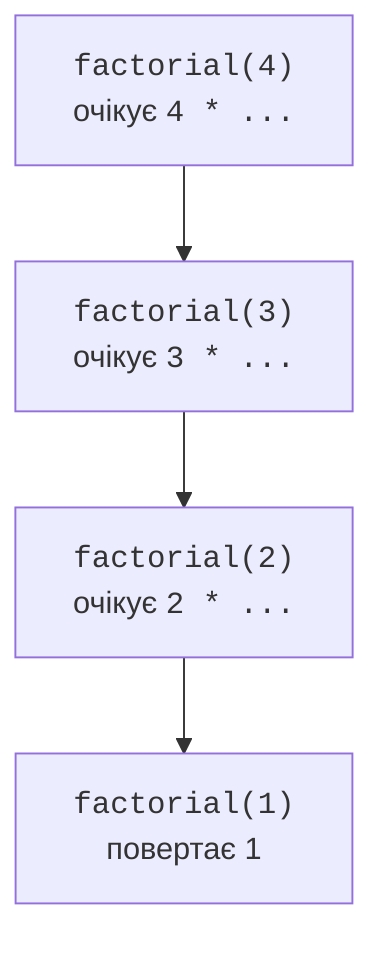
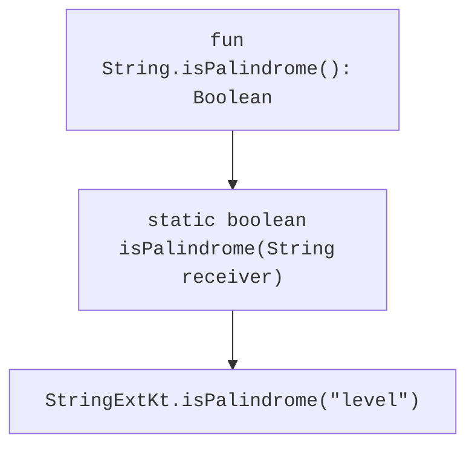

# Рекурсія, інфіксні функції, розширення

## Рекурсія та стек викликів

Рекурсивна функція викликає саму себе для простішої підзадачі. Вона повинна мати базовий випадок і крок, який наближає до нього. Для факторіала базовий випадок – нуль або одиниця, а рекурсивний крок зменшує аргумент на один. Передумова відхиляє від’ємний вхід.

```kotlin
fun factorial(number: Int): Long {
    require(number in 0..20)
    if (number <= 1) return 1L
    return number * factorial(number - 1)
}

tailrec fun gcd(a: Long, b: Long): Long {
    require(a >= 0 && b >= 0)
    return if (b == 0L) a else gcd(b, a % b)
}

fun main() {
    println(factorial(4))
    println(factorial(0))
    println(gcd(48, 18))
}
```

```text
24
1
6
```



Рис. 3.3. Кожний звичайний рекурсивний виклик очікує результат підзадачі. {.caption}

Факторіал має виконати множення після повернення рекурсивного виклику, тому він не хвостовий у цій формі. `gcd` одразу повертає результат наступного виклику; `tailrec` дозволяє компілятору перетворити такий хвіст на цикл. Якщо умови оптимізації не виконані, компілятор повідомляє про це.

Звичайна глибока рекурсія витрачає стек і може спричинити `StackOverflowError`. Tailrec не виправляє неправильний базовий випадок і не запобігає числовому переповненню. Межа 20 для факторіала визначена діапазоном `Long`, а не лише місткістю стека. Показова перевірка 21 повинна дати відмову, а не неправильне число.

## Інфіксні функції

Функцію-член або розширення з одним параметром можна позначити `infix` і викликати без крапки та дужок. Параметр не може бути vararg і не має типового значення. Інфіксний синтаксис доречний для короткої предметної операції, яку природно читати між двома значеннями.

```kotlin
infix fun String.withSuffix(suffix: String): String = this + suffix

fun main() {
    println("file" withSuffix ".txt")
    println("file".withSuffix(".txt"))
}
```

Обидва виклики рівнозначні. Пріоритет інфіксного виклику не слід вгадувати за звичкою до арифметичних операторів. У складному виразі дужки роблять намір явним. Не перетворюйте кожну функцію на infix лише заради скорочення синтаксису.

## Функції-розширення

Розширення записують як `fun String.name(...)`. Тип перед крапкою є типом **приймача**, а `this` у тілі – значенням цього приймача. Виклик виглядає як метод, але розширення не змінює клас `String`, не додає його об’єктам полів і не отримує доступу до приватних деталей реалізації.



Рис. 3.4. JVM-подання розширення передає приймач як аргумент статичного методу. {.caption}

Розширення вибирається статично за оголошеним типом приймача. Це не механізм віртуального перевизначення. Якщо доступний справжній метод класу з відповідною сигнатурою, він має пріоритет над розширенням. Докладне порівняння зі справжнім поліморфізмом буде в темі наслідування.

Розширення можна оголосити для nullable-приймача: `fun String?.orLabel(): String = this ?: "missing"`. У його тілі перевіряють `this` перед зверненням до не-null членів. Виклик через крапку на null тут допустимий, бо null є частиною заявленого контракту приймача.

### Приклад 3. Паліндром і кількість слів

Навчальний паліндром ігнорує пробіли та регістр, але зберігає пунктуацію. Перевірка працює з `Char` у рядках звичайних літер; повний аналіз Unicode-графем потребує іншого контракту. Кількість слів визначено переходами з пробільного стану в непробільний.

```kotlin
fun String.isPalindrome(): Boolean {
    val cleaned = StringBuilder()
    for (character in this) {
        if (!character.isWhitespace()) {
            cleaned.append(character.lowercaseChar())
        }
    }
    var left = 0
    var right = cleaned.length - 1
    while (left < right) {
        if (cleaned[left] != cleaned[right]) return false
        left++
        right--
    }
    return true
}

val String.wordCount: Int
    get() {
        var count = 0
        var inside = false
        for (character in this) {
            if (character.isWhitespace()) {
                inside = false
            } else if (!inside) {
                count++
                inside = true
            }
        }
        return count
    }

fun String?.orLabel(): String = this ?: "missing"

fun main() {
    println("Never odd or even".isPalindrome())
    println("Kotlin".isPalindrome())
    println("  Ada\tLovelace  ".wordCount)
    println("".isPalindrome())
    println((null as String?).orLabel())
}
```

```text
true
false
2
true
missing
```

Властивість-розширення має getter і не має власного backing field. Тому `wordCount` обчислюється заново при кожному читанні. Якщо операція дорога, функція може краще сигналізувати клієнту про роботу, ніж властивість. Порожній рядок у заданому контракті є паліндромом, оскільки немає жодної різної симетричної пари.

::: info Знімок екрана
IntelliJ IDEA: type "level".; show isPalindrome completion from the current file.
:::

Рис. 3.5. Власне розширення доступне через звичайне автодоповнення. {.caption}

Функції розширення розміщують у зрозуміло названому файлі та пакеті. В іншому пакеті їх потрібно імпортувати, як функції верхнього рівня. З Java розширення викликають як статичну функцію з приймачем у першому аргументі. Назва класу-фасаду типово походить від назви Kotlin-файла, наприклад `StringExtKt`.

::: info Знімок екрана
IntelliJ IDEA Tools &gt; Kotlin &gt; Show Kotlin Bytecode &gt; Decompile; show isPalindrome(String) static method.
:::

Рис. 3.6. Декомпіляція показує статичний метод із приймачем. {.caption}
