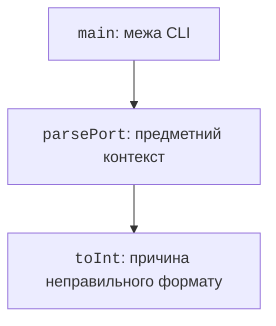

# Трасування стека та налагоджувач

## Трасування стека та причина

### Перевірка закриття після винятку

Закриття ресурсу можна перевірити без доступу до справжнього файла. Навчальний ресурс змінює прапорець у `close`, а всередині `use` навмисно створюємо помилку.

```kotlin
class Probe : AutoCloseable {
    var closed: Boolean = false
        private set

    override fun close() {
        closed = true
    }
}

fun main() {
    val probe = Probe()
    try {
        probe.use {
            check(!it.closed)
            throw IllegalArgumentException("Навчальний збій")
        }
    } catch (error: IllegalArgumentException) {
        println(error.message)
    }
    println("Закрито: ${probe.closed}")
    check(probe.closed)
}
```

Результат – `Навчальний збій`, потім `Закрито: true`. Власний setter закрито від зовнішнього присвоєння, щоб перевірка спостерігала саме виклик `close`. Детальну модель властивостей розглянемо в темі 5.

Такий тест перевіряє поведінку: ресурс закрито після помилки. Перевіряти лише наявність слова `use` у вихідному коді недостатньо. Помилково створений поза блоком інший ресурс усе одно міг би залишитися відкритим.

Під час проєктування обробки складіть таблицю незалежних сценаріїв. Кожний рядок має перевіряти видимий результат та стан, а не внутрішній номер рядка.

| **Сценарій** | **Очікування** |
| --- | --- |
| Операція успішна | Значення отримано, ресурс закрито |
| Помилка розбору | Помилка передана, ресурс закрито |
| Невдала передумова | Стан предметної моделі незмінний |
| Відсутній результат | Явний null або описаний Result |
| Логічна помилка | Тест формули виявляє різницю |

Стек викликів показує, які функції привели до місця помилки. Починайте з типу та повідомлення, знайдіть перший рядок власного коду, а потім перегляньте викликачів. Якщо є `Caused by`, не зупиняйтеся лише на зовнішній обгортці.



Рис. 4.6. Виклики та повернення винятку до main {.caption}

Не покладайтеся на точний номер рядка з чужого скриншота: він змінюється після редагування. Важливі назва функції та операція. Під час передавання помилки додайте контекст, але не вставляйте в повідомлення паролі чи повний вміст приватного документа.

::: info Знімок екрана
Run deliberate text.toInt failure; show type and clickable own source line.
:::

Рис. 4.7. Трасування помилки перетворення рядка {.caption}

Для демонстрації створіть окремий файл із викликом `parsePort("abc")` без обробника. Збережіть трасування, поясніть `cause`, потім поверніть обробку помилки. Навмисно аварійний сценарій не є звичайним способом завершення CLI.

## Налагоджувач IntelliJ IDEA

Точка зупинки призупиняє програму перед виконанням позначеного рядка. Вікно *Variables* показує поточні значення, *Frames* – стек, *Watches* – вирази для спостереження. Доступні локальні змінні залежать від вибраного кадру.

*Step Over* виконує рядок без заглиблення у викликану функцію, *Step Into* переходить усередину, *Step Out* завершує поточний виклик. *Resume* продовжує до наступної зупинки. Для складних бібліотек починайте з власного коду, щоб не загубитися у внутрішніх викликах JVM.

::: info Знімок екрана
Pause corrected average before return; show sum,count,Frames and step controls.
:::

Рис. 4.8. Локальні змінні та кадри викликів {.caption}

Умовна точка зупинки спрацьовує лише за заданого виразу, наприклад `i == 5`. Логувальна точка може друкувати значення, не зупиняючи виконання. Вираз умови повинен бути простим і не змінювати стан програми.

::: info Знімок екрана
Breakpoint condition index==2 in loop; show actual condition popup.
:::

Рис. 4.9. Умова зупинки на потрібній ітерації {.caption}

Точка на винятку корисна, коли `catch` розташований далеко або помилка перехоплюється бібліотекою. У *View Breakpoints* додайте потрібний тип, наприклад `NumberFormatException`, й визначте, чи зупинятися на перехоплених, неперехоплених або обох випадках.

::: info Знімок екрана
Java Exception Breakpoints: NumberFormatException, caught/uncaught settings.
:::

Рис. 4.10. Зупинка безпосередньо в момент винятку {.caption}
