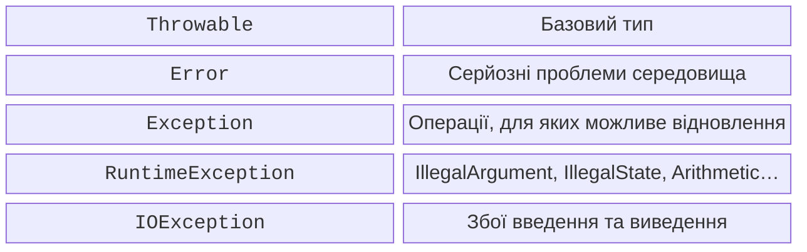
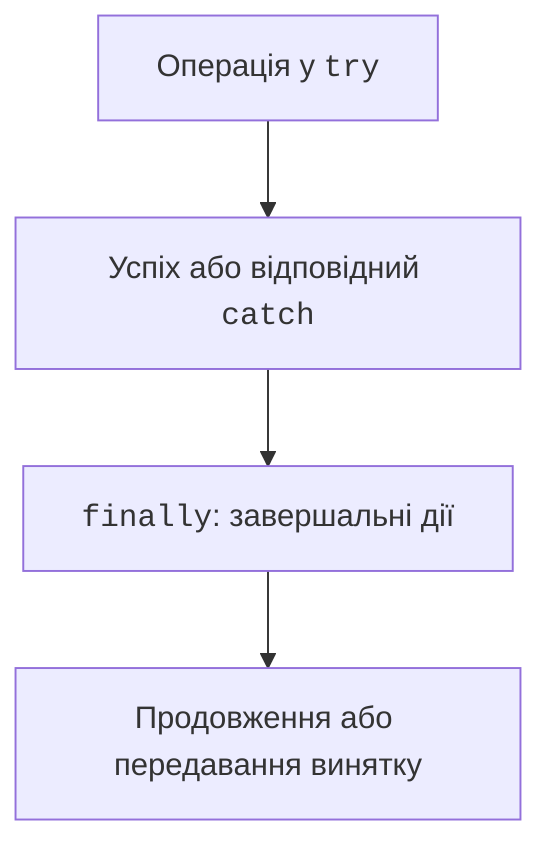
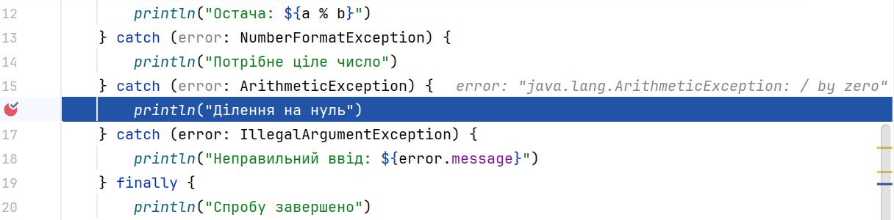

# Винятки та try–catch

## Помилка та її спостережувана поведінка

Програма може бути правильною синтаксично й усе одно не виконувати вимоги. Помилки компіляції знаходить компілятор, винятки виникають під час виконання, а логічна помилка може дати цілком звичайне число. Тому обробка винятків не замінює перевірку формул.

**Виняток** – об’єкт, який описує незвичайне завершення операції. Після `throw` звичайне виконання поточного блока переривається. Середовище шукає відповідний обробник у поточному виклику, а потім вище у стеку. Якщо такого обробника немає, незавершений шлях досягає межі програми й зазвичай завершує її.

Помилка користувача не повинна руйнувати стан даних. Наприклад, неправильна сума переказу має бути відхилена до списання коштів. Повідомлення «щось пішло не так» не допоможе, якщо після нього баланс уже неправильний. Контракт помилки описує і повідомлення, і стан після неї.

Офіційний виклад: <https://kotlinlang.org/docs/exceptions.html>. У цій темі використовуємо стабільні конструкції Kotlin 2.4; експериментальні альтернативи моделі помилок не є передумовою виконання лабораторної.

## Ієрархія Throwable на JVM

Базовий тип – `Throwable`. Гілка `Exception` містить помилки, з якими застосунок часто може впоратися, а `Error` – серйозні проблеми середовища або виконання, наприклад нестачу пам’яті. Звичайна форма введення не повинна перехоплювати всі `Throwable` і продовжувати роботу так, ніби стан програми надійний.



Рис. 4.1. Спрощена ієрархія винятків JVM {.caption}

`NumberFormatException` є підтипом `IllegalArgumentException`. Тому вузький обробник розташовують перед широким. `ArithmeticException` використовується, зокрема, для цілочисельного ділення на нуль; дробове ділення має іншу семантику й може дати нескінченність або `NaN`.

Kotlin не вимагає оголошувати перевірювані винятки у сигнатурі функції. Це відрізняється від Java, але не означає, що функція не здатна завершитися винятком. Для Java-викликачів іноді використовують `@Throws`; поведінку Kotlin-коду ця анотація не перетворює на автоматичну перевірку всіх помилок.

Одна й та сама невдала операція може мати різний сенс на різних рівнях. У функції розбору це «нечисловий рядок», у формі – «неправильне поле кількості», у CLI – ненульовий код завершення. Перетворення помилки має додавати контекст, а не знищувати її первинну причину.

## try, catch і finally

`try` охоплює операцію, від якої очікується виняток. `catch` визначає тип, який можна обробити саме тут. `finally` виконує завершальні дії під час звичайного виходу або розкручування стека. Це не гарантія проти аварійного завершення процесу чи вимкнення живлення.



Рис. 4.2. Вибір обробника та завершальні дії {.caption}

Не розміщуйте в одному великому `try` весь `main`, якщо потрібно обробити лише один очікуваний збій. Вузька межа дозволяє зрозуміти, яка операція спричинила повідомлення. Порожній `catch` приховує причину й робить подальші результати недостовірними.

### Приклад 1. Безпечне ціле ділення

```kotlin
fun main() {
    try {
        print("Ділене: ")
        val a = readlnOrNull()?.toInt()
            ?: throw IllegalArgumentException("Немає діленого")
        print("Дільник: ")
        val b = readlnOrNull()?.toInt()
            ?: throw IllegalArgumentException("Немає дільника")
        require(a in -1000000..1000000)
        require(b in -1000000..1000000)
        println("Частка: ${a / b}")
        println("Остача: ${a % b}")
    } catch (error: NumberFormatException) {
        println("Потрібне ціле число")
    } catch (error: ArithmeticException) {
        println("Ділення на нуль")
    } catch (error: IllegalArgumentException) {
        println("Неправильний ввід: ${error.message}")
    } finally {
        println("Спробу завершено")
    }
}
```

Для 17 і 5 результат – частка 3, остача 2, потім `Спробу завершено`. Для 17 і 0 немає повідомлення про частку: керування переходить до відповідного `catch`, а потім до `finally`. Для рядка `abc` працює обробник формату числа.

Накладена межа чисел також усуває особливий випадок переповнення `Int.MIN_VALUE / -1`. Не слід очікувати, що будь-яке переповнення цілої арифметики автоматично породить виняток. У темі 2 вже показано, як добуток може мовчки вийти за діапазон.



Рис. 4.3. Перехід до обробника ділення на нуль {.caption}
