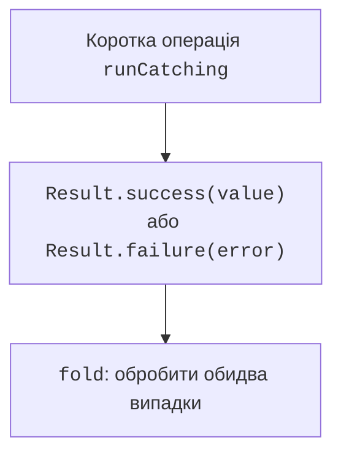

# Result і ресурси

## Вибір між null, винятком і Result

`null` підходить для очікуваної відсутності значення, наприклад пошуку без результату. Виняток підходить для порушення контракту або збою операції. `Result<T>` дозволяє передати успіх або помилку як значення, яке викликач обробляє явно.



Рис. 4.4. Успіх і помилка як значення Result {.caption}

`runCatching` виконує блок і перетворює його результат або перехоплений `Throwable` на `Result`. Це широкий механізм. Не використовуйте його бездумно навколо всієї програми чи корутин: скасування корутини також має передаватися далі. У темі 13 розглянемо це правило для `CancellationException`.

`getOrNull` приховує причину помилки за `null`. `getOrElse` дозволяє сформувати альтернативу, `fold` – обробити обидва результати. `onSuccess` і `onFailure` зручні для спостереження, але не перетворюють помилку автоматично на успіх.

### Приклад 3. Розбір координат

Рядок має рівно дві десяткові координати через кому, кожна від −1000 до 1000. Десятковий роздільник – крапка. Повертаємо `Pair<Double, Double>`; пара зберігає дві пов’язані величини без введення власного класу.

```kotlin
fun coordinates(text: String): Result<Pair<Double, Double>> {
    return runCatching {
        require(text.length <= 100) { "Рядок задовгий" }
        val parts = text.split(',')
        require(parts.size == 2) { "Потрібні x,y" }
        val x = parts[0].trim().toDouble()
        val y = parts[1].trim().toDouble()
        require(x.isFinite() && y.isFinite()) {
            "Координати мають бути скінченними"
        }
        require(x in -1000.0..1000.0 &&
                y in -1000.0..1000.0) { "Координати поза межами" }
        x to y
    }
}

fun main() {
    val result = coordinates("3,4")
    val message = result.fold(
        onSuccess = { point ->
            "x=${point.first}; y=${point.second}"
        },
        onFailure = { error -> "Помилка: ${error.message}" }
    )
    println(message)
    println(coordinates("bad").isFailure)
}
```

Результат – `x=3.0; y=4.0`, потім `true`. Запис у фігурних дужках після `onSuccess` є лямбдою; параметр `point` доступний усередині її тіла. Поки достатньо розуміти цей локальний синтаксис; функції вищого порядку докладно вивчатимемо в темі 11.

Блок `runCatching` тут обмежено коротким синхронним розбором локального рядка. У виробничому API можна обрати явний `try/catch` для конкретних винятків, якщо неприпустимо перетворювати інші збої на дані. Результат потрібно обробити: невикористаний `Result` може так само приховати помилку, як порожній `catch`.

## Перетворення Result і помилки в обробнику

`map` змінює успішне значення, але виняток усередині його перетворення не обов’язково перетворюється на `Result.failure`. Для перетворення, яке може кинути виняток, існує `mapCatching`. Аналогічно варто читати контракт кожної операції, а не вважати весь ланцюжок автоматично захищеним.

```kotlin
fun main() {
    val source = Result.success("12")
    val parsed = source.mapCatching { it.toInt() }
    println(parsed.getOrElse { -1 })
    val invalid = Result.success("abc")
        .mapCatching { it.toInt() }
    println(invalid.fold(
        onSuccess = { "Число: $it" },
        onFailure = { "Неправильне число" }
    ))
}
```

Результат: `12`, потім `Неправильне число`. Альтернатива −1 тут лише демонструє метод; якщо −1 належить допустимому предметному діапазону, потрібна інша форма відображення помилки. `getOrThrow` повертає значення або знову кидає збережений виняток: межа обробки залишається явною.

::: info Знімок екрана
Inspect parsed and invalid from mapCatching example; no synthetic UI.
:::

Рис. 4.5. Успішний і невдалий Result у налагоджувачі {.caption}

## Ресурси та use

Відкритий ресурс потребує закриття незалежно від успіху обробки. Для `AutoCloseable` і відповідних Java-ресурсів зручно використовувати `use`. Ресурс доступний у блоці, а після його завершення викликається `close`, зокрема під час винятку.

```kotlin
import java.io.StringReader

fun main() {
    val text = "10\n20\n30\n"
    val total = StringReader(text).buffered().use { reader ->
        var sum = 0
        while (true) {
            val line = reader.readLine() ?: break
            sum += line.toInt()
        }
        sum
    }
    println("Сума: $total")
}
```

Результат – `Сума: 60`. Приклад використовує пам’ять, тому не залежить від наявності зовнішнього файла. Для реального файла той самий принцип закриває reader після успіху або помилки розбору. Роботу зі шляхами й форматами вивчатимемо в темі 12.

Якщо основний блок і закриття ресурсу кидають винятки, важливо не втратити первинний збій. Механізм `use` зберігає помилку закриття як пригнічену (*suppressed*) поряд із основною. Самописний `finally { close() }` потребує уваги до такого випадку.

Не повертайте ледачий потік читання з блока `use`, якщо його споживання відбудеться після закриття ресурсу. Обчислення, яке потребує відкритого reader, повинне завершитися всередині блока або мати інше явно визначене володіння.
