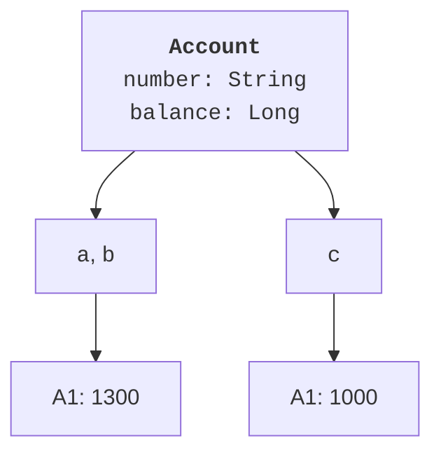
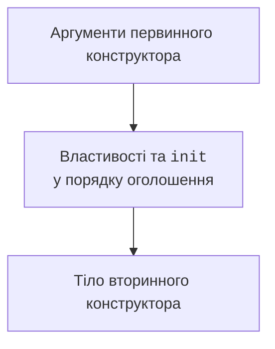

# Клас, конструктори та ініціалізація

## Від окремих змінних до моделі

У програмі обліку рахунків ім’я власника, номер і залишок пов’язані одним змістом. Якщо зберігати їх у незалежних змінних, доводиться всюди пам’ятати, які значення належать разом. Ще складніше забезпечити правило: не можна зняти більше коштів, ніж є на рахунку. Клас об’єднує стан із діями, які цей стан змінюють. Офіційний опис синтаксису: <https://kotlinlang.org/docs/classes.html>.

**Клас** описує тип об’єктів, їхні властивості та доступні методи. **Об’єкт** – конкретний екземпляр із власною ідентичністю і станом. Два рахунки можуть мати однаковий баланс, але це різні рахунки. **Інваріант** – умова, яка має виконуватися після успішного створення об’єкта та після кожної завершеної публічної операції. Наприклад, залишок невід’ємний, а номер не порожній.

Клас не повинен відповідати за все: рахунок перевіряє суму, а консольний інтерфейс запитує текст і показує повідомлення. Такий поділ дозволяє перевіряти модель без клавіатури й пізніше використати її в графічному застосунку. Назви методів описують дії предметної області: `deposit`, `withdraw`, `rename`. Метод `setEverything` приховує зміст і ускладнює перевірку.

Створення має вигляд `Account("A1", 1000)`: слова `new` немає. Змінна містить посилання на об’єкт. Присвоєння `val b = a` не копіює його, тому зміна через `b` видима й через `a`. `val` забороняє переприсвоєння самої змінної, але не робить об’єкт незмінним. Незмінність залежить від його інтерфейсу.



Рис. 5.1. Клас, незалежні об’єкти та спільне посилання {.caption}

Операція `===` перевіряє тотожність посилань. `==` викликає перевірку рівності з урахуванням `null`. Для звичайного класу без власного `equals` успадкована рівність відповідає тотожності. Класи даних у темі 7 матимуть інший, змістовний контракт. Не перевіряйте ідентичність чисел і рядків, щоб визначити рівність значень: особливості представлення на JVM тут зайві.

## Первинний конструктор і властивості

Первинний конструктор записують у заголовку. Параметр із `val` одночасно оголошує властивість лише для читання; із `var` – властивість для читання й запису. Параметр без цих слів є вхідним значенням для ініціалізації, а не публічною властивістю. Якщо початкове значення треба перетворити або обмежити доступ, оголосіть властивість окремо в тілі класу.

Конструктор має забезпечувати придатний початковий стан. Для перевірки аргументу застосовують `require`, який у разі відмови породжує `IllegalArgumentException`. Для неправильної послідовності дій, наприклад запуску вже запущеного приладу, доречний `check` та `IllegalStateException`. Виняток пояснює причину; його перехоплює зовнішній інтерфейс із теми 4.

Параметри за замовчуванням дають зрозумілі короткі виклики. Не створюйте п’ять вторинних конструкторів лише заради різної кількості аргументів. Вторинний конструктор потрібний, коли спосіб подання вхідних даних справді інший або цього вимагає інтеграція з Java. Іменовані аргументи з теми 3 допомагають прочитати виклик без пошуку порядку параметрів.

### Приклад 1. Рахунок із захищеним балансом

Модель зберігає навчальні суми в цілих копійках `Long`. Верхня межа один мільярд копійок робить приклад простим і запобігає переповненню під час дозволених операцій. Баланс доступний для читання, а змінити його можна лише через перевірені методи. Це локальна модель без банківських API.

```kotlin
class Account(val number: String, initial: Long = 0) {
    var balance: Long = initial
        private set

    init {
        require(number.isNotBlank()) { "Empty number" }
        require(initial in 0..1_000_000_000L)
    }

    fun deposit(amount: Long) {
        require(amount > 0) { "Amount must be positive" }
        require(amount <= 1_000_000_000L - balance)
        balance += amount
    }

    fun withdraw(amount: Long) {
        require(amount > 0) { "Amount must be positive" }
        require(amount <= balance) { "Insufficient balance" }
        balance -= amount
    }

    override fun toString(): String = "$number: $balance"
}

fun main() {
    val a = Account("A1", 1000)
    val b = a
    val c = Account("A1", 1000)
    b.deposit(500)
    a.withdraw(200)
    println(a)
    println(c)
    println("same=${a === b}; equal=${a == c}")
    try {
        a.withdraw(2000)
    } catch (e: IllegalArgumentException) {
        println("Rejected: ${e.message}")
    }
    println("balance=${a.balance}")
}
```

```text
A1: 1300
A1: 1000
same=true; equal=false
Rejected: Insufficient balance
balance=1300
```

Усі умови перевіряються до присвоєння, тому невдала операція не залишає об’єкт напівзміненим. Зовнішній код не може написати `a.balance = -100`. Водночас `private set` не забороняє самому класу помилитися: правильність тіла методів залишається нашою відповідальністю. Перевірка після відмови доводить збереження стану.

`override fun toString()` задає коротке подання для людини. Це мінімальне перевизначення методу `Any`; докладний механізм розглядається в темі 6. Рядок подання не є форматом збереження і не повинен містити пароль чи інші приховані дані.


Рис. 5.2. Створення класу в IntelliJ IDEA {.caption}

## Ініціалізатори та вторинний конструктор

Блок `init` не є окремим методом, який можна викликати ззовні. Його код належить процесу створення об’єкта. Ініціалізатори властивостей і блоки `init` виконуються в порядку оголошення. Тому не слід читати властивість, оголошену нижче, сподіваючись, що вона вже має завершене значення. Послідовність показано на рис. 5.3. Тіло вторинного конструктора працює після делегування первинному через `this(...)`.



Рис. 5.3. Етапи створення екземпляра {.caption}

Для одного логічного правила має бути одне місце перевірки. Якщо обидва конструктори приймають рік навчання, вторинний передає перетворене число первинному, а `init` контролює межі. Не дублюйте діапазон у двох конструкторах: під час зміни вимог вони можуть розійтися. Некоректний текст не перетворюйте мовчки на нуль, коли нуль не означає справжнє значення предметної області.
