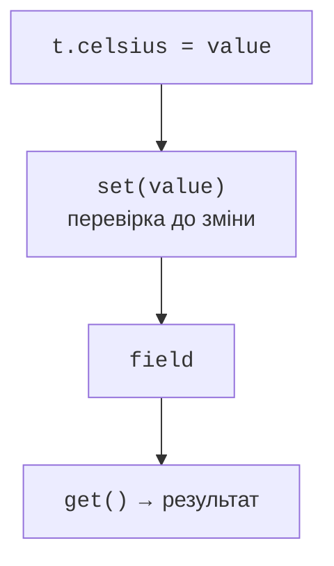

# Властивості, аксесори та lateinit

## Властивості, аксесори та поле

Властивість є інтерфейсом доступу, а не просто коміркою пам’яті. Вона може мати геттер `get()` і сетер `set(value)`. Для звичайної властивості компілятор забезпечує їх автоматично. Власний сетер дає змогу перевірити нове значення, а геттер – обчислити похідне. Деталі: <https://kotlinlang.org/docs/properties.html>.

Спеціальне ім’я `field` доступне всередині аксесорів і позначає поле збереження властивості. Присвоєння самій властивості в її сетері викликає сетер знову й утворює рекурсію. Для обчислюваної властивості без збереження достатньо геттера; окреме поле не потрібне. Зокрема, площу не слід дублювати поруч із шириною.



Рис. 5.4. Перевірка запису та читання з поля {.caption}

**Початковий ініціалізатор властивості не викликає власний сетер.** Тому перевірка лише в `set` не захищає конструктор. Потрібно перевірити початковий аргумент у `init`, застосувати спільну функцію перевірки або ініціалізувати через явну контрольовану дію. Це одна з найпоширеніших помилок першого класу з властивостями.

### Приклад 2. Температура та похідна шкала

Число має бути скінченним і не нижчим за абсолютний нуль. `NaN` та нескінченність не є коректними вимірами. Одна приватна функція обслуговує створення і подальші зміни. Геттер Фаренгейта читає актуальний стан, тому немає двох неузгоджених температур.

```kotlin
class Temperature(initial: Double) {
    var celsius: Double = checked(initial)
        set(value) {
            field = checked(value)
        }

    val fahrenheit: Double
        get() = celsius * 9.0 / 5.0 + 32.0

    private fun checked(value: Double): Double {
        require(value.isFinite() && value >= -273.15) {
            "Invalid temperature"
        }
        return value
    }
}

fun main() {
    val t = Temperature(0.0)
    println("${t.celsius} C = ${t.fahrenheit} F")
    t.celsius = 25.0
    println("${t.celsius} C = ${t.fahrenheit} F")
    try {
        t.celsius = Double.NaN
    } catch (e: IllegalArgumentException) {
        println(e.message)
    }
    println(t.celsius)
}
```

```text
0.0 C = 32.0 F
25.0 C = 77.0 F
Invalid temperature
25.0
```

Геттер має бути передбачуваним: читання температури не повинно надсилати запит у мережу, списувати кошти чи змінювати інший об’єкт. Дорогу або дієву операцію краще назвати методом. Властивість `val` з геттером не обіцяє, що кожне читання повертає однакове значення: тут результат залежить від `celsius`.

## Відкладене встановлення lateinit

Коли значення з’явиться після створення об’єкта, насамперед перевірте, чи не варто передати його конструктору. Для справді пізнього встановлення є `lateinit var`: властивість не nullable, але її читання до присвоєння породжує `UninitializedPropertyAccessException`. Це не автоматичне обчислення; делегат `lazy` з’явиться в темі 8.

`lateinit` не застосовують до `val`, nullable-типів і примітивних типів на кшталт `Int`. Властивість не може мати власних аксесорів. Перевірку `this::mentor.isInitialized` виконують там, де доступне поле відповідної властивості. Не перетворюйте її на повсюдний замінник продуманого життєвого циклу об’єкта.

### Приклад 3. Студент і призначення наставника

```kotlin
class Student(val name: String, val year: Int) {
    lateinit var mentor: String
        private set

    init {
        require(name.isNotBlank())
        require(year in 1..6)
        println("init: $name, year=$year")
    }

    constructor(name: String) : this(name, 1) {
        println("secondary")
    }

    fun assignMentor(value: String) {
        require(value.isNotBlank())
        mentor = value.trim()
    }

    fun describe(): String {
        val teacher = if (this::mentor.isInitialized) {
            mentor
        } else {
            "not assigned"
        }
        return "$name: $teacher"
    }
}

fun main() {
    val student = Student("Olena")
    println(student.describe())
    student.assignMentor("  Iryna  ")
    println(student.describe())
}
```

```text
init: Olena, year=1
secondary
Olena: not assigned
Olena: Iryna
```

У цьому прикладі повідомлення з конструктора потрібні лише для спостереження порядку виконання. У прикладній моделі їх прибирають, щоб створення об’єкта не друкувало несподіваний текст. Альтернативою є nullable-наставник і явний стан «не призначено»; вибір залежить від контракту моделі.
