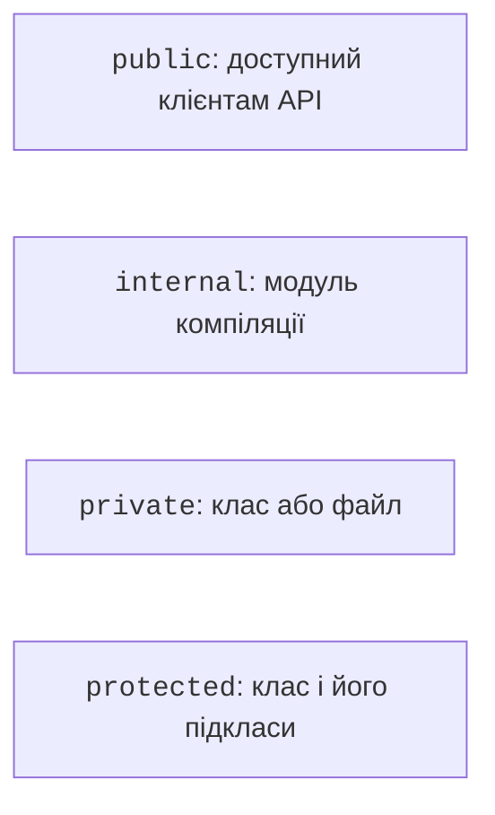

# Видимість, пакети та вкладені класи

## Видимість і межі відповідальності

`public` є типовою видимістю. `private` всередині класу закриває член для зовнішніх викликів; на верхньому рівні обмежує його поточним файлом. `protected` доступний класу та його підкласам і не застосовується до оголошень верхнього рівня. Наслідування детально розглядається наступною темою. `internal` означає доступ у межах модуля компіляції, а не пакета. Джерело: <https://kotlinlang.org/docs/visibility-modifiers.html>.



Рис. 5.5. Межі доступу до оголошень {.caption}

У звичайному Gradle-проєкті модуль пов’язаний із набором джерел, який компілюється разом; тести можуть мати спеціальний доступ до internal-членів основного коду. Не ототожнюйте модуль із текою довільного рівня. Пакет організовує імена, а модифікатор визначає доступ. Два файли одного пакета не отримують автоматично доступу до `private` один одного.

Інкапсуляція зменшує кількість місць, де треба доводити правильність стану. Якщо `balance` можна записати будь-де, усі ці місця мають перевіряти межі. Якщо зміна доступна лише через два методи, перевірка локалізована. Водночас видимість не є криптографічним захистом: секрети не стають безпечними лише через слово `private`.

## Пакети, файли та імпорт

Оголошення `package ua.edu.bank` стоїть перед імпортами. Повне ім’я класу включає пакет. Тека `ua/edu/bank` під `src/main/kotlin` є зручною угодою, хоча синтаксис Kotlin не змушує шлях збігатися з пакетом. Файл може містити кілька пов’язаних класів і функцій верхнього рівня. <https://kotlinlang.org/docs/packages.html>.

`import` дозволяє коротке ім’я, але не створює об’єктів і не запускає конструкторів. Імпорт із `as` розв’язує конфлікт однакових імен або дає локально зрозумілу назву. Не ховайте невдалу структуру пакетів під десятками псевдонімів.

### Приклад 4. Два пакети одного застосунку

Створіть два файли в одному Gradle-модулі. Перший файл `src/main/kotlin/ua/edu/bank/Wallet.kt` містить модель.

```kotlin
package ua.edu.bank

internal class Wallet(val owner: String, val cents: Long) {
    init {
        require(owner.isNotBlank() && cents >= 0)
    }

    fun label(): String = "$owner: $cents kop"
}
```

Другий файл `src/main/kotlin/ua/edu/app/Main.kt` містить запуск. Обидва пакети належать тому самому модулю, тому internal-клас доступний. З іншого незалежного модуля звичайний імпорт не зробить його публічним.

```kotlin
package ua.edu.app

import ua.edu.bank.Wallet as StudyWallet

fun main() {
    val wallet = StudyWallet("Taras", 1250)
    println(wallet.label())
}
```

```text
Taras: 1250 kop
```

Для цього прикладу точка входу JVM має ім’я `ua.edu.app.MainKt`, оскільки функція верхнього рівня розташована у файлі `Main.kt`. Назва класу моделі не визначає точку входу. Після зміни пакета оновіть конфігурацію запуску.

::: info Знімок екрана
Project tree: src/main/kotlin/ua/edu/bank/Wallet.kt and app/Main.kt; expand packages.
:::

Рис. 5.6. Пакети моделі та консольного інтерфейсу {.caption}

## Вкладений і внутрішній клас

Вкладений клас `class Track` усередині `Player` групує пов’язаний тип, але не отримує посилання на конкретний плеєр. Його створюють як `Player.Track(...)`. Модифікатор `inner` додає зв’язок із зовнішнім екземпляром; створення має вигляд `player.Playback()`. Усередині можна явно написати `this@Player`, щоб відрізнити зовнішній об’єкт від внутрішнього. <https://kotlinlang.org/docs/nested-classes.html>.

Використовуйте `inner` лише тоді, коли операція справді залежить від конкретного власника. Зайве приховане посилання ускладнює життєвий цикл: збережений Playback утримує свій Player доступним. Це не вкладене наслідування. У лабораторному прикладі Track описує дані композиції, а Playback змінює гучність власника.
